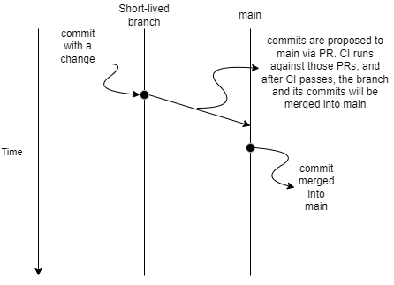
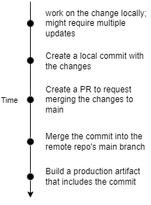
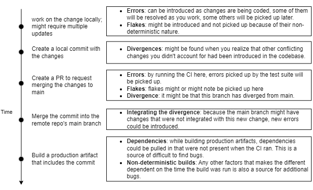
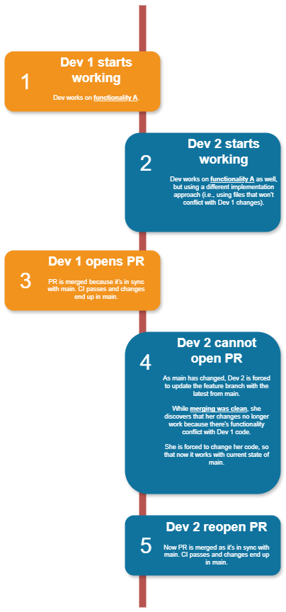
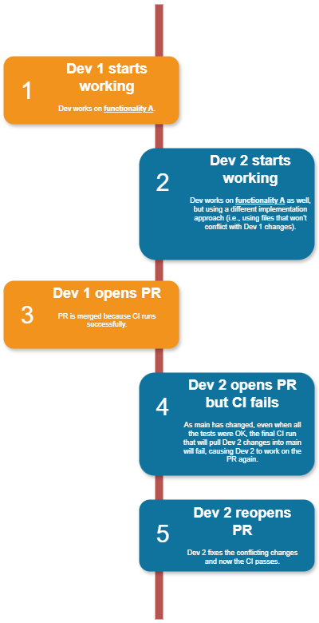
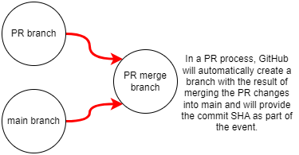
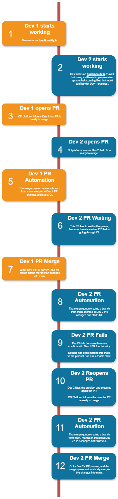
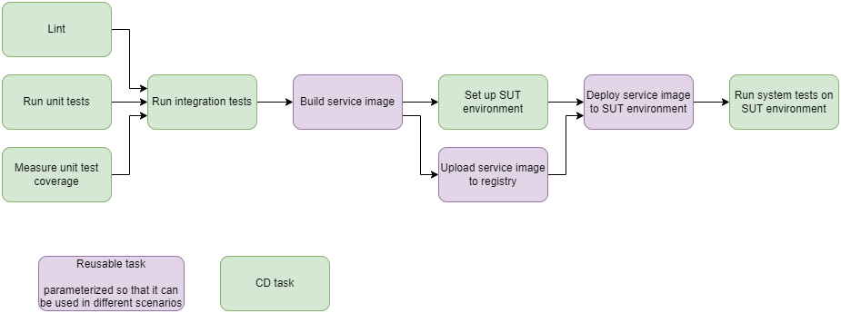

# Hello, lifecycle of a change

This chapter deals with the life cycle of a change, so that you can leanr where bugs can be introduced, and how to use the pipelines to get the proper signals so that they can be fixed as quickly as possible.

## Life cycle of a change

Let's consider a project using trunk-based development with very short-lived branches and PRs.

The following diagram illustrate how this works:



The high-level stages of a change are the following:



| NOTE: |
| :---- |
| The term *production* is used to refer to the environment where you make your software available to your end customers.<br>This term is used to contrast with any intermediate environments where artifacts are used for internal verification or testing. |

## CI only before merge

If you're starting from scratch, the easiest place to start running CI is often right after a change is merged.

| NOTE: |
| :---- |
| Some systems like GitHub and GitLab make it very easy to set up a PR-based CI that can give a signal earlier. |

When using that approach, if the pipeline breaks you'll need to stop pushing changes.

This has some definite drawbacks:

+ You'll find problems only after they are already added to he codebase.

    This means you will be breaking the CD goal of having your codebase in a releasable state at any point.


+ Requiring everyone to stop pushing changes when the CI breaks is frustrating and expensive (in terms of effort and delivery velocity).

As an alternative you should try and run the CI before merging instead, so the engineers could prevent their codebase from getting into a broken state:

+ Instead of finding about the problems when already added, you will stop them from being added to the main codebase.

+ You will avoid blocking everyone when a change is bad. You could only notify the author, let the author fix it, and then try again.

The following diagram illustrates both approaches:

## Timeline of a change's bug

Whenever you're dealing with a project in which you find bugs even when having a solid CD pipeline, it might be a good idea to do a thorough analysis such as the following.

In this diagram, all possible sources of problems are identified and categorized:



The picture illustrates that running the CI only before merging can miss certain types of errors such as:

+ divergence from main branch

+ a different set of dependencies pulled in when running the CI than the ones used for the production artifacts.

+ non-deterministic behavior of flakes that might not be caught when running the CI, but that will manifest in production.

In particular, for the first point, you might find in a large team that developers might be working on changes that might conflict at runtime but that won't be picked up by Git. Regularly pulling changes from main will help to mitigate the divergence, but that is not definitely a rock-solid solution.

In summary:
> Running CI on PRs before merging won't catch all conflicting changes. If the conflicting changes are changing exactly the same lines, Git can catch the conflict, but if the changes are in different lines or files but affect the same functionality, you can end up with a CI that has passed before merge and leaves main branch in broken state after merging.

## CI before and after merge

A possible solution would be to require changes to be combined with the latest main and pass CI before merging.

The possible implementation of that goal are:
1. Run CI periodically on main.
2. Require branches to be up-to-date before they can be merged into main.
3. Use automation to merge changes with main and rerun CI before merging (i.e., use a merge queue).

Option 1 is far from ideal, because you will catch the problem after it has been merged, and therefore, you will not be complying with the goal of always having main in a releasable state, so we won't be paying a lot of attention to this option.

In any case, the implementation would be very simple. In your CD workflow, you would have to include something like:

```yaml
on:
    schedule:
        - cron: "0 * * * *"
```

### Option 2: Require branches to be up-to-date

In this option you'll be forcing the update of the branch of the PR before you can merge, and at the point in which you update your branch, CI will be triggered.

The process is rock solid and you'll be guaranteeing that problems won't sneak into main:



The cost of this approach is making each of the developers wanting to create a PR to sync up with main first. This might become tedious for them, especially if there are many developers presenting PRs.

### Option 3: Automated merge CI

A large team will definitely not choose option 2, because the additional overhead and frustration of always requiring branches to be up-to-date.

This solution is to introduce automation to run CI a final time before merging, against the changes merged with the latest code from main.

These are the details:

1. Before merging, even if the CI has passed previously, run the CI again, including the latest state of main (even if the branch itself isn't up-to-date).

2. If the main branch changes during this final run, run the CI again. Repeat until it has been run successfully with exactly the state of main that you'll be merging into.

With this automation in place, we will have the following timeline:



The steps discussed at the beginning of the section, along with the diagram above only gives us the high level view of the process &mdash; let's understand how we can pull this off:

We need
+ a mechanism to combine the branch with the latest changes in main that CI can use.

    One way to do this is to introduce a CI task that pulls the main branch and does a merge.

    However, more modern CD platforms such as GitHub take care of this for you. When GitHub triggers webhook events (or when using GitHub actions), GitHub provides a merged commit to so that you can test again. That is, GitHub create a commit that merges the PR changes with main.

    

    As long as the CI tasks fetch this merge commit provided by GitHub as `GITHUB_SHA` in the triggering event, you'll make sure branches are up-to-date when CI runs by introducing automation to update the branch to the state needed to run CI.

+ another mechanism to run CI before a merge (to ensure the PR is OK before merging) and to block the merge from occurring until CI passes.
+ a way to detect updates to main (and trigger the pre-merge CI process again) or a way to prevent main from changing while the pre-merge CI is running.

    Most version control system will provide some way to run CI in response to events such as when a PR is opened, updated, or merged (aka a *merge event*). If you run your CI in response to a merge event, you can be alerted when a merge occurs, and run your CI in response. However, this is not sufficient as you will get the event when the PR is already merged into main, so if a problem is found, main will not be in a releasable state.

    Also, there's no mechanism to serialize the changes, or to trigger the CI again if any changed is done into main while the automation is running.

    The answer for these two problems is merge queues (or merge trains).

#### Merge Queues

Let's recall our needs:

1. A mechanism to combine the branch with the latest changes in main that CI can use.

2. Something to block the merge from occurring until CI passes.

3. A way to detect updates to main (and trigger the pre-merge CI process again) or a way to prevent main from chaning while the pre-merge CI is running.

We have a solution for the first requirement, but the other two require a mechanism that would be entirely responsible for merging PRs. This automation is often referred to as *merge queue* or *merge train*, and when using it, merging is never done manually, but is always handled by automation that enforces points 2 and 3.

Merge queues will establish a queue of PRs that are elegible to merge (because they've passed the required CI). When that happens:

+ Each eligible PR is added to the merge queue.

+ For each PR in order, the merge queue creates a temporary branch that merges the changes into main (using the same logic as GitHub uses to create the merged commit it provides in PR events).

+ The merge queue runs the required CD on the temporary branch.

+ If CI passes, the merge queue will go ahead and do the merge. If it fails, it won't. Nothing else can merge while this is happening because all merges need to happen through the merge queue.


| NOTE: |
| :---- |
| For very busy repos, this serialization can be optimized by batching toger PRs for merging and running. When the CI succeeds it saves a lot of time, when it fails, the platform can isolate the offending PRs. |

Now we can picture a very detailed timeline explaining how the merge queue would have addressed the conflict:




In summary, merge queues provide the best solution for Option 3. Merge queues prevent conflicting changes from sneaking in the main branch by managing merging and ensuring CI passes for the combination of the changes being merged and the latest state of main. The most modern CD platforms provide this functionality by enablign their branch protection rules for main to *require merge queue*.

## Flakes and PR-triggered CI

The techniques explained above help to address the divergence from the PRs an the main branch, but possibly won't help with flakes.

As a matter of fact, if your CI fails because of a flake, then you re-run it and works without changing anything, you will be ignoring a potential flake.

The most effective way to uncover flakes is with periodic tests. Note that this won't prevent the code that introduced the flake from being merged into main, but will at least identify a potential non deterministic behavior.

## Bugs and building

Another potentil source of bugs revolve around changes to dependencies:
1. Developers might test their changes with a certain tree of dependencies A.
2. The CI tasks might run its verifications with a different set of dependencies B.
3. The final artifact (e.g, container image) might be build with a different set of dependencies C.

Note that the verifications of point #2 often include some sort of end-to-end system test that might use an artifact similar to the one to be used in point #3, which complicates the matter even more.

That end-to-end test needs something to run against, and therefore, typically include setting up the *system under test* (SUT). To create the SUT, the task needs to build the images used by product.

The end to end task (aka system test) typically includes:
1. Setting up an environment to run the SUT
2. Building an image
3. Pushing the image to a local registry
4. Running the image
5. Run the end-to-end system tests against the running container.

But #2 and #3 won't typically use the same logic as the release pipeline.

Bacause of that problems may arise because of:

+ differences based on when the build happens &mdash; the dependency tree will be different if when building the test image the version of a dependency is different from the version version that will be used when building the production image.

+ differences on the build environment itself &mdash; for example, the OS, Python version, tool version might be different when building the test image and the production image.

The first mitigation you can take is to reuse the same tasks used for production building and deployment.

The final pipeline will look something like the following:



If we employ that pipeline, along with some periodic CI (e.g., build images every hour), if a change in a dependency introduces a bug, there's only about an hour for the bug to sneak through, as it will be picked the next time the CI runs. By using the same tasks, we're mitigating the dependency on the environment variability (OS, Python version, tooling, etc.).

| NOTE: |
| :---- |
| We will still need to work on ensuring that the dependency tree is exactly the same, which we will see in a subsequent chapter when we deal with pinning dependency versions. |


## Summary

The amount of bugs introduced in the product can be greatly reduced by doing:

+ A PR-triggered CI
+ Using a merge queue
+ Running CI periodically to pick up non-deterministic/dependency version related bugs
+ Building a pipeline that reuses the same tasks for building, publishing, and deploying for the system tests and production.

## A deep dive on code conflict

In this chapter, we've talked about a code conflict issue in which two developers were working on the same feature and the VCS were not able to detect the conflict.

This section deep dives on that problem.

Alice has been working on a feature to graph the last seven days of a currency value (e.g., € to $).

While working on this functionality, she finds that the codebase already provides a `get_daily_rates()` function that will return the peak daily rates for a particular currency for some period of time. By default, the function will return the rates for all time by indicating a value of `NUM_DAYS=0`

```python
def get_daily_rates(currency, num_days=MAX):
    rate_hub = get_rate_hub(currency)
    rates = rate_hub.get_rates(num_days)
    return rates
```

Looking around the codebase, Alice finds out that none of the callers are making using of the logic that defaults num_days to `MAX`. Instead, everyone was

```python
rates = get_daily_rates("EUR", 30)
plt.plot(rates)
plt.show()
```

Since she has to call the function several times, she decides to make the value of `num_days` to default to `7`. She also creates a unit test to validate this new functionality.

```python
def get_daily_rates(currency, num_days=7):
    rate_hub = get_rate_hub(currency)
    rates = rate_hub.get_rates(num_days)
    return rates
```


What Alice didn't realize is that Bob is working on some charts and wants to use the previous default value of `30`. Because no one was using the code, get changes the `get_daily_rates()` function implementation to make it more explicit that the `MAX` should be `30`

```python
def get_daily_rates(currency, num_days=MAX):
    rate_hub = get_rate_hub(currency)
    rates = rate_hub.get_rates(30 if num_days==MAX else num_days)
    return rates
```

Bob decides to use that approach in order not to change the function signature and commits it into `main` before Alice does. Because there are no conflicting lines, both feature branches can be merged without issues.

You can review the code in [00: initial codebase](00-initial-codebase/), [01: Alice's PR](01-alice-pr/), and [02: Bob's PR](02-bob-pr/)