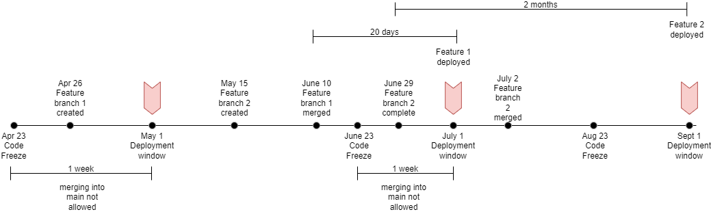
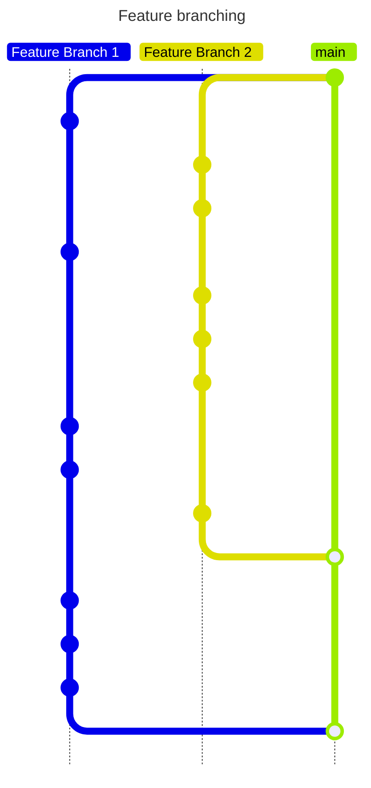
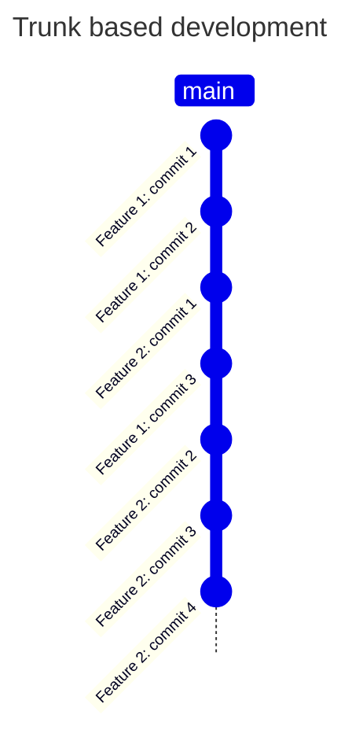

# Easy delivery with version control

In the previous sections we learned about the CI part of the CD pipelines where we were focusing on getting the software in a releasable state at all times using gates.

Now, we will concentrate on the transformation tasks that are used after the continuous integration has happened to build, deploy, and release your code.

## Example scenario

The WmW company has grown from a small number of employees to having more than 50. As the company has grown the engineers have become nervous about the deployments as they're afraid that newer deployments can take the system down, so they have decided to slow them down, and release the services during only specific windows (once every two months).

For a week before a release, the codebase is frozen, and no new changes can go in:


These practices don't seem to alleviate the nervousness around the new deployments, and what's worse, features are taking too long to get into production.

## The DORA metrics

The [DORA metrics](https://www.devops-research.com/research.html) are for key metrics that measure the performance of a software team:


+ Velocity
  + Deployment frequency
  + Lead time for changes

+ Stability
  + Time to restore service
  + Change failure rate

## Focusing on velocity

According to the DORA metrics, velocity in a software product is measure by two metrics:
+ Deployment frequency &mdash; measure how often an organization successfully releases to production.
+ Lead time for changes &mdash; measures the amount of time it takes a commit to get into production.

At WmW, deployments only occur during the established deployment windows, which are very two months.

| NOTE: |
| :---- |
| Although the DORA metrics are defined for running services, the same principles can be applied to other types of software (libraries, images, ...). You just need to change the metrics a little bit: deployment frequency might become release frequency, and lead time for changes for the time it takes for a commit to end up in the hands of the users. |

## Lead time for changes

To measure the lead time for changes, it is a good practice to understand the development process of the software product.

At WmW, features are created in a feature branch, and that branch is then merged back into main when development has finished on the feature. Some features can be completed in as little as one or two days, but some others can take a few weeks.

The following picture illustrates the life of a couple of recent features:



The lead time for the changes in Feature Branch 1 was 20 days. However, because Feature 2 was completed during the code freeze for the deployment window, it couldn't be merged into main until after the code freeze was lifted, and didn't make it to production until September 1, almost two months after it was completed.

## Velocity metrics for WmW

After that study we can conclude:
+ Deployment frequency &mdash; once every two months.
+ Load time for changes &mdash; 45 days

Looking at these values, we don't know whether those are good or bad. Fortunately for us, the DORA team members provide tiers so that you can measure how do you compare with other teams:

| Metric | Elite | High | Medium | Low |
| :----- | :---- | :--- | :----- | :-- |
| **Deployment frequency** | Multiple times a day | Once per week to once per month | Once per month to once every six months | Fewer than once every six months |
| **Lead time for changes** | Less than an hour | One day to one week | One month to six months | More than six months |

| NOTE: |
| :---- |
| Note that there is a slight gap between the buckets. |


Thus looking at the table, WmW engineers know now that they are in the medium tier of the spectrum, and decide to improve the velocity. They decide to target the "High" tier:

+ Deployment frequency &mdash; they need to go from deploying once every couple of months to deploying at least once a month.

+ Lead time for changes &mdash; they need to move from an average lead time of 45 days to one week or less.

## Giving it a go with one feature

In order to increase velocity, the team decides to get rid of feature branches. As this was everything they knew, they are reluctant to introduce such big change, and they decide to give it a go with one specific feature, as a sort of experiment:

> We will get rid of feature branches. Instead of one big merge for each feature, parts of the feature will be incrementally merged as we go.

The feature consists of an additional integration with an streaming service (acme+). Therefore, the new code will be added to the Streaming Integration Service component:


The team was used to feature branching, where long-lived branches were created per feature. Changes were committed to the branch as the feature were developed. Eventually, the entire branch was merged back into the main branch:



Now, the team wants to move to trunk-based development, whereby developers frequently merge back into the trunk of the repository &mdash; commits are made back to main as frequently as possible even if an entire feature is not yet complete. The only requirements is thea the change should be complete to comply with the CD goal of having the software at a releasable state at any time.



## Adopting trunk-based delivery with incremental feature delivery

Before adopting trunk-based delivery, the team discusses how the team used to work. The new feature was to include support for a new streaming service. Thanks to the application architecture, it'll be as easy as providing a new class inheriting from the `StreamingService` class.

1. Make a feature branch off of main
2. Start work on end-to-end tests
3. Fill in the skeleton of the new streaming service class.
4. Start making each individual function work, with more tests and new classes.
5. If the developer remembers, from time to time, merge in changes from main so that the final merge is easier.
6. When it's all ready to go, merge the feature back into main.


When adopting the trunk-based delivery, a few things will need to change:
+ end-to-end tests should be commited to main as disabled, if the feature is not yet complete.


```python
@pytest.mark.skip(reason="feature xyz not fully implemented yet")
def test_get_watch_history(self):
    ...
```

Also, when using this approach, code reviews might be a little *odd*, as the feature will not be 100% complete and might include skipped tests and lack the proper documentation.

The way around it consists of redefining the term *complete*:

+ Clean linting report
+ Docstrings for incomplete functions explain why they are incomplete.
+ Each code change is supported by tests and documentation.
+ Skipped tests include an explanation and refer to a tracking issue.

Note that now the code will include a little bit of dead code with every incremental change. As a result, if a particular feature is dropped of redesigned, that dead code might stay in the codebase.

There are a couple of strategies to fix that:
+ Completely disallow dead code by detecting it pre-merge and blocking it from being merged in.

+ Run automation on a regular basis to detect dead code and propose the changes to remove the code but not merge those proposed changes automatically.

Note that when using this approach, we might need to commit work-in-progress code. That shouldn't represent a problem as long as it is complete (should pass linting, skipped tests, etc.). A PR with that little content can still be reviewed (e.g., look that the docstrings make sense, etc.).

When reviewing a short, in-progress PR, the reviewer has more time to focus on the interfaces and documentation, so it's actually a blessing in disguise.

It will also let other developers working on tangential features to start contributing to committed code early on, rather than waiting for the feature to be complete.

As an example, let's assume that Alice commits something like the following:

```python
def get_watch_history(self, time_period):
    """
    Get shows/movies self.user has already watched in acme+

    The streaming service will hold the complete history of all the shows and movies the user has watched up until the current time, so this function can return anywhere from 0 results to a list of unbounded length.

    This integration with acme+ streaming service is a work in progress (#555) so this function currently returns an empty list [].

    Args:
        time_period: either the value ALL_TIME to return the complete watch history or an instance of TimePeriod providing the start and end datetimes.

    Returns:
        A list of Show objects, one for each already watched shows/movies in the specified time period.
    """
    return []
```

And Bob, can take merge that code right after it's committed and update with the pagination capabilities he's working on:

```python
def get_watch_history(self, time_period, max, index):
    """
    Get shows/movies self.user has already watched in acme+

    The streaming service will hold the complete history of all the shows and movies the user has watched up until the current time, so this function can return anywhere from 0 results to a list of unbounded length.

    This integration with acme+ streaming service is a work in progress (#555) so this function currently returns an empty list [].

    Args:
        time_period: either the value ALL_TIME to return the      complete watch history or an instance of TimePeriod providing the start and end datetimes.

        max: the maximum number of results to return.

        index: the index into the total number of results from which to return up to max results.

    Returns:
        A list of Show objects, one for each already watched shows/movies in the specified time period and according to the given pagination parameters.
    """
    return []
```

Because the code was merged earlier, Bob was able to include code that would otherwise had been left hanging until Alice completed the integration feature (which could be a really long time!).

This really favors the CI goals!
> CI is the process of combining code changes frequently, with each change verified on check-in.

Note also that by improving CI we're also improving deployment.

| NOTE: |
| :---- |
| Avoiding long-lived feature branches and taking an incremental approach with frequent merges back to main using a trunk-based development approach, not only improved CD but also provides better CI. |

## Recommendations for committing frequently

> Development and deployment are easier and faster when changes are committed back to the codebase as frequently as possible.

The most effective approach to ensure this can be done is to break your work into discrete chunks, each of which must be completed in less than a day. This facilitates thinking your work through and makes it easier to collaborate (e.g., by allowing multiple team members to contribute to the same feature).

Here are some tips that can help with creating small, frequent PRs:

1. Get unknowns out of the way by starting with quick and dirty PoCs vs. trying to write production-ready software and explore new technology at the same time.

2. Break your work into discrete tasks, each taking a few hours or a day at most. Think about the small, self-contained PRs you can create for them (each one must be complete with docs and tests).

3. When refactoring, do it in a separate PR and merge it quickly.

4. If you can't avoid working from one big feature branch, keep an eye out as you go for pieces that can be committed back and take the time to create and merge separate PRs for them.

5. Use *feature flags* to prevent work-in-progress features from being exposed to users, and/or use *build flags* to prevent them from being compiled into the codebase at all.


## Measuring lead times after changes

By getting closer to the CI ideal, we're creating a direct impact on the entire CD process.

Let's recall the metrics and our target state:

| DORA Metric | Description | Current | Target |
| :---------- | :---------- | :----- | :------ |
| **Deployment frequency** | measures how often an organization successfully releases to production. | Deploying once every couple of months | Deploy at least once a month |
| **Lead time for changes** | measures the amount of time it takes a commit to get into production. | average lead time of 45 days | average lead time of one week or less. |
