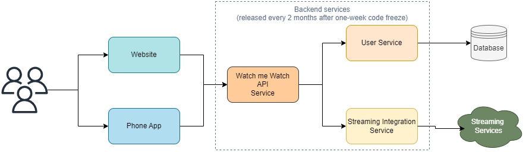

# Easy delivery with version control

In the previous sections we learned about the CI part of the CD pipelines where we were focusing on getting the software in a releasable state at all times using gates.

Now, we will concentrate on the transformation tasks that are used after the continuous integration has happened to build, deploy, and release your code.

## Example scenario

The WmW company has grown from a small number of employees to having more than 50. As the company has grown the engineers have become nervous about the deployments as they're afraid that newer deployments can take the system down, so they have decided to slow them down, and release the services during only specific windows (once every two months).

For a week before a release, the codebase is frozen, and no new changes can go in:

These practices don't seem to alleviate the nervousness around the new deployments, and what's worse, features are taking too long to get into production.

## The DORA metrics

The [DORA metrics](https://www.devops-research.com/research.html) are for key metrics that measure the performance of a software team:

+ Velocity
  + Deployment frequency
  + Lead time for changes

+ Stability
  + Time to restore service
  + Change failure rate

