# Azure Fundamentals
> notes from https://learn.microsoft.com/en-us/credentials/certifications/azure-fundamentals/

Azure Fundamentals is a three-part series that focus on basic cloud concepts, and provides a streamlined overview of the the basic Azure services.

It's a prerequisite for the Exam AZ-900: Microsoft Azure Fundamentals.

The modules are:

1. [Introduction to Cloud Infrastructure: Describe cloud concepts](https://learn.microsoft.com/en-us/training/paths/microsoft-azure-fundamentals-describe-cloud-concepts/)


2. [Introduction to Cloud Infrastructure: Describe Azure architecture and services](https://learn.microsoft.com/en-us/training/paths/azure-fundamentals-describe-azure-architecture-services/)


3. [Introduction to Cloud Infrastructure: Describe Azure management and governance](https://learn.microsoft.com/en-us/training/paths/describe-azure-management-governance/)


4. [Azure Fundamentals Certification](https://learn.microsoft.com/en-us/credentials/certifications/azure-fundamentals/)


Below, you will find notes from each of the modules.

## 0: Sign-up to Azure

Follow the steps from https://azure.microsoft.com/en-us/pricing/purchase-options/azure-account?cid=msft_learn

## 1A: Describe Cloud Computing
> https://learn.microsoft.com/en-us/training/modules/describe-cloud-compute/

### Key topics

+ Define cloud computing.
+ Describe the shared responsibility model.
+ Define cloud models: public, private, hybrid, multi-cloud...
+ Identify appropriate use case for each cloud model.
+ Describe the consumption-based model.
+ Compare cloud pricing models.


### Intro to cloud computing

Cloud computing is the delivery of computing services (VMs, storage, databases, networking, ML, IoT, AI...) over the internet.

Because cloud computing uses the internet to deliver these services, you are not constrained by physical infrastructure the same way that a traditional datacenter is (as you don't need to physically build it).

### The shared responsibility model

In the cloud, responsibilities are shared between the cloud provider (Azure) and the consumer (you):

+ Physical security, power, cooling, and network connectivity are the responsibility of the cloud provider.

+ The consumer is responsible for the data and information stored in the cloud. The consumer is also responsible for access security (giving access only to those who need it).

The shared responsibility model is heavily tied to the cloud service types you use: in IaaS most of the responsibilities are placed on the consumer, while in SaaS, most of the responsibilies are with the cloud provider.

In general, when using a cloud provider, you'll always be responsible for:
+ The information and data stored in the cloud
+ Devices that are allowed to connect to your cloud (cell phones, computers, and so on)
+ The accounts and identities of the people, services, and devices within your organization

The cloud provider is always responsible for:
+ The physical datacenter
+ The physical network
+ The physical hosts

Your service model will determine whose responsible in other areas such as:
+ Operating systems
+ Network controls
+ Applications
+ Identity and infrastructure

### Cloud models

The cloud models define the deployment type of cloud resources: private, public, and hybrid.

#### Private cloud

A private cloud is a cloud (delivering IT services over the internet) that is used by a single entity. It's the natural evolution from a corporate datacenter.

It provides much greater control for the company and its IT department, but comes with a greater cost and fewer of the benefits of a public cloud.

A private cloud may be hosted from your on site datacenter, in a dedicated datacenter offsite, or even by a 3rd party that has dedicated that datacenter to your company.

#### Public cloud

A public cloud is built, controlled, and maintained by a 3rd party cloud provider. Anyone can purchase cloud services and resources in a public cloud.

#### Hybrid cloud

A hybrid cloud is computing environment that uses both public and private clouds in an inter-connected environment. A hybrid cloud environment can be used to allow a private cloud to surge for increased, temporary demand by deploying public cloud resources.

#### Multi-cloud

In a multi-cloud scenario, you use multiple public cloud providers (i.e., different features from different cloud providers). In this scenario you need to manage resources and security in two or more public cloud providers.

#### Azure Arc

Azure Arc is a set of technologies that helps manage your cloud environment. Azure Arc can help manage your cloud environment whether it's a public cloud solely on Azure, a private cloud in your datacenter, a hybrid configuration, or even a multi-cloud environment running on multiple cloud providers at once.

#### Azure VMware Solution

Azure VMware Solution lets you run your VMware workloads in Azure with seamless integration and scalability.

### The consumption-based model

When comparing IT infrastructure models, there are two types of expenses to consider:

+ **Capital expenditure (CapEx)**: a (typically) one-time, up-front expenditure to purchase or secure tangible resources. Examples: A new building, repaving a parking lot, building a datacenter, or buying a company vehicle.

+ **Operational expenditure (OpEx)**: spending money on services or products over time. Examples: Renting a convention center, leasing a company vehicle, signing-up for cloud services.

Cloud computing is OpEx because cloud computing operates on a consumption-based model: you don't pay for electricity, security, physical infrastructure (building). Instead, you pay for the IT resources you use (if you don't use them, you don't pay for them).

The benefits of the consumption based model are:
+ No upfront costs.
+ No need to purchase and manage costly infrastructuer that users might not use to its fullest potential.
+ The ability to pay for more resources when they're needed.
+ The ability to stop paying for resources that are no longer needed.

The drawbacks of the traditional (pre-cloud) approach were:
+ you had to estimate your present and future resource needs.

+ If you overestimate, you will be wasting money.

+ If you underestimate, you will quickly reach capacity and your applications will suffer from decreased performance.

+ Fixing an under-provisioned datacenter can take a long time.

#### Compare cloud pricing models

Cloud computing is the delivery of computing services over the internet by using a pay-as-you-go pricing model.

Thanks to the pay-as-you-go pricing model you will be able to:

+ Plan and manage your operating costs.

+ Run your infrastructure more efficiently.

+ Scale as your business needs change.

### You know you've mastered this chapter when ...

+ You can define what is cloud computing (delivery of computing services over the internet, typically using a pay-as-you-go model).

+ You understand the **shared responsibility model**:
  + Cloud provider is responsible for physical security, power, cooling, network connectivity.
  + Consumer is responsible for:
    + The data and information in the cloud
    + Devices that are allowed to connect to your cloud
    + Accounts and identities of the people, services, and devices within your org
  + Cloud provider or Consumer might be responsible for (depending on the service model):
    + OS
    + Network controls
    + Applications
    + Identity and infrastructure

+ You can define the different cloud models: private, public, and hybrid.

+ You understand the multi-cloud scenario.

+ You know about Azure Arc and Azure VMware.

+ You can define, differentiate, and provide examples on CapEx and OpEx:
  + CapEx is (typically) a one-time, up-front expenditure to purchase or secure tangible resources.
  + OpEx is spending money on services or product over time.

+ You understand that cloud computing is mostly OpEx, as it operates on a consumption-based model, in which you only pay for the resources you use.

+ You can describe the benefits of the consumption-based approach vs. the traditional (pre-cloud) approach.

## 1B: The benefits of using cloud services
> https://learn.microsoft.com/en-us/training/modules/describe-benefits-use-cloud-services/

### Key topics

+ Benefits of high availability (HA) and scalability in the cloud.

+ Benefits of reliability and predictability in the cloud.

+ Benefits of security and governance in the cloud.

+ Benefits of manageability in the cloud.


### Benefits of HA and scalability in the cloud

Two of the biggest considerations when building or deploying a cloud application are:

+ uptime (or availability)
+ ability to handle demand (or scale)


#### High availability (HA)

High availability focuses on ensuring maximum availability, regardless of disruptions or events that may occur.

When you're designing a solution, you'll need to account for service availability guarantees. Azure is a highly available cloud environment with uptime guarantees depending on the service. These guarantees are part of the service-level agreements (SLAs).

An SLA is a standard industry term that serves as a formal agreement between the service provider and the customer that guarantees the customer a stated level of service.

Azure SLA are represented as a percentage of availability (also known as uptime).

SLAs of 99%, 99.9%, 99.95%, and 99.99% (and more) are available (depending on the service).

Please note:

+ 99% SLA percentage means it can be unavailable for up to 1.6 hours per week/7.2 hrs/month.

+ 99.9% SLA percentage means it can be unavailable for up to 10 mins per week/43.2 mins/month.

Highly available services come at an extra cost, with each Azure service having its own SLA.

| NOTE: |
| :---- |
| Resiliency is the ability of a system to recover quickly and continue operating after a failure, disruption, or unexpected event. Resiliency is not the same as availability, but resiliency supports availability. |

#### Scalability

Scalability refers to the ability to adjust resources to meet demand.

The ability to scale means you can add more resources to handle the increased demand.

Conversely, if demand drops off, you can reduce your resources and your costs (as the cloud uses a consumption-based model).

There are two varieties of scalability:

+ vertical scaling: increasing or decreasing the capabilities of specific resources (as in adding more CPU or RAM).

+ horizontal scaling: adding or subtracting the number of resources.

### Reliability and predictability in the cloud

#### Reliability

Reliability is the ability of a system to recover from failures and continue to function. It's a pillar of the Microsoft Azure Well-Architected Framework.

The cloud is decentralized by design, and naturally supports a reliable and resilient infrastructure. You can have your resources deployed in regions around the world so that if a region has a failure, other regions will still be up and running.

In some cases, the cloud services will automatically shift to a different region automatically.

#### Predictability

Predictability in the cloud can be focused on performance or cost predictability. Both are influenced by the Microsoft Azure Well-Architected Framework.

+ Performance predictability focuses on predicting the resources you need to deliver a positive experience for your customers (e.g., using autoscaling, load balancing, and high availability).

+ Cost predictability focuses on forecasting the cost of the cloud spend. Within the cloud, you can track your resource use in real time to ensure you're using them in the most efficient way.

### Security and Governance in the cloud

Cloud features support governance and compliance in different ways:

+ You can use templates to ensure all your deployed resources meet corporate standards and regulatory requirements.

+ Cloud-based auditing helps flag resources that are out of compliance with your standards and provide mitigation strategies.

+ if using IaaS, you will be able to manage the OS and installed software.

+ Cloud providers are well suited to handle DDoS attacks, making your network more robust and secure.

### Manageability in the cloud

#### Manageability of the cloud

Management of the cloud focuses in managing your cloud resources:
+ automatically scaling resources based on needs.
+ deploy resources based on a preconfigured template, removing the need for manual configuration.
+ monitor the health of resources and automatically replace failing resources.
+ receive automatic alerts based on configured metrics, so you're aware of performance in real time.

#### Management in the cloud

Management in the cloud is about how you're able to manage your cloud environment and resources:

+ through a web portal
+ using a command line interfaces
+ using APIs
+ using PowerShell

### You know you've mastered this chapter when ...

+ You understand that the biggest considerations when building or deploying cloud apps are uptime (or availablity) and scalability (ability to handle demand).

+ You can define high availability (HA) as the capability to ensure maximum uptime/availability, regardless of disruptions or events that may occur.

+ You can define resiliency as the ability of a system to recover quickly and continue operating after a failure, disruption, or unexpected event, and understand that resiliency is not the same as availability, but resiliency supports availability.

+ You can define SLA: an industry term that serves as a formal agreement between the service provider and the customer that guarantees the customer a stated level of service. It is a service availability guarantee.

+ You know that SLAs are represented as percentages of availability:
  + 99%: it can be unavailable for up to 1.6 hours/week, 7.2 hours/mo
  + 99.9%: it can be unavailable for up to 10 mins/week, 43.2 mins/mo

+ You understand that highly available services come at a cost.

+ You can define scalability as the ability to adjust resources to meet demand, and you understand both vertical and horizontal scaling techniques.

+ You can define reliability as the ability of a system to recover from failures and continue to function.

+ You are aware that there's a set of Azure architectural best practices known as Microsoft Azure Well-Architected Framework.

+ You're aware that resiliency and reliability in the cloud is supported by its decentralized design based on different regions.

+ You're aware that cloud features support security governance and compliance in different ways (using of golden templates, services that help flag resources out of compliance, and services that automatically handle DDoS and other attacks).

+ You're aware that manageability in the cloud can be looked at from two different perspectives:
  + management of the cloud: capabilities that enable scaling, automatic deployment, health/performance monitoring, alerts, ...
  + management in the cloud: the different ways in which you can manage your resources: web portal, CLIs, APIs, ...

## 1C: Cloud service types
> https://learn.microsoft.com/en-us/training/modules/describe-cloud-service-types/


### Key Topics

+ Describe IaaS
+ Describe PaaS
+ Describe SaaS

### Infrastructure as a Service (IaaS)

In IaaS, the cloud provider is responsible for maintaining the hardware, network (connectivity), and physical security. You're responsible for everything else: OS installation, configuration, and maintenance; network configuration; database and storage configuration...

#### Shared responsibility model when using IaaS

IaaS places the largest share of responsibility with you. The cloud provider is responsible for maintaining the physical infrastructure and its access to the internet. You're responsible for installation and configuration, patching and updates, and security.

| Responsibility               | Azure | Customer |
| :--------------------------- | :---- | :------- |
| Information and data         | ❌   | ✅       |
| Devices (mobile/PCs)         | ❌   | ✅       |
| Accounts and identities      | ❌   | ✅       |
| Identity and directory infra | ❌   | ✅       |
| Applications                 | ❌   | ✅       |
| Network controls             | ❌   | ✅       |
| Operating system             | ❌   | ✅       |
| Physical hosts               | ✅   | ❌       |
| Physical network             | ✅   | ❌       |
| Physical datacenter          | ✅   | ❌       |

#### Scenarios

+ lift-and-shift migrations, in which you're setting up cloud resources that mimic the ones you had in your on-prem datacenter.

+ testing and development, where you can establish configurations and test environments that can be easily replicated.

### Platform as a Service (PaaS)

In a PaaS environment, the cloud provider maintains the physical infrastructure, physical security, and connection to the internet. They also maintain the operating systems, middleware, development tools, and business intelligence services that make up a cloud solution. When using a PaaS you don't have to worry about the licensing or patching for OS and DBs.

#### Shared responsibility model when using PaaS

When using the PaaS model, you or the cloud provider may be responsible for the networking settings and connectivity within your cloud environment, network and application security and the directory infrastructure.

| Responsibility               | Azure | Customer |
| :--------------------------- | :---- | :------- |
| Information and data         | ❌   | ✅       |
| Devices (mobile/PCs)         | ❌   | ✅       |
| Accounts and identities      | ❌   | ✅       |
| Identity and directory infra | ✅   | ✅       |
| Applications                 | ✅   | ✅       |
| Network controls             | ✅   | ✅       |
| Operating system             | ✅   | ❌       |
| Physical hosts               | ✅   | ❌       |
| Physical network             | ✅   | ❌       |
| Physical datacenter          | ✅   | ❌       |

#### Scenarios

+ Development framework: PaaS provides a framework that developers can build upon to develop or customize cloud-based applications.

+ Analytics or business intelligence: tools provided as a service with PaaS allow organizations to analyze and mine their data, finding insights and patterns, and predicting outcomes to improve forecasting, product design decisions, investment returns, and other business decisions.

### Software as a Service (SaaS)

With SaaS, you're essentially renting or using a fully developed application. Email, financial software, messaging, etc. are examples of SaaS.

#### Shared responsibility model when using SaaS

SaaS is the least flexible, and the easiest to get up and running. It also places the most responsibility with the cloud provider:

| Responsibility               | Azure | Customer |
| :--------------------------- | :---- | :------- |
| Information and data         | ❌   | ✅       |
| Devices (mobile/PCs)         | ❌   | ✅       |
| Accounts and identities      | ❌   | ✅       |
| Identity and directory infra | ✅   | ✅       |
| Applications                 | ✅   | ❌       |
| Network controls             | ✅   | ❌       |
| Operating system             | ✅   | ❌       |
| Physical hosts               | ✅   | ❌       |
| Physical network             | ✅   | ❌       |
| Physical datacenter          | ✅   | ❌       |

#### Scenarios

+ Email or messaging applications
+ Business productivity applications
+ Finance and expense tracking

### You know you've mastered this chapter when ...

+ You can define the IaaS model, in which the cloud provider is responsible for maintaining the hardware, the network (connectivity), and physical security and the customer is responsible for everything else: OS installation, configuration, and maintenance; network configuration; database and storage configuration, ...

+ You can define the PaaS model, in which the cloud provider maintains the physical infrastructures, physical security, and connectivity to the internet, as well as the operating systems, middleware, dev tools, and business intelligence services that make up the cloud solution, also relieving the customer from worrying about the licensing and patching for OS and DBs.

+ You can define SaaS model, in which the customer rents or uses a fully developed app.

+ You can identify the ten dimensions that are relevant for the shared responsibility model, and can classify for IaaS, PaaS, and SaaS, which ones fall into the cloud or customer's hands. Namely:


## 2A: Core architectural components of Azure
> https://learn.microsoft.com/en-us/training/modules/describe-core-architectural-components-of-azure/


### Key Topics

+ Azure regions, region pairs, sovereign regions
+ Availability zones
+ Azure datacenters
+ Azure resources and resource groups
+ Azure Subscriptions
+ Management groups
+ Hierarchy of resource groups, subscriptions, and management groups

### What is Microsoft Azure

Azure is Microsoft's cloud computing platform. Azure supports IaaS, PaaS, and SaaS computing. Most of Azure services are pay-as-you-go.

A few of the most popular services are:

+ Virtual Machines

+ Cloud based storage

+ Azure's app services provide a scalable hosting platform to create web based applications. It facilitates deployment, operability, and scalability.

+ Azure functions you can create event-driver serverless applications.

+ Azure Container Instances and Azure Kubernetes Service allow you to deploy containerized applications with fully managed services.

+ Fully managed relational and in-memory databases supporting many commercial and OSS engines.

+ Azure Cosmos DB provides support for NoSQL databases.

+ Azure AI and ML services empower developers and data scientist with a wide range of productive experiences for building, training, deploying ML models faster.

Azure's regional data centers allow you to distribute your applications globally so that you locate your data and apps where they're needed most, thereby improving your application performance for your users.

Azure portal lets you create, configure, and control all your services and resources from a single, easy to use web-based interface.

Azure provides more than 100 services that enable many types of approaches: from running existing apps on VMs to exploring new software paradigms.


### Getting started with Azure accounts

To create Azure services, you need an **Azure subscription**.

When you're working with your own applications and business needs you need to create an **Azure account**, and a subscription will be created for your.

After you've created an Azure account, you'll be able to create additional subscriptions.

For example, your company might use a single Azure account for your business, and separate subscriptions for development, marketing, and sales departments.

After you've created an Azure subscription, you can start creating Azure resources with each subscription.


### Creating an Azure account

You create an account by signing up on the Azure website or through a Microsoft representative.

Once you have an active Azure account, you may want to create additional subscriptions for resource or billing management purposes.

If you have multiple subscriptions you can organize them into invoice sections, with each invoice section being a line item on the invoice that shows the changes incurred that month. You can also set up multiple invoices within the same billing account by using billing profiles.

Each billing profile have its own monthly invoice and payment method.

Once your account is active, and billing is set up you're ready to start using Azure.

As a part of your subscription you have 24x7 access to documentation, community support, and new Azure capabilities videos created by Azure engineers.

The free account includes:

+ Free access to popular Azure products for 12 months.
+ A $200 credit to use for the first 30 days.
+ Access to more than 25 products that are always free.

There is also a free student account:
+ Free access to certain Azure services for 12 months.
+ A credit to use for the first 12 months.
+ Free access to certain software developer tools.

Most of the exercises in the introduction to Azure learning paths and modules rely on a "bring your own subscription" (BYOS).

### Exercise: Interacting with Azure

You can interact with Azure in different ways, including through the web portal or using the Azure command-line interface (CLI) with PowerShell or Bash commands.

#### Azure portal

The Azure portal provides a GUI to interact with Azure services.

Once you're logged into the portal, you can navigate around Azure using the interface, or using the CLI.

The Azure portal is available at https://portal.azure.com

#### The CLI

You can use the CLI from within the Azure portal by clicking on the Cloud Shell icon.


Then, you can change between PowerShell and Bash by using the icons in the section of the screen that is opened at the bottom of the screen:

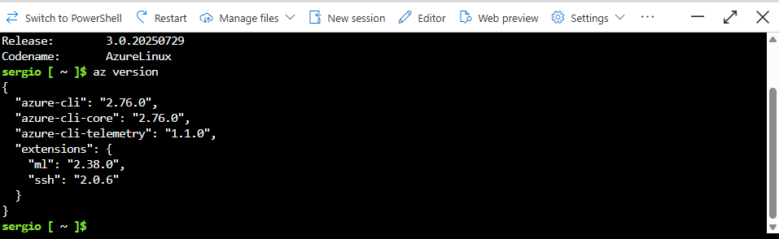


Azure CLI features an interactive mode that is activated with `az interactive` command. Interactive mode provides autocompletion, command descriptions, and examples.

In this mode you can use the arrow keys or tab to complete the commands. When running on interactive mode, you don't need to prefix your commands with `az`.

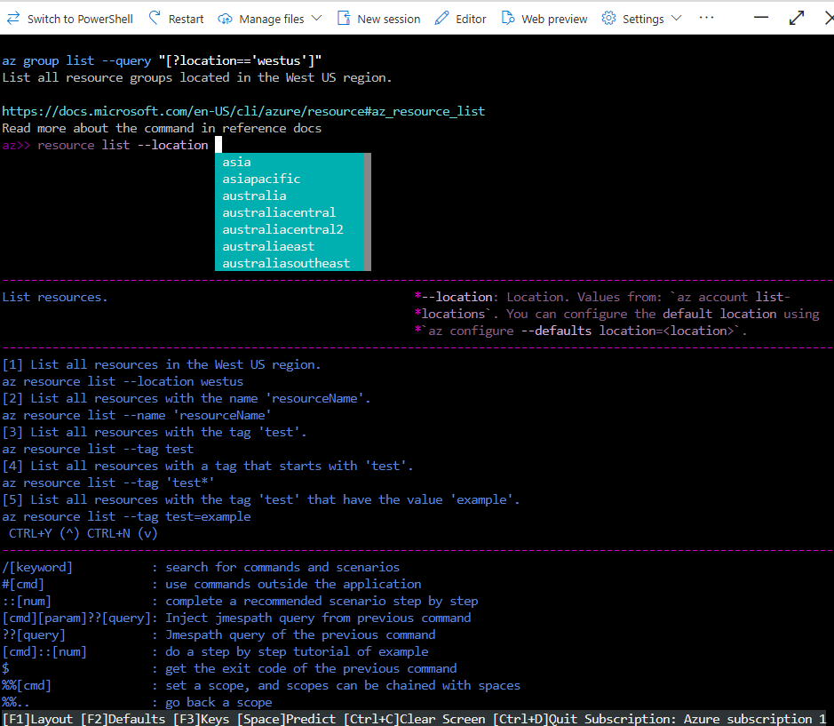

You can type `exit` to exit the interactive mode.

### Azure physical infrastructure

This section focuses on the core architectural components of Azure. These can be broken down into two main groupings: the physical infrastructure, and the management infrastructure.

#### Physical infrastructure

The physical infrastructure for Azure starts with datacenters. They're facilities with resources arranged in racks, with dedicated power, cooling, and networking infrastructure.

Azure has datacenters around the world. However, these individual datacenters aren't directly accessible.

Datacenters are grouped into Azure Regions or Azure Availability Zones that are designed to help you achieve resiliency and reliability for your business-critical workloads.

You can explore the underlying Azure infrastructure here: https://datacenters.microsoft.com/

From there you can navigate to useful pages such as https://azure.microsoft.com/en-us/explore/global-infrastructure/products-by-region/.


##### Azure regions

An Azure region is a geographical area on the planet that contains at least one, but potentially multiple datacenters that are nearby and networked together with a low-latency network.

Azure intelligently assigns and controls the resources within each region to ensure workloads are appropriately balanced.

When you deploy a resource in Azure, you'll often need to choose the region where you want your resource deployed.

| NOTE: |
| :---- |
| Some services or VM features are only available in certain regions. There are also some global Azure services that don't require you to select a particular region (e.g., Entra ID, Azure Traffic Manager, Azure DNS, ...). |


##### Availability Zones

Availability zones are physically separate datacenters within an Azure region. Each availability zone is made up of one or more datacenters equipped with independent power, cooling, and networking.

An availability zone is set up to be an isolation boundary. If one availability zone goes down, the other continues working.

Availability zones are connected through high-speed, private fiber-optic networks.

To ensure resiliency, a minimum of three separate availability zones are present in all availability zone-enabled regions. However, not all Azure regions currently support availability zones.


###### Using availability zones in your apps

You want to ensure your services and data are redundant so you can protect your information in case of failure.

When you host your infrastructure on an on-prem datacenter, setting up your own redundancy requires that you create duplicate hardware environment. In Azure, you can help make your app highly available through availability zones.

The idea is to co-locate your compute, storage, networking, and data resources within an availability zone and replicate it in other availability zone within the selected Azure region. That way you will be building high-availability features into your application architecture.

| NOTE: |
| :---- |
| Using multiple availability zones to run your mission-critical apps will increase your cost as you will be duplicating your services and you will have to consider the costs of transferring data between availability zones. |

Availability zones are primarily used for VMs, managed disks, load balancers, and SQL databases. Azure services that support availability zones fall into three categories:

+ Zonal services: you pin the resource to a specific zone (e.g., VMs, managed disks, IP addresses).

+ Zone-redundant services: the platform replicates automatically across zones (e.g., zone-redundant storage, SQL database).

+ Non-regional services: services that are always available from Azure geographies and are resilient to zone-wide outages and region-wide outages.

##### Region pairs

Even with the additional resiliency that availability zones provide, an incident impacting multiple availability zones in a single region could impact your app.

If your app requires further resilience, you can use Region pairs.

Most Azure regions are paired with another region within the same geography (at least 300 miles away). This approach allows for replication of resources across a geography and helps mitigate the likelihood of interruptions because of events such as natural disasters, civil unrest, power outages, or physical network outages that affect an entire region. When using Azure region pairs, if a region was affected by a natural disaster, services would automatically fail over to the other region in its region pair.

| NOTE: |
| :---- |
| Not all Azure services automatically replicate data or automatically fall back from a failed region to cross-replicated to another enabled region. In these scenarios, recovery and replication must be configured by you. |

Examples of region pairs in Azure are West US which is paired with East US.


Additional advantages of region pairs are:

+ If an extensive Azure outage occurs, one region out of every pair is prioritized to make sure at least one is restored as quickly as possible for apps hosted in that region pair.

+ Planned Azure updates are rolled out to paired regions one region at a time to minimize downtime and risk of app outage.

+ Data continues to reside within the same geography (except for Brazil South) for compliance/legal purposes.

##### Sovereign regions

Azure also has sovereign regions which are instances of Azure that are isolated from the main instance of Azure for compliance/legal purposes.

Azure sovereign regions include:

+ US DoD Central, US Gov Virginia, US Gov Iowa, ...: These regions are physically and logically isolated instances of Azure for US government agencies and partners. These datacenters are operated and screened by US personnel and include additional compliance certifications.

+ China East, China North, ...: Regions available through a partnership between MSFT and 21Vianet, where MSFT doesn't directly maintain the datacenters.

### Azure management infrastructure

The management infrastructure includes accounts, subscriptions, resource groups, and resources.


#### Azure resources and resource groups

A resource is the basic building block of Azure. Anything you create, provision, deploy, configure, etc. is a resource (e.g., VMs, virtual networks, databases, cognitive services, etc.).

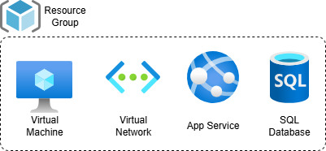


Resource groups are simply groupings of resources. When you create a resource you're required to place it into a resource group. A resource group can contain many resources, but a given resource can only be in one resource group at a time. Some resource may be moved between resource groups, but when you move a resource to a new group, it will no longer be associated with the former group. Additionally, resource groups can't be nested.

When you apply an action to a resource group, that action will apply to all the resources within the resource group (e.g., if you delete a resource group, all the resources within the resource group will be deleted; if you grant or deny access to a resource group, you've granted/denied access to all the resources with the resource group).

Before provisioning resources, it's good to think about the resource group structure that best suit your needs. For example, if you're setting up a temporary dev environment, grouping all the resources together means you can deprovision all of the associated resources at once by deleting the resource group. If you're provisioning compute resources that will need three different access permissions, it may be best to group resource based on access schemas so that you can control the permissions at the resource group level.

#### Azure subscriptions

Subscriptions are a unit of management, billing, and scale. Similar to resource groups are a way to organize resources logically, subscriptions allow you to logically organize your resource groups and facilitate billing.

Using Azure requires a subscription. A subscription provides you with authenticated and authorized access to Azure products and services. It also allows you to provision resources. An Azure subscription links to an Azure account, which is an identity in Microsoft Entra ID or in a directory that Microsoft Entra ID trusts.

An account can have multiple subscriptions, but it's only required to have one. In a multi-subscription account, you can use the subscriptions to configure different billing models and apply different access-management policies. You can use Azure subscriptions to define boundaries around Azure products, services, and resources.

There are two types of subscription boundaries you can use:

+ Billing boundary: This subscription type determines how an Azure account is billed for using Azure. You can create multiple subscriptions for different types of billing requirements. Azure generates separate billing reports and invoices for each subscription so that you can organize and manage costs.

+ Access control boundary: Azure applies access-management policies at the subscription level, and you can create separate subscriptions to reflect different organizational structures. An example is that within a business, you have different departments to which you apply distinct Azure subscription policies. This billing model allows you to manage and control access to the resources that users provision with specific subscriptions.

##### Creating additional Azure subscriptions

You can create additional subscriptions for resource or billing management purposes.

You might choose to create additional subscriptions to separate:

+ Environments: you can choose to create subscriptions to set up separate environments for development and testing, security, or to isolate data for compliance reasons. The design is particularly useful because resource access control occurs at the subscription level.

+ Organizational structures: you can create subscriptions to reflect different organizational structures. For example you could limit one team to lower-cost resources, while allowing the IT department the full range of resources. This approach allows you to manage and control access to the resources that users provision within each subscription.

+ Billing: you can create additional subscriptions for billing purposes. Because costs are first aggregated at the subscription level, you might want to create subscriptions to manage and track costs based on your needs. For instance, you might want to create one subscription for your production workloads and another subscription for your development and testing workloads.

#### Management group, subscriptions, and resource group hierarchy

You can build a flexible structure of management groups and subscriptions to organize your resources into a hierarchy for unified policy and access management.

The following diagram is an example of creating a hierarchy for governance by using management groups.


Some examples of how you can use management groups are:

+ Create a hierarchy that applies a policy. You could limit VM locations to the US West Region in a group called Production. This policy will be inherited by all the subscriptions that are descendants of that management group and will apply to all VMs under those subscriptions. This security policy can't be altered by the resource or subscription owner, which allows for improved governance.

+ Provide user access to multiple subscriptions. By moving multiple subscriptions under a management group, you create one Azure RBAC assignment on the management group, which will make all the sub-management groups, subscriptions, resource groups, and resources underneath to inherit those permissions. That way, you don't have to script Azure RBAC definitions over different subscriptions.

Note that:

+ 10,000 management groups can be supported in a single directory.
+ A management group tree can support up to six levels of depth. This limit doesn't include the root or subscription level.
+ Each management group and subscription can support a single parent.


### Exercise: Create an Azure resource

1. Create a VM
2. Validate it has been created by going to Resource Groups page

### You know you've mastered this chapter when ...

+ You can define what's Azure and the computing models (IaaS, PaaS, SaaS) it supports, and are aware that most of Azure's services are pay-as-you-go.

+ You can enumerate a few of the most popular Azure services: VMs, Cloud based storage (Azure Storage Accounts), Azure App Services, Azure Functions (Azure Function Apps), Relational and in-memory databases, Azure Cosmos DB, Azure AI and ML services.

+ You can define the Azure Portal as a single, web-based interface that lets you create, control, and configure all your services and resources.

+ You understand that when sign up on Azure your first need an Azure account, and that when you create your account, an Azure subscription will be created for you.

+ You're aware that after your first subscription is created, you can create additional for resource organization or billing management purposes.

+ You're familiar with the following hierarchy:


+ You're aware that when you have multiple subscriptions, you can organize them into invoice sections in your billing. You're aware that you can set up multiple invoices within the same billing account by using billing profiles, with each billing profile having its own monthly invoice and payment method.

+ You're aware of the characteristics of the Azure free acount giving free access to popular Azure products for 12 months, $200 credit for the first 30 days, and access to 25+ products that are always free. You're also aware of the free student account.

+ You understand that Azure architectural components can be classified into: physical infrastructure and management infrastructure:
  + Physical infrastructure:
    + You understand that physical infrastructure consists of datacenters around the world that are not directly accessible.
    + You know that datacenters are grouped into Azure Regions or Azure Availability Zones.
    + You can define an Azure Region as a geographical area on the planet that contains at least one, but potentially multiple datacenters that are nearby and neworked together with low-latency network. You understand that you'll often need to choose the region where you want your resource to be deployed, while some other services are global and on't require region selection (Entra ID, Azure DNS, Azure Traffic Manager, ...).
    + You can define an Availability Zone as a physically separate datacenter within an Azure region, with each datacenter equipped with independent power, cooling, and networking.
    + You're aware that Availability Zone-enabled regions have a minimum of three Availability Zones to ensure resiliency, but that not all Azure regions are Availability zone enabled.
    + You understand that Availability Zones are instrumental to provide redundancy and ensure your apps and info are protected in case of failure: you typically co-locate compute, storage, networking, and data resources in an availability zone and replicate it in other availability zone within the same Azure region.
    + You're aware that there are three types of Azure services:
      + Zonal services: when a resource is pinned to a specific zone (e.g., VM).
      + Zone-redundant services: when the platform replicates automatically across zones (e.g., SQL database, zone-redundant storage).
      + Non-regional services: services that are always available and resilient to zone-wide outages/region-wide outages.
    + You're aware of the concept of region pairs: Azure regions that are paired with other Azure regions to enable resiliency when an incident impacts multiple availability zones in a single region.
    + You're aware of Azure sovereign regions isolated from the other Azure infrastructure for compliance/legal purposes (e.g., US DoD, China regions,...)

  + Management infrastructure:
    + You're aware of the management infrastructure hierarchy: account, subscription, resource groups, resources.
    + You can define a resource as the basic building block of Azure (anything you create, provision, configure, deploy, etc. is a resource).
    + You can define a resource group a a grouping of resources. You know that a resource needs to be placed into a resource group, that a resource group can contain many resources but that a given resource can only be placed into one resource group at a time, and that resource groups can't be nested.
    + You understand that resource groups are instrumental for management activities as actions to a resource group will apply to all the resources within that resource group.
    + You can define an Azure subscription as a unit of management, billing, and scale that lets you logically organize your resource groups and facilitate billing. You understand that an Azure subscription provides you with authenticated and authorized access to Azure products and services, and that resources are provisioned into subscriptions.
    + You understand that an Azure subscription links to an Azure account, which is an identity in Microsoft Entra ID (or an identity in a directory Microsoft Entra ID trusts).
    + You understand that an Azure account can have multiple subscriptions it's only required to have one. You're aware that when you have multiple subscriptions you can use them to configure different billing (Azure generates separate billing reports and invoices per subscription) or establish different access control boundaries (Azure applies access-management policies at the subscription level).
    + You understand that you can create additional subscriptions to model different computing environments, different org structures, or different billing strategies.
    + You're familiar with the concept of management groups to organize subscriptions. You know that you can use management groups to create a hierarchy that applies certain policies (e.g., limit VM placement by setting a policy at the management group level, thus making all the descendant subscriptions inheriting it), or to provide user access to multiple subscriptions in an easier way.
    + You know about the management groups limits: 10,000 management groups in a single directory, with the tree supporting up to six levels of depth (not counting the root or subscription level), with wach management group and subscription supporting a single parent.


## 2B: Azure Compute and networking services
> https://learn.microsoft.com/en-us/training/modules/describe-azure-compute-networking-services/

### Key topics

+ Compare compute types, including container instances, VMs, and Azure Functions.
+ Describe VM options, including VMs, VM scale sets, VM availability sets, and Azure Virtual Desktop.
+ Describe resources required for VMs.
+ Describe application hosting options, including Azure Web Apps, containers, and VMs.
+ Describe virtual networking, including the purpose of Azure virtual networks, Azure virtual subnets, peering, Azure DNS, VPN Gateway, and ExpressRoute.
+ Define public and private endpoints.

### Azure virtual machines

Azure Virtual Machines provide IaaS in the form of virtualized servers in Azure.

This service is an ideal choice when you need:
+ Total control over the OS.
+ The ability to run custom software.
+ Use custom hosting configurations.

Because it's an IaaS offering, you need to configure, update, and maintain the software that runs on the VM.

When using Azure VMs you can create or use an already created image to rapidly provision VMs.

An image is a template used to create a VM and may already include an OS and other software, like development tools or web hosting environments.

### Scale VMs in Azure

You can run single VMs for testing, development, or other minor tasks. You can also group VMs together to provide high availability, scalability, and redundancy. Azure can also manage the grouping of VMs for you with features such as scale sets and availability sets.

#### Virtual machine scale sets

Virtual machine scale sets let you create and manage a group of identical, load-balanced VMs.

Virtual machine scale sets allow you to centrally manage, configure, and update a large number of VMs in minutes. The number of VM instances can automatically increase or decrease in response to demand, or you can set it to scale based on a defined schedule.

Virtual machine scale sets also automatically deploy a load balancer to make sure that your resources are being used efficiently. They are ideal for building large-scale services for compute, big-data, and container workloads.

#### Virtual machine availability sets

Virtual machine availability sets are designed to ensure that VMs stagger updates and have varied power and network connectivity, preventing you from losing all your VMs with a single network or power failure.

Availability sets accomplish these objectives by grouping VMs in two ways: update domain and fault domain.

+ **Update domain**: The update domain groups VMs that can be rebooted at the same time. This setup allows you to apply updates while knowing that only one update domain grouping is offline at a time. All of the machines in one update domain update. An update group going through the update process is given a 30-min time to recover before maintenance on the next update domain starts.

+ **Fault domain**: The fault domain groups your VMs by common power source and network switch. By default, an availability set splits your VMs across up to three fault domains. This helps protect against physical power or networking failure by having VMs in different fault domains (thus being connected to different power and networking resources).

There's no additional cost for configuring an availability set &mdash; you only pay for the VM instances you create.

### Example of when to use VMs

+ During testing and development: as you can easily set up and delete environments when you no longer need them.
+ When running applications in the cloud: as you will be able to handle fluctuations in demand.
+ When extending your datacenter to the cloud: as organizations can create a virtual network with VMs that extend an on-prem datacenter.
+ During disaster recovery: if a primary on-prem datacenter fails, you can create VMs running on Azure to run your critical apps and then shut them down once your primary datacenter becomes operational again.

### Move to the cloud with VMs

VMs are an excellent choice when you're moving a physical server to the cloud (lift and shift). You can create an image of the physical server and host it with a VM with little or no changes.

### VM Resources

When you provision a VM, you'll have to pick (among other):
+ Size: purpose, number of processor cores, amount of RAM
+ Storage disks: HDD, SDD, etc.
+ Networking: virtual network, public IP address, port configuration

### Exercise: Create an Azure VM and install Nginx

#### Task 1: Create a resource group

Log into Azure, open a Cloud shell and create a resource group named `IntroAzureRG` in a region.

| NOTE: |
| :---- |
| The following example uses `northeurope` region instead of `eastus` region, as there are more VM availability. |

```bash
# group create: creates a new resource group
az group create --name IntroAzureRG --location northeurope
{
  "id": "/subscriptions/2a2998a8-86aa-460e-9088-9a307441c7d5/resourceGroups/IntroAzureRG",
  "location": "eastus",
  "managedBy": null,
  "name": "IntroAzureRG",
  "properties": {
    "provisioningState": "Succeeded"
  },
  "tags": null,
  "type": "Microsoft.Resources/resourceGroups"
}
```

#### Task 2: Create a Linux VM

In the same shell type:

| NOTE: |
| :---- |
| The VM size has changed from `Standard_D2s_v5` to `Standard_B1s` because of limitations with the free account. |

```bash
az vm create \
  --resource-group "IntroAzureRG" \
  --name my-vm \
  --size Standard_B1s \
  --public-ip-sku Standard \
  --image Ubuntu2204 \
  --admin-username azureuser \
  --generate-ssh-keys
{
  "fqdns": "",
  "id": "/subscriptions/2a2998a8-86aa-460e-9088-9a307441c7d5/resourceGroups/IntroAzureRG/providers/Microsoft.Compute/virtualMachines/my-vm",
  "location": "northeurope",
  "macAddress": "7C-ED-8D-48-A4-02",
  "powerState": "VM running",
  "privateIpAddress": "10.0.0.4",
  "publicIpAddress": "134.149.32.166",
  "resourceGroup": "IntroAzureRG"
}
```


#### Task 3: Install Nginx

You'll use a Custom Script Extension to install Nginx. This is an easy way to download and run scripts on your Azure VMs (there are also other ways to configure your system after your VM is up and running):

```bash
az vm extension set \
  --resource-group "IntroAzureRG" \
  --vm-name my-vm \
  --name customScript \
  --publisher Microsoft.Azure.Extensions \
  --version 2.1 \
  --settings '{"fileUris":["https://raw.githubusercontent.com/MicrosoftDocs/mslearn-welcome-to-azure/master/configure-nginx.sh"]}' \
  --protected-settings '{"commandToExecute": "./configure-nginx.sh"}'
{
  "autoUpgradeMinorVersion": true,
  "id": "/subscriptions/2a2998a8-86aa-460e-9088-9a307441c7d5/resourceGroups/IntroAzureRG/providers/Microsoft.Compute/virtualMachines/my-vm/extensions/customScript",
  "location": "northeurope",
  "name": "customScript",
  "provisioningState": "Succeeded",
  "publisher": "Microsoft.Azure.Extensions",
  "resourceGroup": "IntroAzureRG",
  "settings": {
    "fileUris": [
      "https://raw.githubusercontent.com/MicrosoftDocs/mslearn-welcome-to-azure/master/configure-nginx.sh"
    ]
  },
  "type": "Microsoft.Compute/virtualMachines/extensions",
  "typeHandlerVersion": "2.1",
  "typePropertiesType": "customScript"
}
```

The command uses the Custom Script Extension to run a bash script on the VM. The script is stored in GitHub.

You can review the script [here](https://raw.githubusercontent.com/MicrosoftDocs/mslearn-welcome-to-azure/master/configure-nginx.sh):

1. Runs `apt-get update`.
2. Installs Nginx.
3. Sets the home page, `/var/www/html/index.html` to print a welcome message that includes the VM's hostname.

### Azure virtual desktop

Azure Virtual Desktop is a desktop and application virtualization service that runs on the cloud. It enables you to use a cloud-hosted version of Windows from any location. It works across devices and OS, and works with apps you can use to access remote desktops or most modern browsers.

Azure Virtual Desktop enables central management security for the user's desktop, while reducing IT management overhead. It separates OS data and apps from local hardware. That is, you separate the compute environment from user devices, so that the risk of leaking confidential information is reduced, while the user can use any device to connect with this remote environment.

The remote desktop infrastructure includes the roles that you would have to manage at scale: gateway, broker, diagnostics, load balancing, are fully managed.

All the VMs in the Windows Virtual Desktop service communicate over secure connection, and you benefit from the capacity of the cloud, being able to choose any size VM in Azure, and vary the density of users based on the workload.

#### Enhance security

Azure Virtual Desktop provides centralized security management for user's desktops with Microsoft Entra ID. You can enable multifactor authentication to secure user sign-ins. You can also secure access to data by assigning RBACs to users.

With this solution, the data and apps are separated from the local hardware. The actual desktop and apps are running in the cloud, meaning the risk of confidential data being left on a personal device is reduced. Additionally user sessions are isolated in both single and multi-session environments.

#### Multi-session Windows 10 or Windows 11 deployment

Azure Virtual Desktop lets you use Windows 10 or Windows 11 Enterprise multi-session, which enables multiple concurrent users on a single VM. It also provides a more consistent experience with broader app support when compared to Windows Server OS.

### Azure containers

Containers are an excellent choice to run multiple instances of one or multiple applications on a single host machine.

#### What are containers?

Containers are a virtualization environment. Much like running multiple VMs on a single physical host, you can run multiple containers on a single physical or virtual host.

Unlike VMs, you don't manage the OS for a container. Containers are lightweight and designed to be created, scaled out, and stopped dynamically. One of the most popular container engines is Docker, and Azure supports Docker.

#### Compare VMs to containers

VMs provide an abstraction layer for CPU, memory, and storage. With VMs, you decide the OS, install tools and packages, etc. With VMs you can only run one OS at a time &mdash; if you require to run different apps that require multiple runtime environments you will be forced to use multiple VMs. VMs are emulating a full computer and therefore, starting or taking a snapshot are slow operations.

A container bundles a single app and its dependencies, which can then be deployed as a unit to a container host. The containerization abstracts away the OS and infra requirements, allowing the containerized app to run side-by-side with other containerized apps. That is, containers virtualize the OS. You can spin up containers quickly, are you just need to wait for the containerized app to launch, rather than having to wait for the OS and the app. Also containerized apps tend to be smaller in size. Additionally, containers can be orchestrated with container cluster orchestration solutions. This will let you forget about which server will host each container.

If you need to control the full environment, you should use a VM. If not, the portability, performance, and management characteristics of the containers will be a better choice.

#### Azure Container Instances

Azure Container Instances offer the fastest and simplest way to run a container in Azure without having to manage any VM or adopt additional services. Azure Container Instances is a PaaS that allows you to upload containers and then the service runs the containers for you.

#### Azure Container Apps

Azure Container Apps is another PaaS offering that removes the container management piece. It enables you to incorporate load balancing and scaling.

#### Azure Kubernetes Service

Azure Kubernetes Service (AKS) is a container orchestration service that manages the lifecycle of containers. When you're deploying a fleet of containers, AKS can make fleet management simpler and more efficient.

#### When to use containers in your solutions

Containers are ideal when using a microservice architecture. In this paradigm, you break solutions into smaller, independent pieces. This split allows you to separate portions of your app into logical sections that can be maintained, scaled, or updated independently.

For example, you might split a website into:
+ a container hosting your front end.
+ a container hosting your back end.
+ a container hosting your storage.

If you website backend reaches capacity, but the front end and storage aren't stressed, you could scale the back-end to improve performance. Also, you could replace the storage service without impacting the other components.

### Azure Functions

Azure Functions is an event-driven, serverless compute option that doesn't require maintaining VMs or containers.

When using VMs or containers, those resources need to be running in order for your app to function. With Azure Functions, an event wakes up the function, alleviating the need to keep resources provisioned when there are no events.

#### Serverless computing in Azure

The goal of serverless computing is to help forget the maintenance tasks (OS, upgrades, patches in packages, etc.) by taking care of those tiresome types of server management tasks, so that you can focus your effort on getting your application ready for your end users.

Serverless computing doesn't mean there are no servers &mdash; it means that the responsibility of managing servers is already handled for you. It lets you focus on developer concerns rather than infra concerns.

The benefits of using serverless computing are:
1. No infrastructure management: no need to spend time on infra management activities and instead you simply deploy your code and it automatically runs with high availability.
2. Scalability: you can scale from nothing to 10,000s of request without any configuration.
3. Pay for what you use: being event-driven, you're only charged for the time it takes to run your code instead of paying for resources if they're not being used.

#### Benefits of Azure Functions

Azure Functions is an ideal solution when you're only concerned about the code running your service and not about the underlying platform or infra.

Because Functions are event driven, they are commonly used to perform work in response to an event (like a REST request), timer, or message from another Azure service, and when that work can be completed quickly, within seconds or less.

Functions scale automatically based on demand, so they are a good choice when demand is variable.

Azure Functions runs your code when it triggers and automatically deallocates resources when the function is finished. In this model, Azure only charges you for the CPU time used while your function runs.

Functions can be either be stateless or stateful. When they are stateless (the default), they behave as if they restart every time they respond to an event. When they're stateful (called Durable Functions), a context is passed through the function to track prior activity.


### Application hosting options

If you need to host your app in Azure, you might initially turn to a VM or containers. But there are other hosting options that you can use with Azure, including Azure App Service.

#### Azure App Service

Azure App Service enables you to build and host web apps, background jobs, mobile back-ends, and RESTful APIs in the programming language of your choice without managing the infrastructure.

It offers automatic scaling and HA. App Service supports Windows and Linux. It enables deployments from GitHub, Azure DevOps, or any Git repo to support the CD model.

When using Azure App Service, you focus on building and maintaining your app, and Azure focuses on keeping the environment up and running.

Azure App Service is an HTTP-based service for hosting web apps, REST APIs, and mobile back-ends. It supports multiple programming languages like Java, PHP, Python, Node.js, and frameworks such as .NET, .NET Core.

#### Types of app services

With Azure App Service you can host most common app styles like:

+ Web apps
+ API apps
+ WebJobs
+ Mobile apps

App Service handles most of the infrastructure decisions you deal with in hosting web-accessible apps:

+ Deployment and management are integrated into the platform.
+ Endpoints can be secured.
+ Sites can be scaled quickly to handle traffic loads.
+ The built-in load balancing and traffic manager provide HA.

Azure App Service are ideal for web-oriented apps.

##### Web apps

App Service includes full support for hosting web apps using ASP.NET, ASP.NET Core, Java, Ruby, Node.js, PHP, or Python.

You can choose either Windows or Linux as the host OS.

##### API apps

You can build REST-based web APIs by using your choice of language and framework. You get full Swagger support and the ability to package and publish your API in Azure Marketplace.

The produced apps can be consumed from any HTTP- or HTTPS-based client.

##### WebJobs

You can use the WebJobs feature to run a program (.exe, Java, PHP, Python, or Node.js) or script (.cmd, .bat, PowerShell, or Bash) in the same context as a web app, API app, or mobile app.

They can be scheduled or run by a trigger. WebJobs are often used to run background tasks as part of your application logic.

##### Mobile apps

With the Mobile Apps feature of App Service you can quickly build a back-end for iOS and Android apps.

You can:
+ Store mobile app data in a cloud-based SQL database.
+ Authenticate customers against common social providers, such as MSA, Google, X, and Facebook.
+ Send push notifications.
+ Execute custom back-end logic in C# or Node.js.

On the mobile app side, there's SDK support for native iOS and Android, Xamarin, and React native apps.

### Azure virtual networking

Azure virtual networks and virtual subnets enable Azure resources (VMs, web apps, databases, ...) to communicate:
+ with each other
+ with users on the internet
+ with on-premises client computers

Azure virtual networks provide the following key networking capabilities:
+ isolation and segmentation
+ internet communications
+ communication between Azure resources
+ communication with on-prem resources
+ route network traffic
+ filter network traffic
+ connect virtual networks

Azure virtual networking supports both public and private endpoints to enable communication between external or internal resources:
+ **Public endpoints** have a public IP address and can be accessed from anywhere in the world.
+ **Private endpoints** exist within a virtual network and have a private IP address from within the address space of that virtual network.

#### Isolation and segmentation

Azure virtual networks allow you to create multiple isolated virtual networks. When you set up a virtual network, you define a private IP address space by using either public or private IP address ranges. The IP range only exist within the virtual network and isn't internet routable. You can divide that IP address space into subnets and allocate part of the defined address space to each named subnet.

For name resolution, you can use the name resolution service built into Azure, or you can configure the virtual network to use either an internal or an external DNS server.

#### Internet communications

You can enable incoming connections from the internet by assigning a public IP address to an Azure resoure, or putting a resource behind a public load balancer.

#### Communication between Azure resources

You want to enable Azure resources to communicate securely with each other. You can do that in one of two ways:

+ Virtual networks can connect not only VMs but other Azure resources such as App Service Environment for Power Apps, Azure Kubernetes Service, and Azure VM scale sets.

+ Service endpoints can connect to other Azure resource types, such as Azure SQL databases and storage accounts. This approach enables you to link multiple Azure resources to virtual networks to improve security and provide optimal routing between resources.

#### Communication with on-prem resources

Azure virtual networks enable you to link resources together in your on-prem environment and within your Azure subscription.

You can create a network that spans both your local and cloud environments using either:

+ Point-to-site virtual private network connections are from a computer outside your organization back into your corporate network. The client computer initiates an encrypted VPN connection to connect to the Azure virtual network.

+ Site-to-site private networks link your on-premises VPN device or gateway to the Azure VPN gateway in a virtual network. In effect, the devices in Azure can appear as being on the local network. The connection is encrypted and works over the internet.

+ Azure ExpressRoute provides a dedicated private connectivity to Azure and doesn't travel over the internet. ExpressRoute is useful for environment where you need greater bandwidth and even higher levels of security.

#### Route network traffic

By default, Azure routes traffic between subnets on any connected virtual networks, on-prem networks, and the internet.

You also can control routing to override those settings with either:

+ Route tables allow you to define rules about how traffic should be directed. You can create custom route tables that control how packets are routed between subnets.

+ Border Gateway Protocol (BGP) works with Azure VPN gateways, Azure Route Server, or Azure ExpressRoute to propagate on-prem BGP routes to Azure virtual networks.

#### Filter network traffic

Azure virtual networks enable you to filter traffic between subnets by using the following approaches:

+ Network security groups are Azure resources that can contain multiple inbound and outbound security rules. You can define these rules to allow or block traffic, based on factors such as source and destination IP address, port, and protocol.

+ Network virtual appliances are specialized VMs that can be compared to hardened network appliances. A network virtual appliance carries out a particular network function, such as running a firewall or performing a WAN optimization.

#### Connect virtual networks

You can link virtual networks together by using virtual network peering. Peering allows two virtual networks to connect directly to each other. Network traffic between peered networks is private, and travels on the Microsoft backbone network, never entering the public internet. Peering enables resources in each virtual network to communicate with each other. These virtual networks can be in separate regions. This feature allows you to create a global interconnected network through Azure.

User-defined routes (UDR) allow you to control the routing tables between subnets within a virtual network or between virtual networks to enable greater control over network traffic flow.

### Exercise: Configure network access

This exercise, you'll create a network security group that makes the VM created in [Exercise: create an Azure VM and install Nginx](#exercise-create-an-azure-vm-and-install-nginx) accessible from the internet on port 80.

#### Task 1: Access your web server

Let's first get the IP address for your VM and attempt to access the web server's home page:

Let's first interrogate the IP address response structure of the `az vm list-ip-addresses` command:

```bash
$ az vm list-ip-addresses \
--resource-group IntroAzureRG
--name my-vm
[
  {
    "virtualMachine": {
      "name": "my-vm",
      "network": {
        "privateIpAddresses": [
          "10.0.0.4"
        ],
        "publicIpAddresses": [
          {
            "id": "/subscriptions/2a2998a8-86aa-460e-9088-9a307441c7d5/resourceGroups/IntroAzureRG/providers/Microsoft.Network/publicIPAddresses/my-vmPublicIP",
            "ipAddress": "134.149.32.166",
            "ipAllocationMethod": "Static",
            "name": "my-vmPublicIP",
            "resourceGroup": "IntroAzureRG",
            "zone": null
          }
        ]
      },
      "resourceGroup": "IntroAzureRG"
    }
  }
]
```

As you see, the command returns a JSON that includes the public IP address we're looking for in `virtualMachine.network.publicIpAddress[0].ipAddress`.

Azure CLI allows you to query the response structure. Because the response is an array, you will need to start querying using `[]`. Also, although we know the address is in the first index (index 0) of the array, it could be that there are multiple IP addresses associated to that VM, therefore it's common to use `publicIpAddresses[*]`.

Anyway, the following command will return the IP address as a JSON object:

```bash
$ az vm list-ip-addresses \
--resource-group "IntroAzureRG" \
--name my-vm \
--query "[].virtualMachine.network.publicIpAddresses[*].ipAddress"
[
  [
    "134.149.32.166"
  ]
]
```

You can use the `--output tsv` to flatten the JSON, so that you can load it into an environment variable:


```bash
IPADDRESS="$(az vm list-ip-addresses \
--resource-group "IntroAzureRG" \
--name my-vm \
--query "[].virtualMachine.network.publicIpAddresses[*].ipAddress" \
--output tsv)"
```

Right after that, you can do:

```bash
$ echo $IPADDRESS
134.149.32.166
```

Now you can check if the public IP address is accessible from the internet by running:

```bash
$ curl --connect-timeout 5 http://${IPADDRESS} --verbose
*   Trying 134.149.32.166:80...
* Connection timed out after 5002 milliseconds
* closing connection #0
curl: (28) Connection timed out after 5002 milliseconds
```

Same thing will happen if you try to hit `${IPADDRESS}` from your browser.

#### Task 2: List the current network security group rules

Now let's examine why the server isn't accesible using `az network nsg list` command. The command outputs a huge JSON with default security rules and other metadata we're not interested in &mdash; we just want the network security group name, so that we can interrogate the specific details.

Therefore, we can do:

```bash
$ az network nsg list \
  --resource-group "IntroAzureRG"
  --query '[].name'
  --output tsv
my-vmNSG
```

Now that we have the name, we can interrogate the rules defined in the `my-vmNSG` network security group using `az network nsg rule list` command:

```bash
$ az network nsg rule list \
  --resource-group "IntroAzureRG" \
  --nsg-name my-vmNSG
[
  {
    "access": "Allow",
    "destinationAddressPrefix": "*",
    "destinationAddressPrefixes": [],
    "destinationPortRange": "22",
    "destinationPortRanges": [],
    "direction": "Inbound",
    "etag": "W/\"b86e0d69-d6f9-436e-807c-85ac9dfa2d57\"",
    "id": "/subscriptions/2a2998a8-86aa-460e-9088-9a307441c7d5/resourceGroups/IntroAzureRG/providers/Microsoft.Network/networkSecurityGroups/my-vmNSG/securityRules/default-allow-ssh",
    "name": "default-allow-ssh",
    "priority": 1000,
    "protocol": "Tcp",
    "provisioningState": "Succeeded",
    "resourceGroup": "IntroAzureRG",
    "sourceAddressPrefix": "*",
    "sourceAddressPrefixes": [],
    "sourcePortRange": "*",
    "sourcePortRanges": [],
    "type": "Microsoft.Network/networkSecurityGroups/securityRules"
  }
]
```

We can format this output in a table for an easier reading:

```bash
az network nsg rule list \
  --resource-group "IntroAzureRG" \
  --nsg-name my-vmNSG \
  --query '[].{Name:name, Priority:priority, Port:destinationPortRange, Access:access}' \
  --output table
```

The command will render:

Name               Priority    Port    Access
-----------------  ----------  ------  --------
default-allow-ssh  1000        22      Allow


The only rule defined in the NSG allows inbound connections over port 22 (SSH). The priority of the rule is 1000. Rules in NSGs are processed in priority order, with lower numbers processed before higher numbers.

This explains why the Nginx installed in the VM isn't responding. We'll need to define a new rule to allow inbound connections on port 80 (HTTP).

#### Task 3: Crete the network security rule

We can use the followin `az` command to create a rule within the NSG:

```bash
$ az network nsg rule create \
  --resource-group "IntroAzureRG" \
  --nsg-name my-vmNSG \
  --name allow-http \
  --protocol tcp \
  --priority 100 \
  --destination-port-range 80 \
  --access Allow
{
  "access": "Allow",
  "destinationAddressPrefix": "*",
  "destinationAddressPrefixes": [],
  "destinationPortRange": "80",
  "destinationPortRanges": [],
  "direction": "Inbound",
  "etag": "W/\"6ce839f0-5d86-470a-beac-a9152d0abc19\"",
  "id": "/subscriptions/2a2998a8-86aa-460e-9088-9a307441c7d5/resourceGroups/IntroAzureRG/providers/Microsoft.Network/networkSecurityGroups/my-vmNSG/securityRules/allow-http",
  "name": "allow-http",
  "priority": 100,
  "protocol": "Tcp",
  "provisioningState": "Succeeded",
  "resourceGroup": "IntroAzureRG",
  "sourceAddressPrefix": "*",
  "sourceAddressPrefixes": [],
  "sourcePortRange": "*",
  "sourcePortRanges": [],
  "type": "Microsoft.Network/networkSecurityGroups/securityRules"
}
```

We've set priority to 100 to ensure it gets processed before any other rules that might interfere with this.

We can use the same table command from the previous section to query the NSG rules:

```bash
az network nsg rule list \
  --resource-group "IntroAzureRG" \
  --nsg-name my-vmNSG \
  --query '[].{Name:name, Priority:priority, Port:destinationPortRange, Access:access}' \
  --output table
```

The command will render:

Name               Priority    Port    Access
-----------------  ----------  ------  --------
default-allow-ssh  1000        22      Allow
allow-http         100         80      Allow


Now the server is configured to allow connections on port 80.

#### Task 4: Access your web server

Now we can run the `curl` command again:

```bash
$ curl --connect-timeout 5 http://${IPADDRESS} --verbose
*   Trying 134.149.32.166:80...
* Connected to 134.149.32.166 (134.149.32.166) port 80
* using HTTP/1.x
> GET / HTTP/1.1
> Host: 134.149.32.166
> User-Agent: curl/8.11.1
> Accept: */*
>
* Request completely sent off
< HTTP/1.1 200 OK
< Server: nginx/1.18.0 (Ubuntu)
< Date: Mon, 10 Nov 2025 08:24:45 GMT
< Content-Type: text/html
< Content-Length: 71
< Last-Modified: Sun, 09 Nov 2025 07:58:32 GMT
< Connection: keep-alive
< ETag: "691049a8-47"
< Accept-Ranges: bytes
<
<html><body><h2>Welcome to Azure! My name is my-vm.</h2></body></html>
* Connection #0 to host 134.149.32.166 left intact
```

And now, we can also use the browser to hit $IPADDRESS:


#### Task 5: Clean up

We won't be using the VM anymore, so we can clean everything up by simply removing the `IntroAzureRG` resource group from the portal.

Note that in the portal you will see another resource group `NetworkWatcherRG` that was created automatically. You must delete it too.

### Azure virtual private networks

A virtual private network (VPN) uses an encrypted tunnel within another network. VPNs are typically deployed to connect two or more trusted private networks to one another over an untrusted network (typically the public internet). Traffic is encrypted while traveling over the untrusted network to prevent eavesdropping or other attacks. VPNs can enable networks to safely and securely share sensitive information (over insecure channels).

#### VPN gateways

A VPN gateway is a type of virtual network gateway.

Azure VPN Gateway instances are deployed in a dedicated subnet of the virtual network and enable the following connectivity:
+ Connect on-prem datacenters to virtual networks through a site-to-site connection.
+ Connect individual devices to virtual networks through a point-to-site connection.
+ Connect virtual networks to other virtual networks through a network-to-network connection.

All data transfer is encrypted inside a private tunnel as it crosses the internet. You can deploy only one VPN gateway in each virtual network. However, you can use one gateway to connect to multiple locations (other virtual networks or on-prem datacenters).

When setting up a VPN gateway, you must specify the type of VPN (either policy-based or route-based). These two types determine how to identify which traffic needs encryption.

Regardless of the type, the authentication employed is a preshared key:

+ Policy-based VPN gateways specify statically the IP address of packets that should be encrypted through each tunnel. This type of device evaluates every data packet against those sets of IP addresses to choose the tunnel where that packet is going to be sent through.

+ Route-based VPN gateways, IPSec tunnels are modeled as a network interface or virtual tunnel interface. IP routing (either static routes or dynamic routing protocol) decides which one of these tunnel interfaces to use when sending each packet. Route-based VPNs are the preferred connection method for on-prem devices. They're more resilient to topology changes such as the creation of new subnets.

Use a route-based VPN gateway if you need any of the following types of connectivity:

+ Connections between virtual networks.
+ Point-to-site connections.
+ Multisite connections
+ Coexistence with an Azure ExpressRoute gateway

#### High-availability scenarios

If you're configuring a VPN to keep your information safe, you also want to be sure that it's highly available and fault tolerant. The following subsection describe a few ways to maximize the resiliency of your VPN gateway.

##### Active/standby

By default, VPN gateways are deployed as two instances in an active/standby configuration, even if you only see one VPN gateway resource in Azure.

When planned/unplanned maintenance disruption affects the active instance, the standby instance automatically assumes responsibility for connections without any user intervention. Connections are interrupted during this failover, but they typically restore within a few seconds for planned maintenance and within 90 seconds for unplanned disruptions.

##### Active/active

With the introduction of support for the BGP routing protocol, you can also deploy VPN gateways in active/active configuration. In this configuration, you assign a unique public IP address to each instance. You then create separate tunnels from the on-prem device to each IP address. You can extend the high availabilit by deploying an additional VPN device on-prem.

##### ExpressRoute failover

Another HA option is to configure a VPN gateways as a secure failover path for ExpressRoute connections. ExpressRoute circuits have resiliency built-in. However, they aren't immune to physical problems that affect the cables delivering connectivity or outages that affect the complete ExpressRoute location.

In HA scenarios, where there's risk associated with an outage of an ExpressRoute circuit, you can also provision a VPN gateway that uses the internet as an alternative method of connectivity. In this way, you can ensure there's always a connection to the virtual networks.

##### Zone-redundant gateways

In regions that support availability zones, VPN gateways and ExpressRoute gateways can be deployed in a zone-redundant configuration. This configurations brings resiliency, scalability, and HA to virtual network gateways. Deploying gateways in Azure availability zones physically and logically separate gateways within a region while protecting your on-prem network connectivity to Azure from zone-level failures. These gateways require different gateway stock keeping units (SKUs) and use Standard public IP addresses instead of Basic public IP addresses.

### ExpressRoute

Azure ExpressRoute lets you extend your on-prem networks into the Microsoft cloud over a private connection, with the help of a connectivity provider.

This connection is called an ExpressRoute circuit. With ExpressRoute, you can establish connections to Microsoft cloud services (e.g., Azure, Microsoft 365). This feature allows you to connect offices, datacenters, or other facilities to the Microsoft cloud. Each location would have its own ExpressRoute circuit.

Connectivity can be from an any-to-any (IP VPN) network, a point-to-point Ethernet network, or a virtual cross-connection through a connectivity provider at a colocation facility. ExpressRoute connections don't go over the public internet. This setup allows ExpressRoute connections to offer more reliability, faster speeds, consistent latencies, and higher security than typical connections over the internet.

#### Features and benefits of ExpressRoute

The benefits of using ExpressRoutes as the connection between Azure and your on-prem networks are:

+ Connectivity to Microsoft cloud services across all regions in the geopolitical region.
+ Global connectivity to Microsoft services across all regions with the ExpressRoute Global Reach.
+ Dynamic routing between your network and Microsoft via Border Gateway Protocol (BGP).
+ Built-in redundancy in every peering location for higher reliability.

##### Connectivity to Microsoft cloud services

ExpressRoute enables direct access to the following services in all regions:

+ Microsoft Office 365
+ Microsoft Dynamics 365
+ Azure compute services (e.g., Azure VMs)
+ Azure cloud services (e.g., Azure Cosmos DB and Azure Storage).


##### Global connectivity

You can enable ExpressRoute Global Reach to exchange data across your on-prem sites by connecting your ExpressRoute circuits. For example, if you had an office in Asia and a datacenter in Europe, both with ExpressRoute circuits connecting them to the Microsoft network, you could use ExpressRoute Global Reach to connect those facilities, allowing them to communicate without transferring data over the public internet.

##### Dynamic routing

ExpressRoute uses the BGP. BGP is used to exchange routes between on-prem networks and resources running in Azure. This protocol enables dynamic routing between your on-prem network and services running in the Microsoft cloud.

##### Built-in redundancy

Each connectivity provider uses redundant devices to ensure that connections established with Microsoft are HA. You can configure multiple circuits to complement this feature.

#### ExpressRoute connectivity models

ExpressRoute supports four models that you can use to connect your on-prem network to the Microsoft cloud:

+ CloudExchange colocation
+ Point-to-point Ethernet connection
+ Any-to-any connection
+ Directly from ExpressRoute sites


##### Colocation at a cloud exchange

Colocation refers to your datacenter, office, or other facility being physically colocated at a cloud exchange, such as an ISP. If your facility is colocated at a cloud exchange, you can request virtual cross-connect to the Microsoft cloud.

##### Point-to-point Ethernet connection

Point-to-point Ethernet connections refers to using a point-to-point connection to connect your facility to the Microsoft cloud.

##### Any-to-any networks

With any-to-any connectivity, you can integrate your WAN with Azure by providing connections to your offices and datacenters. Azure integrates with your WAN connection to provide a connection like you would have between your datacenter and any branch offices.

##### Directly from ExpressRoute sites

You can connect directly into the Microsoft's global network at a peering location strategically distributed across the world. ExpressRoute Direct provides dual 100 Gbps or 10 Gbps connectivity, which supports active/active connectivity at scale.

#### Security considerations

With ExpressRoute, your data doesn't travel over the public internet, reducing the risks associated with internet communications. ExpressRoute is a private connection from your on-prem infrastructure to your Azure infrastructure. Even if you have an ExpressRoute connection, DNS queries, certificate revocation list checking, and Azure CDN requests are still sent over the public internet.

### Azure DNS

Azure DNS is a hosting service for DNS domains that provides name resolution by using Azure infrastructure. By hosting your domains in Azure, you can manage your DNS records using the same credentials, APIs, tools, and billing as your other Azure services.

#### Benefits of Azure DNS

Azure DNS uses the scope and scale of Azure to provide benefits such as:
+ Reliability and performance
+ Security
+ Ease of use
+ Customizable virtual networks
+ Alias records

##### Reliability and performance

DNS domains in Azure DNS are hosted on Azure's global network of DNS name servers, providing resiliency and HA.

Azure DNS uses anycast networking, so the closest available DNS server answers each DNS query, providing fast performance and HA for your domain.

##### Security

Azure DNS is based on Azure Resource Manager, which provides features such as:
+ Azure RBAC to control who has access to specific actions for your organization.
+ Activity logs to monitor how a user in your organization modified a resource or to find an error when troubleshooting.
+ Resource locking to lock a subscription, resource group, or resource. Resource locking prevents other users in your organization from accidentally deleting or modifying critical resources.

##### Ease of use

Azure DNS can manage DNS records for your Azure services and provide DNS for your external resources as well. Azure DNS is integrated in the Azure portal and uses the same credentials, support contact, and billing as your other Azure services.

Because Azure DNS is running on Azure, it means you can manage your domains and records with the Azure portal, Azure PowerShell cmdlets, and the cross-platform Azure CLI.

Applications that require automated DNS management can integrate with the service by using the REST APIs and SDKs.

##### Customizable virtual networks with private domains

Azure DNS also supports private DNS domains. This feature allows you to use your own custom domain names in your private networks, rather than being stuck with the Azure-provided names.

##### Alias records

Azure DNS also supports alias record sets. You can use an alias record set to refer to an Azure resource, such as an Azure public IP address, an Azure Traffic Manager profile, or an Azure CDN endpoint.

If the IP address of the underlying resource changes, the alias record set seamlessly updates itself during DNS resolution. The alias record set points to the service instance, and the service instance is associated with an IP address.

Note that you can't use Azure DNS to buy a domain name. You can buy a domain name by using App Service domains or a 3rd party domain name registrar. Once purchased, your domains can be hosted in Azure DNS for record management.

### You know you've mastered this chapter when ...

+ **Azure Virtual Machines**:
  + You understand that Azure VMs provide IaaS in the form of virtualized servers in Azure, ideal when you need total control over the OS, ability to run custom software and customize the hosting configurations.

  + You're aware that when using Azure VMs, you can create or use an already created image to rapidly provision VMs.

  + You can define a VM image as a template used to create a VM that may already include an OS and other software.

  + You're aware that you can scale VMs in Azure with two different features:
    + Scale Sets: allow you to centrally manage, configure, and update a large number of VMs in minutes. The number of VMs can be configured to increase/decrease based on demand or on schedule. When using scale sets, a load balancer is automatically deployed.
    + Availability Sets: ensure that VMs can stagger updates and have varied power and networking to ensure resiliency. You can use update domains to create groups of VMs that can be updated together, and fault domains to group machines in different availability zones.

  + You understand that when provisioning a VM you choose the size (vCPU, RAM, ...), storage (SDD, HDD, ...), and networking (virtual network, public IP address, port config).

+ **Azure Virtual Desktop**:
  + You can define the Azure Virtual Desktop service as a desktop and application virtualization service that runs in the cloud a version of Windows. You understand that by using so, users don't have data or apps in the local hardware. You understand that the service is fully managed, and that the VMs in the Windows Virtual Desktop service communicate over secure connection. You're aware that it support multi-session in Windows 11.

  + You understand that you user security management in Azure Virtual Desktop relies on Microsoft Entra ID, where you can configure MFA, RBAC, etc.

+ **Azure containers**:
  + You are familiar with containers: a lightweight virtualization technology that allows to run multiple containers on a single physical or virtual host.

  + You can compare VMs to containers: VMs provide an abstraction layer for CPU, memory, and storage, while containers are more lightweight and focus on packaging a single app and its dependencies. You understand that you can run multiple containers side-by-side on a single host, and you can also orchestrate containerized solutions.

  + You are familiar with Azure Container Instances. This service is a PaaS service providing the simplest and easiest way to run a container in Azure without having to manage any VM.

  + You are familiar with Azure Container Apps. This is another PaaS service for running containers providing load balancing and scaling.

  + You are familiar with Azure Kubernetes Service (AKS): a container orchestration service that manages the lifecycle of containers.

+ **Azure Functions**:
  + You're familiar with Azure functions: an event-driven, serverless compute option that doesn't require maintaining VMs or containers.

  + You are familiar with the characteristics of serverless computing: you don't do maintenance and focus on getting the app ready for your users. You understand that the benefits are: no infra management, scalability, pay for what you use.

  + You know that the types of events that can wake up an Azure function are REST requests, timers, messages from other services.

  + You're aware that Azure functions can either be stateless (they restart every time they respond to an event) or stateful (a context is passed through the function to track prior activity).

+ **Azure App Services**:
  + You can define the Azure App Service: a service that enables you to build and host web apps, background jobs, RESTful APIs, and mobile backends in the programming language of your choice (.NET, Python, Ruby, Node.js, Java, PHP).

  + You understand that when using Azure App Service, most of the infra decisions are managed for your: deployment and management are integrated into the platform, endpoints can be secured, scalability can be enabled to handle traffic loads, and there's built-in load balancing and traffic management for HA.

+ **Azure Virtual Networking**

  + You can define Azure virtual networking, where you can define virtual networks and virtual subnets to enable Azure resources to communicate between them, with users on the internet, and with on-prem client computers.

  + You can list the key Azure Virtual Networks capabilities, namely:
    + isolation and segmentation
    + internet communications
    + communication between Azure resources
    + communication with on-prem resources
    + route network traffic
    + filter network traffic
    + connect virtual networks

  + You understand that Azure virtual networking supports both public endpoints (feature public IP addresses and can be accessed from anywhere in the world) and private endpoints (exist within a virtual network and have a private IP address from within the address space of the virtual network).

  + You understand that virtual networks can connect different types of resources (but not all), and service endpoints can be used to connect other resource types between them (e.g., Azure SQL databases and storage accounts).

  + You need to be familiar with the different ways in which you can establish communications between on-prem resources and Azure resources using a network that spans both your on-prem and cloud environments:
    + Point-to-site virtual private network connections: gets a computer outside your org back into your corporate nework.
    + Site-to-site private network: links your on-prem VPN device or gateway to the Azure VPN gateway in a virtual network so that those devices appear as being on the local network.
    + Azure ExpressRoute: provides a dedicated connectivity to Azure and doesn't travel over the internet.

  + You understand that when using Azure routes traffic between subnets on any connected virtual networks, on-prem networks, and the internet. You understand that you can control routing with route tables (rules defining how packets are routed between subnets) and that Border Gateway Protocol (BGP) works with Azure VPN gateways, Azure Route Server, or Azure ExpressRoute to propagate on-prem BGP routes to Azure virtual networks.

  + You understand that you can filter traffic between subnets using Network security groups (NSGs) and network virtual appliances (specialized VMs) that carry out a particular network function.

  + You understand that peering allows two virtual networks to connect directly to each other, and that the traffic between peered networkgs is private, and travels on the Microsoft backbone network, without entering the public internet. When using peering, resources in each virtual network can talk to each other, even if hosted in separate regions.

  + You are aware that you can use user-defined routes (UDR) to control routing tables between subnets within a virtual network or between virtual networks to enable greated control over network traffic flow.

+ **Azure VPN Gateways**:
  + You're familiar with the Azure VPN gateway: a service that is deployed in a dedicated subnet of the virtual network to enable:
    + site-to-site communications between on-prem datacenters and virtual networks
    + point-to-site communications between devices and virtual networks
    + connect virtual networks to other virtual networks

  + You know that you just can deploy one Azure VPN gateway in each virtual network, but one gateway can connect to multiple locations.

  + You understand that there are two types of Azure VPN gateways:
    + Policy-based VPN gateway: use static IP addressed to route the packets.
    + Route-based VPN gateway: more resilient to topology changes (preferred in most cases).

  + You're aware that by default, VPN gateways are deployed as two instances in an active/standby configuration, with the standby assuming responsibility for connections without user intervention during failover.

  + You're also aware that you can also deploy Azure VPN gateways in active/active configuration (thanks to the introduction of the BGP introduction).

  + You also know that you can configure VPN gateways as a secure failover for ExpressRoute connections (i.e., using internet as an alternative method of connectivity when ExpressRoute fails for some reason).

  + You know that you can also deploy a special Azure VPN gateway using a zone-redundant configuration, thus protecting connectivity from on-prem to Azure from zone-level failures (special SKU and special public IP addresses are required).

+ **ExpressRoute**:
  + You understand that Azure ExpressRoute lets you extend your on-prem networks into Microsoft Cloud (Azure compute services, Azure cloud services) over a private connection, with the help of a connectivity provider.
  + You're aware that this connection, called an ExpressRoute circuit, can be used to connect on-prem facilities to Azure, Microsoft 365, etc.
  + You understand that ExpressRoute connections don't go over the public internet, and that this offers greater control over reliability, speed, latency, security...
  + You're aware that can enable ExpressRoute Global Reach to exchange data across your on-prem sites by connecting your ExpressRoute circuits (without transferring data over the public internet).
  + You know that ExpressRoute uses the BGP, which enables dynamic routing between your on-prem network and services running in the Microsoft cloud.
  + You're aware that each connectivity provider uses redundant devices to ensure that connections established with Microsoft are HA.
  + You're familiar with the different ExpressRoute connectivity models:
    + CloudExchange colocation: when your facility is colocated at a cloud exchange.
    + Point-to-point Ethernet connection: when you use a point-to-point connection between your facility and Microsoft cloud.
    + Any-to-any connection: when you integrate your WAN with Azure-
    + Directly from ExpressRoute sites: when you connect directly into Microsoft's network at a peering location.
  + You understand that when you use ExpressRoute, your data doesn't travel over the public internet (which is more secure), but that DNS queries, certificate revocation list checking, and Azure CDN requests are still sent over the public internet.

+ **Azure DNS**:
  + You understand that Azure DNS is a hosting service for domains that provides name resolution in Azure.
  + You acknowledge that when using Azure DNS you leverage the scope and scale of Azure to get benefits in reliability (HA), performance (using anycast so the closest available DNS server answers each DNS query), security (integrated with Azure Resource Manager, with activity logs, with resource locking), ease of use (allowing same credentials, APIs, tools and billing), customizable virtual networks (allowing private DNS domains for private networks) and alias records (to refer to Azure resources by name rather than IP addresses).


## 2C: Azure storage services
> https://learn.microsoft.com/en-us/training/modules/describe-azure-storage-services/


### Key Topics

+ Compare Azure storage services
+ Describe storage tiers
+ Describe redundancy options
+ Describe storage account options and storage types
+ Identify options for moving files, including AzCopy, Azure Storage Explorer, and Azure File Sync
+ Describe migration options, including Azure Migrate and Azure Data Box

### Azure storage accounts

Azure storage is Azure's cloud storage solution for modern data storage scenarios.

Core storage services offer:
+ a massively scalable object store for data objects.
+ disk storage for Azure VMs.
+ a file system service for the cloud.
+ a messaging store for reliable messaging.
+ a NoSQL store.

**Azure Blob Storage** is an object storage solution that you can use to store massive amounts of unstructured data, such as text or binary data. It is ideal for service images, or documents directly to a browser, storing data for archives or distributed access, streaming video and audio, and DR scenarios.

**Azure Disk Storage** provides disks for Azure VMs and applications to access and use as they need. Azure offers both SSDs and conventional HDDs.

**Azure File** offers fully managed file shares in the cloud, and shares are accessible using industry standard network protocols. Mounting Azure file shares is just like connecting to shares on your local network.

**Azure Table Storage** offers a NoSQL data store for key-value pairs using large scale datasets. You can use it to store petabytes of semi-structured data, while keeping your costs down.

**Azure Queue Storage** provides async message queueing for communication between app components, whether they are running on the cloud, on your desktop, on prem, or on mobile devices.


There are three Azure storage tiers that you can use to balance your costs: hot (data accessed frequently), cool (data accessed infrequently for at least 30 days), and archive (data that is rarely accessed for at least 180 days).


A storage account provides a unique namespace for your Azure Storage data that's accesible from anywhere in the world over HTTP or HTTPS. Data in this account is secure, highly available, durable, and massively scalable.

When you create your storage account, you'll start by picking the storage account type, which determines the storage services and redundancy options, and has an impact on the use cases.

The list of redundancy options are:

+ Locally redundant storage (LRS)
+ Geo-redundant storage (GRS)
+ Read-access geo-redundant storage (RA-GRS)
+ Zone-redundant storage (ZRS)
+ Geo-zone-redundant storage (GZRS)
+ Read-access geo-zone-redundant storage (RA-GZRS)

The available storage account types are:

| Type | Supported services | Redundancy Options | Usage |
| :--- | :----------------- | :----------------- | :---- |
| Standard general-purpose v2 | Blob Storage (including Data Lake Storage), Queue Storage, Table Storage, and Azure Files | LRS, GRS, RA-GRS, ZRS, GZRS, RA-GZRS | Standard storage account type for blobs, file shares, queues, and tables. Rcommended for most scenarios using Azure Storage. If you want support for network file system (NFS) in Azure files, use the premium file shares account type instead. |
| Premium block blobs | Blob Storage (including Data Lake Storage) | LRS, ZRS | Premium storage account type for block blobs and append blobs. Recommended for scenarios with high transaction rates or that use smaller objects or require consistently low storage latency. |
| Premium file shares | Azure files | LRS, ZRS | Premium storage account type for file shares only. Recommended for enterprise or high-performance scale applications. Use this account type if you want a storage account that supports both Server Message Block (SMB) and NFS file shares. |
| Premium page blobs | Page blobs only | LRS | Premium storage account type for page blobs only |

#### Storage account endpoints

Every storage account in Azure must have a unique-in-Azure account name. This ensures having a unique namespace in Azure for your data. The combination of the account name and the Azure Storage service endpoint forms the endpoints for your storage account.

When naming your storage account, keep these rules in mind:
+ storage account names must be between 3 and 24 chars long and may contain numbers and lowercase letters only.
+ No two storage accounts in Azure can have the same name.

The endpoint format for the different services in Azure is illustrated in the following table:

| Storage service | Endpoint |
| :-------------- | :------- |
| Blob Storage | https://{storage-account-name}.blob.core.windows.net |
| Data Lake Storage Gen2 | https://{storage-account-name}.dfs.core.windows.net |
| Azure Files | https://{storage-account-name}.file.core.windows.net |
| Queue Storage | https://{storage-account-name}.queue.core.windows.net |
| Table Storage | https://{storage-account-name}.table.core.windows.net |

### Azure storage redundancy


Azure Storage always store multiple copies of your data so that it's protected from planned and unplanned events such as transient hardware failures, network, or power outages, and natural disasters.

Redundancy ensures that your storage account meets its availability and durability targets even in case of failures.

When deciding the redundancy option, you must consider the tradeoffs between cost and availability.

The factors that help determine which redundancy option to choose from are:
+ How your data is replicated in the primary region.
+ Whether the data is replicated to a second region, geographically separated from the primary region (to protect against regional disasters).
+ Whether your app requires read access to the replicated data in the secondary region, if the primary region is running optimally.

#### Redundancy in the primary region

Data in an Azure Storage account is always replicated in the primary region, but there are two different replication strategies you can choose from: LRS and ZRS.

##### Locally redundant storage (LRS)

Locally redundant storage (LRS) replicates your data three times within a single datacenter in the primary region. LRS provides at least 11 nines of durability of objects over a given year (99.999999999%).

LRS is the lowest-cost redundancy option, and offers the least durability when compared to other options. LRS protects your data against server rack and drive failures. However, if a disaster such as fire or flooding occurs within the data center, all replicas of a storage account using LRS may be lost or unrecoverable. To mitigate this, Microsoft recommends using zone-redundant storage (ZRS), geo-redundant storage (GRS), or geo-zone redundant storage (GZRS).


##### Zone-redundant storage (ZRS)

For availability zone-enabled regions, ZRS replicates your Azure Storage data synchronously across three Azure availability zones in the primary region. ZRS offers durability for Azure Storage data objects of at least 12 nines over a given year (99.9999999999%).

With ZRS, your data is still accessible for both read and write operations even if a zone becomes unavailable. No remounting of Azure file shares from the connected client is required. If a zone becomes unavailable, Azure undertakes networking updates, such as DNS repointing. These updates may affect your application if you access data before the updates have completed.

Microsoft recommends using ZRS in the primary region for scenarios that require high availability. ZRS is also recommended for restricting replication of data within a country or region to meet data governance requirements.


#### Redundancy in a secondary region

For applications requiring high durability, you can choose to additionally copy the data in your storage account to a secondary region that is hundreds of miles away from the primary region. If the data in your storage account is copied to a secondary region, your data will be safe even in the event of a catastrophic failure that prevents the data in the primary region from being recovered.

Whe you create a storage account, you select the primary region for the account. The paired secondary region is based on Azure Region Pairs, and cannot be changed.

Azure Storage offers two options for copying your data to a secondary region: geo-redundant storage (GRS) and geo-zone-redundant storage (GZRS). GRS is similar to running LRS but in two regions, while GZRS is similar to running ZRS in the primary region and LRS in the secondary region.

By default, data in the secondary region isn't available for read or write access unless there's a failover to the secondary region. If the primary region becomes unavailable, you can choose to fail over to the secondary region. After the failover has completed, the secondary region becomes the primary region, and you can again read and write data.

| NOTE: |
| :---- |
| Because data is replicated to the secondary region asynchronously, a failure that affects the primary region may result in data loss if the primary region can't be recovered. The interval between the most recent writes to the primary region and the last write to the secondary region is known as the recovery point objective (RPO). The RPO indicates the point in time to which data can be recovered. Azure Storage typically has an RPO of less than 15 mins, although there's currently no SLA on how long it takes to replicate data to the secondary region. |


##### Geo-redundant storage (GRS)

GRS copies your data synchronously three times within a single physical location in the primary region using LRS, and then copies your data asychronously to a single physical location in the secondary region (the region pair) using LRS.

GRS offers durability for Azure Storage data objects of at least 16 nines of durability of objects over a given year (99.99999999999999%).


##### Geo-zone-redundant storage (GZRS)

GZRS combines the HA provided by redundancy across availability zones with protection from regional outages provided by geo-replication.

Data in a GZRS storage account is copied across three Azure availability zones in the primary region (similar to ZRS) and is also replicated to a secondary geographic region using LRS, for protection from regional disasters.

Microsoft recommends using GZRS for applications requiring maximum consistency, durability, availability, performance, and resilience for disaster recovery.

GZRS is designed to provide at least 16 nines of durability of objects over a given year (99.99999999999999%).


#### Read access to data in the secondary region

Geo-redundant storage (with GRS or GZRS) replicates your data to another physical location in the secondary region to protect against regional outages. However, that data is available to read only if the customer of Microsoft initiates a failover from the primary to the secondary region.

However, if you enable read access to the secondary region, your data is always available, even when the primary region is running optimally. This option enables the read-access-geo-redundant storage (RA-GRS) or read-access geo-zone-redundant storage (RA-GZRS).

Remember that the data in your secondary region may not be up-to-date due to RPO.

### Azure storage services

The Azure Storage platform includes the following data services:

+ Azure Blobs: a massively scalable object store for text and raw binary data. It includes support for big data analytics through Data Lake Storage Gen2.

+ Azure Files: managed file shares for cloud or on-prem deployments.

+ Azure Queues: a messaging store for reliable messaging between app components.

+ Azure Disks: block-level storage volumes for Azure VMs.

+ Azure Tables: NoSQL tables for structured, non-relational data.

### Benefits of Azure Storage

+ Durable and highly available: Redundancy ensures that your data is safe if transient hardware failures occur. You can also opt to replicate data across data centers or geographical regions for additional protection from local catastrophes or natural disasters. Data replicated in this way remains highly available if an unexpected outage occurs.

+ Secure: All data written to an Azure Storage account is encrypted by the service. Azure Storage provides you with fine-grained control over who has access to your data.

+ Scalable: Azure Storage is designed to be massively scalable to meet the data storage and performance needs of today's applications.

+ Managed: Azure handles hardware maintenance, updates, and critical issues for you.

+ Accessible: Data in Azure Storage is accessible from anywhere in the world over HTTP or HTTPS. Microsoft provides client libraries for Azure Storage in a variety of languages, including .NET, Java, Node.js, Python, PHP, Ruby, Go, and others, as well as a mature REST API. Azure Storage supports scripting in Azure PowerShell or Azure CLI. The Azure Portal and Azure Storage Explorer offer easu visual solutions for working with your data.

### Azure Blobs

Azure Blob storage is an object storage solution for the cloud. It can store massive amounts of data, such as text or binary data.

Azure Blob storage is unstructured, meaning that there are no restrictions on the kinds of data it can hold.

Blob storage can manage thousands of simultaneous uploads, massive amounts or video data, constantly growing log files, and can be reached anywhere with an internet connection.

Blobs aren't limited to common file formats. A blob could contain GBs of binary data streamed from a scientific instrument, an encrypted message for another application, or data in a custom format for an app you're developing.

With Blob Storage you don't need to think about or manage disks. Data is uploaded as blobs, and Azure takes care of the physical storage needs.

Blob storage is ideal for:

+ serving images or documents directly to a browser.
+ storing files for distributed access.
+ streaming video and audio.
+ storing data for backup, restore, DR, archiving, ...
+ storing data for analysis by an on-prem or Azure-hosted service.

#### Accessing blob storage

Objects in Blob Storage can be accessed from anywhere in the world via HTTP or HTTPS. Users or client apps can access blobs via URLs, the Azure Storage REST API, Azure PowerShell, Azure CLI, or an Azure Storage client library.

The storage client libraries are available for multiple languages, including .NET, Java, Node.js, Python, PHP, and Ruby.

#### Blob storage tiers

To manage costs for your expanding storage needs, it's helpful to organize your data based on attributes like frequency of access and planned retention period.

Data stored in the cloud can be handled differently based on how it's generated, processed, and accessed over its lifetime:
+ Some data may be actively accessed and modified throughout its lifetime.
+ Some data is accessed frequently early in its lifetime, with access dropping drastically as the data ages.
+ Some data remains idle in the cloud and is rarely, if ever, accessed after it's stored.

To accommodate these different access needs, Azure Storage provides several access tiers, which you can use to balance costs with your actual needs. These are called access tiers:

+ Hot access tier: optimized for storing data that is accessed frequently (e.g., images for your website).

+ Cool access tier: optimized for data that is infrequently accessed and stored for at least 30 days (e.g., invoices for your clients).

+ Cold access tier: optimized for storing data that is infrequently accessed and stored for at least 90 days.

+ Archive access tier: appropriate for data that is rarely accessed and stored for at least 180 days, with flexible latency requirements (e.g., long-term backups).

The following considerations apply to the access tiers:

+ Hot, cool, and cold access tiers can be set at the account level. The archive tier isn't available at the account level.
+ Hot, cool, cold, and archive tiers can be set at the blob level, during or after the upload.
+ Data in the cool and cold access tiers can tolerate slightly lower availability, but still requires high durability, retrieval latency, and throughput characteristics similar to hot data. For cool and cold data, a lower availability SLA and higher access costs compared to hot data are acceptable trade-offs for lower storage costs.
+ Archive storage stores data offline and offers the lowest storage costs, but also the highest costs to rehydrate and access data.


### Azure Files

Azure File storage offers fully managed file shares in the cloud that are accessible via the industry standard Server Mesage Block (SMB) or Network File System (NFS) protocols. Azure Files file shares can be mounted concurrently by cloud or on-prem deployments.

SMB Azure file shares are accessible from Windows, Linux, and MacOS clients. NFS Azure File share are accessible from Linux or MacOS clients. Additionally, SMB Azure file shares can be cached on Windows Servers with Azure File Sync for fast access near where the data is being used.


#### Azure Files key benefits

+ Shared access: Azure file shares support the industry standard SMB and NFS protocols, meaning you can seamlessly replace your on-prem file shares with Azure file shares without worrying about app compatibility.

+ Fully managed: Azure file shares can be created without the need to manage hardware or an OS (you don't need to patch the server OS or replace faulty disks).

+ Scripting and tooling: PowerShell cmdlets and Azure CLI can be used to create, mount, and manage Azure file shares as part of the administration of Azure applications. You can create and manage Azure file shares using Azure Portal and Azure Storage Explorer.

+ Resiliency: Azure Files has been built from the ground up to always be available. Replacing on-prem file shares with Azure Files means you don't have to wake up in the middle of the night to deal with local power outages or network issues.

+ Familiar programmability: Apps running in Azure can access data in the share using the file system I/O APIs. There is no need to migrate existing apps. In addition, you can use Azure Storage client librarries or the Azure Storage REST API.


### Azure Queues

Azure Queue storage is a service for storing a large number of messages. Once stored, you can access them anywhere in the world via authenticated calls using HTTP or HTTPS. A queue can contain as many messages as your storage account has room for (potentially millions). Each individual message can be up to 64KB in size. Queues are commonly used to create a backlog of work to process asynchronously.

Queue storage can be combined with compute functions like Azure Functions to take an action when a message is received.

### Azure Disks

Azure Disk storage, or Azure managed disks, are block-level storage volumes managed by Azure for use with Azure VMs. They're the same as physical disks, but they're virtualized &mdash; offering greater resiliency and availability than a physical disk.

With managed disks, you just provision the disk, and Azure will take care of the rest.

### Azure Tables

Azure Table storage stores large amounts of structured, non-relational data.

Azure Tables is a NoSQL datastore that accepts authenticated calls from inside and outside the Azure cloud. This enables you to use Azure tables to build your hybrid or multicloud solution and have your data always available. Azure tables are ideal for storing structured, non-relational data.

### Exercise: Create a storage blob

#### Task 1: Create an storage account

Log into the portal and create an storage account for Blob.
Configure it with LRS redundancy, and make sure you enable the option "Allow enabling anonymous access on individual containers".

#### Task 2: Work with blob storage

Create a container by selecting Data Storage >> Containers from the blade.

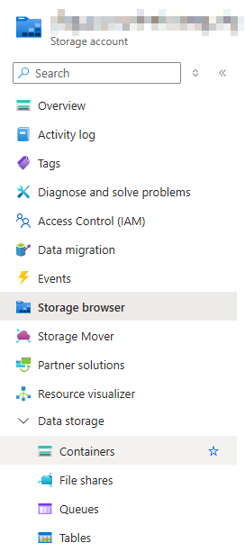

Configure it with a name and Anonymous Access level set to Private (no anonymous access level).

Upload an image, select it and copy the URL field.

Try to open the URL from a browser window (it should fail telling you the resource does not exist).

#### Task 3: Change the access level of your blob

Then change the access level for the Blob (only for the blob you have just uploaded).

Try again with the URL, you should see the picture.


#### Clean up

Go to Resource groups and delete the IntroAzureRG.

### Identify Azure data migration options

This section illustrates the different services available to get your data into Azure. Azure supports both real-time migration of infra, apps, and data using Azure Migrate, as well as async migration of data using Azure Data Box.

#### Azure Migrate

Azure Migrate is a service that helps you migrate from an on-prem environment to the cloud. Azure Migrate functions as a hub to help you manage the assessment and migration of your on-prem datacenter to Azure, providing:

+ Unified migration platform: A single portal to start, run, and track your migration to Azure.

+ Range of tools: Tools for assessment and migration. Azure Migrate tools include Azure Migrate: Discovery and assessment, and Azure Migrate: Server Migration. Azure Migrate also integrates with other Azure services and tools, and with independent software vendors (ISV) offerings.

+ Assessment and migration: In the Azure Migrate hub, you can assess and migrate your on-prem infra to Azure.

##### Integrated tools

In addition to working with tools from ISVs, the Azure Migrate hub also includes the following tools to help with migration:

+ **Azure Migrate: Discovery and Assessment**. Discover and assess on-prem servers running VMware, Hyper-V, and physical servers in preparation for migration to Azure.

+ **Azure Migrate: Server Migration**. Migrate VMware VMs, Hyper-V VMs, physical servers, other virtualized servers, and public cloud VMs to Azure.

+ **Data Migration Assistant**. Data Migration Assistant is a stand-alone tool to assess SQL Servers. It helps pinpoint potential problems blocking migration. It identifies unsupported features, new features that can benefit your after migration, and the right path for database migration.

+ **Azure Database Migration Service**. Migrate on-prem dbs to Azure VMs running SQL Server, Azure SQL Database, or SQL Managed Instances.

+ **Azure App Service migration assistant**. Azure App Service migration assistant is a standalone tool to assess on-prem websites for migration to Azure App Service. Use Migration Assistant to migrate .NET and PHP web apps to Azure.

+ **Azure Data Box**. Use Azure Data Box products to move large amounts of offline data to Azure.


#### Azure Data Box

Azure Data Box is a physical migration service that helps transfer large amounts of data in a quick, inexpensive, and reliable way.

The secure data transfer is accelerate by shipping you a propietary Data Box storage device that has a maximum usable storage of 80 TBs. The Data Box is transported to and from your datacenter via a regional carrier. A rugged case protects and secures the Data Box from damage during transit.

You can order the Data Box device via the Azure portal to import or export data from Azure. Once the device is received, you can quickly set it up using the local web UI and connect it to your network. Once you're finished transferring the data (either into or out of Azure), simply return the Data Box.

If you're transferring data into Azure, the data is automatically uploaded once Microsoft receives the Data Box back. The entire process is tracked end-to-end by the Data Box service in the Azure portal.

##### Use cases

Data Box is ideally suited to transfer data sizes larger than 40 TBs in scenarios with no to limited network connectivity. The data movement can be one-time, periodic, or an initial bulk data transfer followed by periodic transfers.

Scenarios where Data Box can be used to import data to Azure:

+ One-time migration: when a large a mount of data of on-prem data is moved to Azure.

+ Moving a media library from offline tapes into Azure to create an online media library.

+ Migrating your VM farm, SQL server, and apps to Azure.

+ Moving historical data to Azure for in-depth analysis and reporting using HDInsight.

+ Initial bulk transfer: when an initial bulk transfer is done using Data Box (seed) followed by incremental transfers over the network.

+ Periodic uploads: when large amount of data is generated periodically and needs to be moved to Azure.

Scenarios where Data Box can be used to export data from Azure:

+ DR: when a copy of the data from Azure is restored to an on-prem network. In a typical DR scenario, a large amount of Azure data is exported to a Data Box. Microsoft then ships this Data Box, and the data is restored on-prem in a short time.

+ Security requirements: when you need to be able to export data out of Azure due to government or security requirements.

+ Migrate back to on-prem or to another cloud service provider: when you want to move all the data back to on-prem, or to another cloud service provider, export data via Data Box to migrate the workloads.

Once the data from your import order is uploaded to Azure, the disks on the device are wiped vlean in accordance with NIST 800-88r1. For an export order, the disks are erased once the device reaches the Azure datacenter.


### Azure file movement options

In addition to large scale migration using service like Azure Migrate and Azure Data Box, Azure also has tools designed to help you move or interact with individual files or small file groups. Among these tools are:

+ AzCopy
+ Azure Storage Explorer
+ Azure File Sync

#### AzCopy

AzCopy is a command-line utility that you can use to copy blobs or files to or from your storage account. With AzCopy, you can upload files, download files, copy files between storage accounts, and even synchronize files. AzCopy can even be configured to work other cloud providers to help move files back and forth between clouds.

| NOTE: |
| :---- |
| Synchronizing blobs or files with AzCopy is a one-direction sync activity. When you synchronize, you designate the source and destination, and AzCopy will copy files or blobs in that direction. It doesn't sync bi-directionally based on timestamps or other metadata. |

#### Azure Storage Explorer

Azure Storage Explorer is a standalone app that provides a GUI to manage files and blobs in your Azure Storage Account. It works on Windows, MacOS, and Linux OS and uses AzCopy on the backend to perform all of the file and blob management tasks. With Storage Explorer, you can upload to Azure, download from Azure, or move between storage accounts.

#### Azure File Sync

Azure File Sync is a tool that lets you centralize your file shares in Azure Files and keep the flexibility, performance, and compatibility of a Windows file server.

Once you install Azure File Sync on your local Windows server, it will automatically stay bi-directionally synced with your files in Azure.

With Azure File Sync, you can:

+ Use any protocol available on Windows Server to access your data locally (SMB, NFS, FTPS, ...).

+ Have as many caches as you need across the world.

+ Replace a failed local server by installing Azure File Sync on a new server in the same datacenter.

+ Configure cloud tiering so the most frequently accessed files are replicated locally, while infrequently accessed files are kept in the cloud until requested.

### You know you've mastered this chapter when ...

+ You understand that Azure Storage/Azure Storage Account is a cloud storage solution available in Azure for modern data storage scenario. The service offers: a massively scalable object store, disk storage for VMs, a file system service for the cloud, a messaging system, and a NoSQL store.

+ You know that Azure Blob Storage is an object storage solution to store massive amounts of unstructured data (text or binary).

+ You know that Azure Disk Storage is the service that provides disks for Azure VMs and apps.

+ You know that Azure File is the service that offers managed file shares in the cloud using industry standard protocols.

+ You know that Azure Table Storage offers a NoSQL data store for key-value pairs backed by large scale datasets.

+ You know that Azure Queue Storage provides async messaging queueing for communication between app components.

+ You understand that there are three storage tiers that can be used to balance cost: hot (data accessed frequently), cool (data accessed infrequently for at least 30 days), and archive (data that is rarely accessed for at least 180 days).

+ You understand that a storage account provides a unique namespace for your Azure storage data that is accessible from anywhere in the world over HTTPS. Data in a storage account is secure, highly durable, highly available, and massively scalable.

+ You're familiar with the list of redundancy options available: Locally redundant storage (LRS), Geo-redundant storage (GRS), Read-access geo-redundant storage (RA-GRS), Zone-redundant storage (ZRS), Geo-zone-redundant storage (GZRS), and Read-access geo-zone redundant storage (RA-GZRS).
  + LRS: replicates the data three times within a single datacenter in the primary region. Provide 11 nines of durability. It protects against server rack and drive failures.
  + ZRS: available only in zone-enable regions, replicates the data synchronously across three availability zones in the primary region. Provides 12 nines of durability over a year.
  + GRS: In region-pair enabled regions, uses LRS on the primary region and then asynchronously copies the data to a region pair in which LRS is used. Provides 16 nines of durability.
  + GZRS: In region-pair enabled regions, uses ZRS on the primary region and then asynchronously copies the data to a region pair in which LRS is used. Provides 16 nines of durability.

+ You're aware that when using Geo-redundant storage (either GRS or GZRS), the secondary region is only enabled when a failover occurs. However, you can enable read-access on the secondary region. You know that the data in the secondary region might not be up-to-date because of RPO.


+ You're familiar with the available storage account types:
  + Standard general-purpose v2: standard account type for blobs, file shares, queues, and tables.
  + Premium block blocks: premium storage account type for block blobs.
  + Premium file shares: premium storage account for file shares.
  + Premium page blobs: premium storage account type for page blobs.

+ You understand that every storage account in Azure must have a unique-in-Azure account name that ensures an isolated namespace for your data in Azure. Each of the services (Blob, Data Lake Storage Gen2, Azure Files, ...) have a different HTTPS endpoint such as: https://<storage-account-name>.blob.core.windows.net.

+ You are aware that storage account names must have between 3 and 24 numbers and lowercase letters only, and that they are unique-in-Azure.

+ You're familiar with the Blob storage tiers:
  + Hot access tier: data that is accessed frequently.
  + Cool access tier: data that is infrequently accessed, and will maintain that condition for at least 30 days.
  + Cold access tier: data is rarely accessed, and will maintain that condition for at least 90 days.
  + Archive access tier: data is rarely accessed, and will maintain that condition for at least 180 days.

+ You understand that Azure files support standard file sharing protocols such as SMB and NFS, and Azure Files file shares can be mounted concurrently by cloud or on-prem deployments.

+ You can elaborate about the Azure files key benefits: shared access, fully managed, scripting and tooling, resiliency and familiar programmability.

+ You're aware that Azure queues can contain a large number of messages, but each message is limited to 64 KB. You also know that they can be used from Azure Functions to take an action when a message is received.

+ **Azure Migrate**
  + you understand that Azure Migrate is a service that helps you migrate from an on-prem environment to the cloud, acting as a hub that helps you manage the assessment and migrations of your on-prem datacenter to Azure.
  + You understand that Azure Migrate is a portal, with a range of tools to assess and migrate from your on-prem infra to Azure.
  + You understand that it can work with tools from ISVs but it also includes:
    + Azure Migrate: Discovery and Assessments: discover and assess on-prem servers running VMware, Hyper-V, or physical.
    + Azure Migrate: Server Migration: to migrate servers to Azure.
    + Data Migration Assistant: to assess SQL Servers to Azure.
    + Azure Database Migration Service: to migrate on-prem DBs to Azure VMs running SQL server, Azure SQL Database, or SQL Managed Instances.
    + Azure App Service Migration Assistant: assesses on-prem websites for migration to Azure App Service.
    + Azure Data Box: to move large amount of offline data to Azure. This is a physical migration service (either in or out).

+ You're familiar with Azure file movement options:
  + AzCopy: a command-line utility to copy blobs or files to or from your storage account.
  + Azure Storage Explorer: standalone tool providing a GUI to manage files and blobs in your Azure Storage Account.
  + Azure File Sync: tool to centralize your file shares in Azure Files. It lets you keep files in your local windows server synchronized with what you have in Azure.

## 2D: Azure identity, access, and security
> https://learn.microsoft.com/en-us/training/modules/describe-azure-identity-access-security/


### Key topics

+ Describe directory services in Azure, including Microsoft Entra ID and Microsoft Entra Domain Services.
+ Describe authentication methods in Azure, including SSO, MFA, and passwordless.
+ Describe external identities and guest access in Azure.
+ Describe Microsoft Entra Conditional Access.
+ Describe Azure RBAC.
+ Describe the concept of Zero Trust.
+ Describe the purpose of the defense in depth model.
+ Describe the purpose of Microsoft Defender for Cloud.

This section deals with directory services in Azure, authentication methods, and access control. You'll learn concepts such as Zero Trust, defense in depth, and how they keep your cloud safer.

Additionally, you'll get an introduction of Microsoft Defender for Cloud.

### Azure directory services

Microsoft Entra ID is a directory service that enables you to sign in and access both Microsoft cloud applications and the cloud apps you develop. Microsoft Entra ID can also help you maintain your on-prem Active Directory (AD) deployment.

For on-prem environments, AD runninng on Windows Server provides an identity and access management service that's managed by your organization. Microsoft Entra ID is Microsoft's cloud-based identity and access management service.

With Microsoft Entra ID, you control the identity accounts, and Microsoft ensures that the service is globally available.

When you secure identities on-prem with AD, Microsoft doesn't monitor sign-in attempts. When you connect AD with Microsoft Entra ID, Microsoft can help protect you by detecting suspicious sign-in attempts at no extra cost. For example, Microsoft Entra ID can detect sign-in attempts from unexpected locations or unknown devices.

#### User Personas of Microsoft Entra ID

Microsoft Entra ID is for:

+ IT administrators: Admins can use Microsoft Entra ID to control access to applications and resources based on their business requirements.

+ App developers: Devs can use Microsoft Entra ID to provide a standards-based approach for adding functionality to apps they build, such as adding SSO functionality to an app or enabling an app to work with a user's existing credentials.

+ Users: Users can manage their identities and take maintenance actions like self-service password reset.

+ Online service subscribers: Microsoft 365, Microsoft Office 365, Azure, and Microsoft Dynamics CRM Online subscribers are already using Microsoft Entra ID to authenticate into their account.

#### What does Microsoft Entra ID do?

Microsoft Entra ID provides services such as:

+ Authentication: This includes verifying identity to access applications and resources. It also includes providing functionalisty such self-service password reset, MFA, a custom list of banned passwords, and smart lockout services.

+ Single sign-on (SSO): SSO enables you to remember only one username and one password to access multiple applications. A single identity is tied to a user, which simplifies the security model. As user change roles or leave an organization, access modifications are tied to that identity, which greatly reduces the effort needed to change or disable accounts.

+ Application management: You can manage your cloud and on-prem apps by using Microsoft Entra ID. Features like Application Proxy, SaaS apps, the My Apps portal, and SSO provide a better UX.

+ Device management: Along with account for individual people, Microsoft Entra ID supports the registration of devices. Registration enables devices to be managed through tools like Microsoft Intune. It also allows device-based Conditional Access policies to restrict access attempts to only those coming from known devices, regardless of the requesting user account.

#### Can I connect my on-prem AD with Microsoft Entra ID?

You can conect AD with Microsoft Entra ID, enabling a consistent UX between cloud and on-prem and preventing you from maintaining two identity sets.

One method is using Microsoft Entra Connect, which synchronizes user identities between on-prem AD and Microsoft Entra ID. Microsoft Entra Connect synchronizes changes between both identity systems, so you can use features like SSO, MFA, and self-service password reset under both systems.

#### What is Microsoft Entra Domain Services?

Microsoft Entra Domain Services is a service that provides managed domain services such as domain join, group policy, LDAP, and Kerberos/NTLM authentication.

Just like Microsoft Entra ID lets you use directory services without having to maintain the infra supporting it, with Microsoft Entra Domain Services you get the benefit of domain services without the need to deploy, manage, and patch domain controllers (DCs) in the cloud.

A Microsoft Entra Domain Services managed domain lets you run legacy apps in the cloud that can't use modern authentication methods, or where you don't want directory lookups to always go back to an on-prem AD DS environment.

You can lift and shift those legacy apps from your on-prem environment into a managed domain, without needing to manage the AD DS environment in the cloud.

Microsoft Entra Domain Services integrates with your existing Microsoft Entra tenant. This integration lets users sign into services and applications connected to the managed domain using their existing credentials. You can also use existing groups and user accounts to secure access to resources. These features provide a smoother lift-and-shift of on-prem resources to Azure.

##### How does Microsoft Entra Domain Services work?

When you create a Microsoft Entra Domain Services managed domain, you define a unique namespace. This namespace is the domain name. Two Windows Server domain controllers are then deployed into your selected Azure region. This deployment of DCs is known as a replica set.

You don't need to manage, configure, or update these DCs. The Azure platform handles the DCs as part of the managed domain, including backups and encryption at rest using Azure Disk encryption.

##### Is information synchronized?

A managed domain is configured to perform a one-way synchronization from Microsoft Entra ID to Microsoft Entra Domain Service. You can create resources directly in the mangaged domain, but they aren't synchronized back to Microsoft Entra ID. In a hybrid environment with an on-prem AD DS environment, Microsoft Entra Connect synchronizes identity information with Entra ID, which is then synchronized to the managed domain.

Apps, services, and VMs in Azure that connect to the managed domain can then use the common Microsoft Entra Domain Services features such as domain join, group policy, LDAP, and Kerberos/NTLM authentication.


### Azure Authentication methods

Authentication is the process of establishing the identity of a person, service, or device. It requires the person, service, or device to provide some type of credential to prove they are who they say they are.

Azure supports multiple authentication methods including passwords, SSO, MFA, and passwordless.

For the longest time, security, and convenience seemed to be at odds with each other. Thankfully, new authentication solutions provide both security and convenience.

The following diagram shows the security level compared to the convenience. Notice that Passwordless is high security and high convenience while passwords on their own are low security but high convenience.

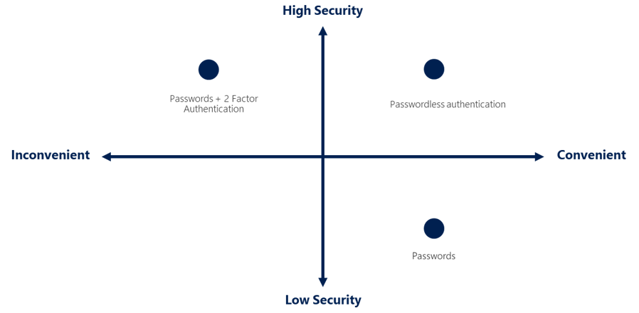

#### What's SSO?

SSO enables a user to sign in one time and use that credential to access multiple resources and apps from different providers. For SSO to work, the different apps and providers must trust the initial authenticator.

More identities mean more passwords to remember and change. Password policies can vary among apps. As complexity requirements increase, it becomes increasingly difficult for users to remember them. The more passwords a user has to manage, the greater the risk of a credential-related security incident.

With SSO, you need to remember only one ID and one password. Access across apps is granted to a single identity that's tied to the user, which simplifies the security model. As users change roles or leave an organization, access is tied to a single identity. This change greatly reduces the effort needed to change or disable accounts. Using SSO for accounts makes it easier for users to manage their identities and for IT to manage user.

| NOTE: |
| :---- |
| SSO is only as secure as the initial authenticator because the subsequent connections are all based on the security of the initial authenticator. |

#### What's MFA?

MFA is the process of prompting a user for an extra form (or factor) of identification during the sign-in process. MFA helps protect against a password compromise in situations where the password was compromised but the second factor wasn't.

Typically, this consists of entering a code sent to your phone after having introduced your username and password to sign-in to online services.

MFA provides additional security for your identities by requiring two or more elements to fully authenticate. These elements fall into three categories:

+ Something the user knows &mdash; this might be a challenge question.
+ Something the user has &mdash; this might be a code that's sent to the user's mobile phone.
+ Something the user is &mdash; this is typically some sort of biometric property, such as a fingerprint or face scan.

MFA increases identity security by limiting the impact of credential exposure (e.g., stolen usernames and passwords). With MFA enabled, an attacker who has a user's password would also need to have possession of their phone or their fingerprint to fully authenticate.

| NOTE: |
| :---- |
| MFA should be enabled wherever possible because it adds enormous benefits to security. |

##### What's Microsoft Entra MFA?

Microsoft Entra MFA is a Microsoft service that provides MFA capabilities. It enables users to choose an additional form of authentication during sign-in, such as a phone call or mobile app notification.

#### What's passwordless authentication?

While MFA brings enormous benefits in terms of security, the UX is not that great as users get frustrated with the additional action they need to carry out on top of having to remember their passwords.

Passwordless authentication methods are more convenient because the password is removed and replaced with something you have, plus something you are, or something you know.

Passwordless authentication needs to be set up on a device before it can work. For example, your computer is something you have. Once it's been registered or enrolled, Azure now knows that it's associated with you. Now that the computer is known, once you provide something you know or are (such as a PIN or fingerprint), you can be authenticated without using a password.

Each organization has different needs when it comes to authentication. Microsoft global Azure and Azure Government offer the following three passwordless authentication options that integrate with Microsoft Entra ID:

+ Windows Hello for Business
+ Microsoft Authenticator app
+ FIDO2 security keys


##### Windows Hello for Business

Windows Hello for Business is ideal for information workers that have their own designated Windows PC. The biometric and PIN credentials are directly tied to the user's PC, which prevents access from anyone other than the owner. With public key infrastructure (PKI) integration and built-in support for SSO, Windows Hello for Business provides a convenient method for seamlessly accessing corporate resources on-prem and in the cloud.

##### Microsoft Authenticator App

You may be already using the Microsoft Authenticator App as an MFA option in addition to a password. You can also use the Authenticator App as a passwordless option.

The Authenticator App turns any iOS or Android phone into a strong, passwordless credential. Users can sign-in to any platform or browser by getting a notification to their phone, matching a number displayed on the screen to the one on their phone, and then using their biometric (touch or face) or PIN to confirm.

##### FIDO2 security keys

The Fast Identity Online (FIDO) Alliance helps to promote open authentication standards and reduce the use of passwords as a form of authentication. FIDO2 is the latest standards that incorporates the web authentication (WebAUthn) standard.

FIDO2 security keys are an unphisable standards-based passwordless authentication method that can come in any form factor. FIDO is an open standard for passwordless authentication. FIDO allows users and organizations to leverage the standard to sign-in to their resources without a username or password by using an external security key or a platform key built into a device.

Users can register and then select a FIDO2 security key at the sign-in interface as their main means of authentication. These FIDO2 security keys are typically USB devices, but could also use Bluetooth or NFC. With a hardware device that handles the authentication, the security of an account is increased as there's no password that could be exposed or guessed.

### Azure external identities

An external identity is a person, device, service, etc. that is outside your organization. Microsoft Entra External ID refers to all the ways you securely interact with users outside your organization. If you want to collaborate with partners, distributors, suppliers, or vendors, you can share your resources and define how your internal users can access external organizations. If you're a developer creating consumer-facing apps, you can manage your customers' identity experiences.

External Identities may sound similar to SSO. With External Identities, external user can *bring their own identities*. Whether they have a corporate or government-issued digital identity, or an unmanaged social identity like Google or Facebook, they can use their own credentials to sign in. The external user's identity provider manages their identity, and you manage access to your apps with Microsoft Entra ID or Azure AD B2C to keep your resources protected.


The following capabilities make up External Identities:

+ Business-to-Business (B2B) collaboration: Collaborate with external users by letting them use their preferred identity to sign-in to your Microsoft apps or other enterprise apps (SaaS apps, custom-developed apps, etc.). B2B collaboration users are represented in your directory, typically as guest users.

+ B2B direct connect: Establish a mutual, two-way trust with another Microsoft Entra organization for seamless collaboration. B2B direct connect currently suppports Teams shared channels, enabling external users to access your resources from within their home instances of Teams. B2B direct connect users aren't represented in your directory, but they're visible from within the Teams shared channel and can be monitored in Teams admin center reports.

+ Microsoft AD business to consumer (B2C): Publish modern SaaS apps or custom-developed apps (excluding Microsoft apps) to consumers and customers, while using Azure AD B2C for identity and access management.

Depending on how you want to interact with external organizations and the types of resources you need to share, you can use a combination of these capabilities.

With Microsoft Entra ID, you can easily enable collaboration across organizational boundaries by using the Microsoft Entra B2B feature. Guest users from other tenants can be invited by admins or by other users. This capability also applies to social identities such as Microsoft accounts.

You also can easily ensure that guest users have appropriate access. You can ask the guest users themselves or a decision maker to participate in an access review and recertify (or attest) to the guests' access. The reviewers can give their input on each user's need for continued access, based on suggestions from Microsoft Entra ID. When an access review is finished, you can then make changes and remove access for guests who no longer need it.

### Azure conditional access

Conditional Access is a tool that Microsoft Entra ID uses to allow or deny access to resources based on identity signals. Thse signals include:
+ who the user is
+ where the user is
+ what device the user is requesting access from

Conditional Access helps IT admins:
+ Empower users to be productive wherever and whenever.
+ Protect the organization's assets.

Conditional Access also provides a more granular MFA experience for users. For example, a user might not be challenged for a second authenticator factor if they're at a known location. However, they might be challenged for a second authentication factor if their sign-in signals are unusual or they're at an unexpected location.

During sign-in, Conditional Access collects signals from the user, makes decisions based on those signals, and then enforces that decision by allowing or denying the access request or challenging for an MFA response.

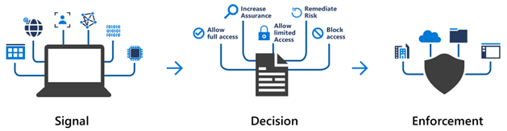

The signal might be the user's location, the user's device, or the app the user is trying to access.

Based on these signals, the decision might be to allow full access if the user is signing in from their usual location. If the user is signing in from an unusual location or a location that's marked as high risk, then access might be blocked entirely or possibly granted after the user provides a second form of authentication.

Enforcement is the action that carries out the decision. For example, the action is to allow access or require the user to provide a second form of authentication.

#### When can I use Conditional Access?

Conditional Access is useful when you need to:

+ Require MFA to access an app depending on the requester's role, location, or network. For example, you could require MFA for admins, but not for regular users or for people connecting from outside your corporate network.

+ Require access to services only through approved client apps. For example, you could limit which email apps are able to connect to your email service.

+ Require users to access yur app only from managed devices. A managed device is a device that meets your standards for security and compliance.

+ Block access from untrusted sources, such as access from unknown or unexpected locations.

### Azure role-based access control (RBAC)

The principle of least privilege says you should only grant access up to the level needed to complete a task. If you only need read access to a storage blob, then you should only be granted read access to that storage blob. Write access to that blob shouldn't be granted, nor should be granted read access to other storage blobs.

Managing that level of permissions for an entire team would become tedious. Instead of defining the detailed access requirements for each individual, and then updating access requirements when new resources are created or new people join the team, Azure enables you to control access through Azure RBAC.

Azure provides built-in roles that describe common access rules for cloud resources. You can also define your own roles. Each role has an associated set of access permissions that relate to that role. When you assign individuals or groups to one or more roles, they receive all the associated access permissions.

For example, if you hire a new engineer and add them to the Azure RBAC group for engineers, they automatically get the same access as the other engineers in the same Azure RBAC group. Similarly, if you add aditional resources and point Azure RBAC at them, everyone in that Azure RBAC group will now have those permissions on the new resources as well as the existing resources.

#### How is RBAC applied to resources?

RBAC is applied to a scope, which is a resource or set of resources that this access applies to.


The diagram above shows the relationship between roles and scopes. A management group, subscription, or resource group might be given the role of owner, so they have increased control and authority. An observer, who isn't expected to make any updates, might be given a role of Reader for the same scope, enabling them to review or observe the management group, subscription, or resource group.

Scopes include:

+ A management group (i.e., a collection of multiple subscriptions).
+ A single subscription.
+ A resource group.
+ A single resource.

Observers, users managing resources, admins, and automated processes illustrated the kinds or users or accounts that would typically be assigned each of the various roles.

Azure RBAC is hierarchical, in that when you grant access at a parent scope, those permissions are inherited by all child scopes.

For example:

+ When you assign the Owner role to a user at the management group scope, the user can manage everything in all subscriptions within the management group.

+ When you assign the Reader role to a group at the subscription scope, the members of that group can view every resource group and resource within the subscription.


#### How is Azure RBAC enforced?

Azure RBAC is enforced on any action that's initiated against an Azure resource that passes through Azure Resource Manager. Resource Manager is a management service that provides a way to organize and secure your cloud resources.

You typically access Resource Manager from the Azure portal, Azure Cloud Shell, Azure PowerShell, and the Azure CLI.

Azure RBAC doesn't enforce access permissions at the application or data level. Application security must be handled by your application.

Azure RBAC uses an allow model. When you're assigned a role, Azure RBAC allows you to perform actions within the scope of that role. If one role assignment grants you read permissions to a resource group and a different role assignment grants you write permissions to the same resource group, you have both read and write permissions on that resource group.

### Zero Trust model

Zero Trust is a security model that assumes the worst case scenario and protects resources with that expectations. Zero Trust assumes breach at the outset, and then verifies each request as though it originated from an uncontrolled network.

Today, organizations need a new security model that effectively adapts to the complexity of the moderns environment; embraces the mobile workforce; and protects people, devices, applications, and data wherever they're located.

Zero Trust security model is based on these guiding principles:

+ Verify explicitly: always authenticate and authorize based on all available data points.
+ Use least privilege access: limit user access with *Just-In-Time* and *Just-Enough-Access* (JIT/JEA), risk-based adaptive policies, and data protection.
+ Assume breach: minimize blast radius and segment access. Verify end-to-end encryption. Use analytics to get visibility, drive threat detection, and improve defenses.

#### Adjusting to Zero Trust

Traditionally, corporate networks were restricted, protected, and generally assumed safe. Only managed computers could join the network, VPN access was tightly controlled, and personal devices were frequently restricted or blocked.

The Zero Trust model flips that scenario. Instead of assuming that a device is safe because it's within the corporate network, it requires everyone to authenticate. Then grants access based on authentication rather than location.

### Defense-in-depth

The objective of defense-in-depth is to protect information and prevent it from being stolen by those who aren't authorized to access it.

A defense-in-depth strategy uses a series of mechanisms to slow the advance of an attack that aims at acquiring unauthorized access to data.

#### Layers of defense-in-depth

You can visualize defense in depth as a set of layers, with the data to be secured at the center and all the other layers functioning to protect that central data layer.


Each layer provides protection so that if one layer is breached, a subsequent layer is already in place to prevent further exposure. This approach removes reliance on any single layer of protection. It slows down an attack and provides alert information that security teams can act upon, either automatically or manually.

+ The physical security layer is the first line of defense to protect computing hardware in the datacenter.
+ The identity and access layer controls access to infrastructure and keeps track of changes.
+ The perimeter layer uses distributed denial of service (DDoS) protection to filter large-scale attacks before they can cause a denial of service for users.
+ The network layer limits communication between resources through segmentation and access controls.
+ The compute layer secures access to VMs (or other compute elements such as containers or functions).
+ The application layer helps ensure that applications are secure and free of security vulnerability.
+ The data layer controls access to business and customer data you need to protect.

These layers provide a guideline for you to help make security configuration decisions in all of the layers of your apps.

Azure provides security tools and features at every level of the defense-in-depth concept.

##### Physical security

Physically securing access to buildings and controlling access to computing hardware within the datacenter are the first line of defense.

With physical security, the intent is to provide physical safeguards against access to assets. These safeguards ensure that other layers can't be bypassed, and loss or theft is handled appropriately. Microsoft uses various physical security mechanisms in its cloud datacenters.

##### Identity and access

The identity and access layer is all about ensuring that identities are secure, that access is granted only to what's needed, and that sign-in events and changes are logged.

At this layer, it's important to:
+ Control access to infra and change control.
+ Use SSO and MFA
+ Audit events and changes


##### Perimeter

The network perimeter protects from network-based attacks against your resources. Identifying these attacks, eliminating their impact, and alerting you when they happen are important ways to keep your network secure.

At this layer, it's important to:
+ Use DDoS protection to filter large-scale attacks before they can affect the availability of a system for users.
+ Use perimeter firewalls to identify and alert malicious attacks against your network.


##### Network

At this layer, the focus is on limiting the network connectivity across all your resources to allow only what's required. By limiting this communication, you reduce the risk of an attack spreading to other systems in your network.

At this layer, it's important to:
+ Limit communication between resources.
+ Deny by default.
+ Restrict inbound internet access and limit outbound access where appropriate.
+ Implement secure connectivity to on-prem networks.

##### Compute

Malware, unpatched systems, and improperly secured systems open your environment to attacks. The focus in this layer is on making sure that your compute resources are secure and that you have the proper controls in place to minimize security issues.

At this layer it's important to:
+ Secure access to VMs (or containers or functions).
+ Implement endpoint protection on devices and keep systems patched and current.

##### Application

Integrating security into the application development lifecycle helps reduce the number of vulnerabilities introduced in code. Every development team should ensure that its applications are secure by default.

At this layer, it's important to:
+ Ensure that apps are secure and free of vulnerabilities.
+ Store sensitive app secrets in a secure storage medium.
+ Make security a design requirement for all app development.

##### Data

Those who store and control access to data are responsible for ensuring that it's properly secured. Often, regulatory requirements dictate the controls and processes that must be in place to ensure the confidentiality, integrity, and availability of the data.

In almost all cases, attackers are after data:
+ Stored in a db.
+ Stored on disk inside VMs.
+ Stored in SaaS apps, such as Office 365.
+ Managed through cloud storage.

### Microsoft Defender for Cloud

Defender for Cloud is a monitoring tool for security posture management and threat protection. It monitors your cloud, on-prem, hybrid, and multicloud environments to provide guidance and notifications aimed at strengthening your security posture.

Defender for Cloud provides the tools needed to harden your resources, track your security posture, protect against cyber attacks, and streamline security management. Deployment of Defender for Cloud is easy, as it's already natively integrated to Azure.

#### Protection everywhere you're deployed

Because Defender for Cloud is an Azure-native service, many Azure services are monitored and protected without needing any deployment.

However, if you also have an on-prem datacenter or are also operating in another cloud, monitoring of Azure services may not give you a complete picture of your security situation.

When necessary, Defender for Cloud can automatically deploy a Log Analytics agent to gather security-related data. For Azure machines, deployment is handled directly. For hybrid and multicloud environments, Microsoft Defender plans are extended to non-Azure machines with the help of Azure Arc. Cloud Security Posture Management (CSPM) features are extended to multicloud machines without the need for any agents.

##### Azure-native protections

Defender for Cloud helps you detect threats across:

+ Azure PaaS services: Detect threats targeting Azure services including Azure App Service, Azure SQL, Azure Storage Account, etc. You can also perform anomaly detection on your Azure activity logs using the native integration with Microsoft Defender for Cloud Apps (formerly known as Microsoft Cloud App Security).
+ Azure data services: Defender for Cloud includes capabilities that help you automatically classify your data in Azure SQL. You can also get assessments for potential vulnerabilities across Azure SQL and Storage services, and recommendations for how to mitigate them.
+ Networks: Defender for Cloud helps you limit exposure to brute force attacks. By reducing access to VM ports, using the just-in-time VM access, you can harden your network preventing unnecessary access. You can set secure access policies on selected ports, for only authorized users, allowed source IP address ranges or IP addresses, and for a limited amount of time.

##### Defend your hybrid resources

In addition to defending your Azure environment, you can add Defender for Cloud capabilities to your hybrid cloud environment to protect your non-Azure servers. To help you focus on what matters most, you'll get customized threat intelligence and prioritized alerts according to your specific environment.

To extend protection to on-prem machines, deploy Azure Arc and enable Defender for Cloud's enhanced security features.

##### Defend resources running on other clouds

Defender for Cloud can also protect resources in other clouds (AWS, GCP).

For example, if you've connected an AWS account to an Azure subscription, you can enable any of these protections:
+ Defender for Cloud's CSPM features extend to your AWS resources. This agentless plan assesses your AWS resources according to AWS-specific security recommendations, and includes the results in the secure score. The resources will also be assessed for compliance with built-in standards specific to AWS (AWS CIS, AWS PCI DSS, and AWS Foundational Security Best Practices). Defender for Cloud's asset inventory page is a multicloud enabled feature helping you manage your AWS resources alongside your Azure resources.
+ Microsoft Defender for Containers extend its container threat detection and advanced defenses to your Amazon EKS Linux clusters.
+ Microsoft Defender for Servers brings threat detection and advanced defenses to your windows and Linux EC2 instances.

#### Assess, Secure, and Defend

Defender for Cloud fills three vital needs as you manage the security of your resources and workloads in the cloud and on-prem:


##### Continuously assess

Defender for Cloud helps you continuously assess your environment. Defender for Cloud includes vulnerability assessment solutions for your VMs, container registries, and SQL servers.

Microsoft Defender for servers includes automatic, native integration with Microsoft Defender for Endpoint. With this integration enabled, you'll have access to the vulnerability findings from Microsoft threat and vulnerability management.

Between these assessment tools you'll have regular, detailed vulnerability scans to cover your compute, data, and infrastructure. You can review and respond to the results of these scans all from within Defender for Cloud.

##### Secure

In order to be secure in the cloud, you have to ensure your workloads are secure. To secure your workloads, you need security policies in place that are tailored to your environment and situation. Because policies in Defender for Cloud are built on top of Azure Policy controls, you're getting the full range and flexibility of a world-class policy solution. In Defender for Cloud, you can set your policies to run on management groups, across subscriptions, and even for a whole tenant.

One of the benefits of moving to the cloud is the ability to grow and scale as you need, adding new services and resources as necessary. Defender for Cloud is constantly monitoring for new resources being deployed across your workloads. Defender for Cloud assesses if new resources are configured accordingly to security best practices. If not, they're flagged and you get a prioritized list of recommendations for what you need to fix. Recommendations help you reduce the attack surface across each of your resources.

The list of recommendations is enabled and supported by the Azure Security Benchmark. This Microsoft-authores, Azure-specific benchamert provides a set of guidelines for security and compliance best practices based on common compliance frameworks.

In this way, Defender for Cloud enables you not just to set security policies, but to apply secure configuration standards across your resources.

To help you understand how important each recommendation is to your overall security posture, Defender for Cloud groups the recommendations into security controls and adds a secure score value to each control. The secure score gives you an at-a-glance indicator of the health of your security posture, while the controls give you a working list of things to consider to improve your security score and your overall security posture.

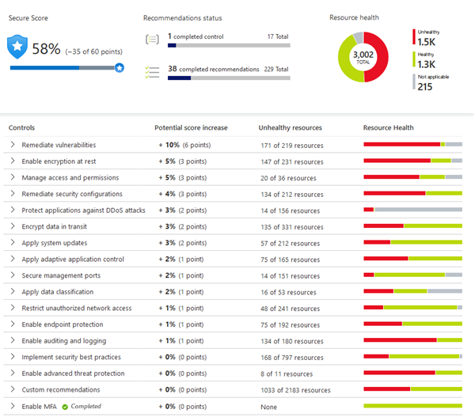

##### Defend

The first two areas were focused on assessing, monitoring, and maintaining your environment. Defender for Cloud also helps you defend your environment by providing security alerts and advanced threat protection features.

###### Security alerts

When Defender for Cloud detects a threat in any area of your environment, it generates a security alert.

Security alerts:
+ Describe details of the affected resources.
+ Suggest remediation steps.
+ Provide, in some cases, an option to trigger a logic app in response.

Whether an alert is generated by Defender for Cloud or received by Defender for Cloud from an integrated security product, you can export it. Defender for Cloud's threat protection includes fusion kill-chain analysis, which automatically correlates alerts in your environment based on cyber kill-chain analysis, to help you better understand the full story of an attack campaign, where it started, and what kind of impact it had on your resources.

###### Advanced threat protection

Defender for cloud provides advanced threat protection features for many of your deployed resources, including VMs, SQL databases, containers, web apps, and your network. Protections include securing the management ports of your VMs with just-in-time access, and adaptive application controls to create allowlists for what apps should and shouldn't run on your machines.

### You know you've mastered this chapter when ...

+ **Microsoft Entra ID**
  + You know that Microsoft Entra ID is Microsoft's cloud-based identity and access management service. It is a directory service that enables you to sign-in and access both Microsoft cloud apps and the cloud apps you develop, and that it can also help maintain your on-prem Active Directory (AD) deployments.
  + You understand that in Entra ID, you control the identity accounts, and Microsoft ensures that the service is globally available.
  + You're aware that Entra ID is for IT admins (to configure access to apps and resources based on their needs), app devs (to implement standard authentication and authorization and SSO), users (to manage their identitys, reset their passwords), online service subscribers (to authenticate to Microsoft 365, Office 365, Azure, Microsoft Dynamics...).
  + You know that Entra ID provides the following services:
    + Authentication: identity verification, password reset, MFA, smart lockout, custom list of banned passwords.
    + SSO
    + App management
    + Device management
  + You're aware that you can connect Entra ID with your on-prem AD for extra functionality. This can be done with Microsoft Entra Connect.

+ You're aware of Microsoft Entra Domain Services that provides managed domain services without the need to deploy, manage, and patch domain controllers in the cloud. This helps you run legacy apps that are not prepared to modern authentication methods. It can be integrated with our Entra ID tenant.

+ You can define authentication as the process of establishing the identity of a person, service, or device.

+ You are aware that Azure supports multiple authentication methods including passwords, SSO, MFA, and passwordless.
+ You're familiar with the concept of SSO, that allows a user to sign-in one time and use that credential to access multiple resources and apps from different providers, and understand that for SSO to work, the different apps and providers must trust the initial authenticator. You also understand that SSO simplifies the security model as when a user changes roles or leave an organization, the change is automatically reflected.
+ You know that MFA is a security strategy that prompts a user for an extra form of identification during the sign-in process. You understand that this increases security in the case of a password compromise.
+ You understand the the 2nd form in MFA requires something the user knows (e.g. a security question), something the user has (e.g., a code in a mobile phone), and something the user is (a biometric property).
+ You're aware that Microsoft Entra MFA is a Microsoft service that provides MFA capabilities.
+ You're aware of the benefits of passwordless authentication, both in terms of UX and security. You understand is like MFA but without passwords, effectively relying on: something you have, something you are, or something you know. Passwordless authentication is based on the registration of a device you own plus a something you know or are (such as a PIN or fingerprint).
+ You're familiar with the different passwordless methods that integrate with Entra ID: Windows Hello for Business, Microsoft Authenticator App, and FIDO2 security keys.
+ **External Identities**:
  + You understand that an external identity is a person, device, service, etc. that is outside your organization.
  + You know that Entra External ID refers to all the ways you securely interact with users outside your org (partners, vendors, distributors, suppliers, ...).
  + You understand that External Identities is similar to SSO in the sense that user bring their own identities to sign in to your apps, via Entra ID (B2B) or Azure AD B2C (B2C).
  + You're aware of the following capabilities that make up External Identities:
    + B2B collaboration: when you enable collaboration with external users by letting them use their preferred identity to sign-in to your Microsoft apps or other enterprise apps (SaaS apps, custom-developed apps, etc.). In your directory, B2B collaboration users are represented as guests.
    + B2B direct connect: establish a mutual, two-way trust with another Entra organization for seamless collaboration. B2B direct connect users aren't represented in your directory, but they're visible from within Teams shared channels.
    + Microsoft AD B2C: used to publish modern SaaS apps or custom developed, non-Microsoft apps to end customers.
  + You understand that with Entra ID you can invite guest users from other tenants, and ensure that guest users have appropriate access by implementing access reviews, attestation guests' access, etc.

+ **Azure conditional access**
  + You're aware that Conditional Access is a tool that Entra ID uses to allow or deny access to resources based on identity signals (who the user is, where the user is, what decide the user is requesting access from).
  + You're aware that Conditional Access can be used to request MFA depending on those signals, allowing full access if the user is signing in from their usual location, or blocking the user entirely if signals are unexpected.
  + You understand that you can use Conditional Access to require access to services (such as emails) only through approved client apps, or from managed devices.

+ ***Azure RBAC**
  + You understand that Azure RBAC simplifies applying the Principle of Least Privilege as instead of applying permissions for each individual, you can use built-in roles (defining common access roles for cloud resources) or your custom roles.
  + You're aware that each role has an associated set of permissions, and when roles are assigned to a user or a group, they receive all the associated access permissions.
  + You understand that RBAC is applied to a scope, a construct that identifies a resource or a set of resources that this access applies to. Examples are: management groups (a collection of subscriptions), subscriptions, resource groups, or resources.
  + You're aware that RBAC is hierarchichal, in that when you grant access at a parent scope, those permissions are inherited by all child scopes. E.g., When you assign the Owner role to a user at the management group scope, the users can manage everything in all subscriptions within the management group.
  + You understand that Azure RBAC is enforced through Azure Resource Manager, and all actions, independently from where they are coming from (API, Azure Cloud Shell, Azure PowerShell, Azure CLI).
  + You're aware that Azure RBAC uses an allow model: when you're assigned a role, you can perform the actions within the scope of that role: when you are giving the read and write permissions on a resource you have both read and write permissions on that resource group.

+ **Zero Trust Model**
  + You're aware that Zero Trust Model is a security model that assumes the worst case scenario and protects resources with that expectations, assuming a breach at the outset, so that everyt request is verified as though it originated from an uncontrolled network.
  + You understand that Zero Trust Model is based on these principles:
    + Verify explicitly: always authenticate and authorize based on all available data points.
    + Use least privilege access: ideally with Just-In-Time and Just-Enough-Access (JIT/JEA), risk-based adaptive policies, and data protection.
    + Assume breach: minimize blast radius and segment access; use end-to-end encryption; use analytics to get visibility; drive threat detection...
  + You understand that adjusting to Zero Trust means flip the legacy scenario in which you assumed corporate networks were secure.

+ **Defense-in-Depth**
  + You understand that defense-in-depth is a security strategy that uses a series of mechanisms to slow the advance of an attach that aims at acquiring unauthorized access to data.
  + You're aware that defense-in-depth can be visualized as a set of concentrical layers functioning to protect the central layer that represents the data:
    1. Physical security: Security in the datacenter.
    2. Identity and access: Access control to the infrastructure.
    3. Perimeter: DDoS protection to filter large-scale attacks.
    4. Network: Network segmentation and limit communication between resources.
    5. Compute: Secure access to VMs, containers, or functions.
    6. Application: Ensure apps are secure and free of security vulnerabilities.
    7. Data: Control access to business and customer data.

+ **Microsoft Defender for Cloud**
  + You are aware that Defender for Cloud is a monitoring tool for security posture management and threat protection.ç
  + You are aware that Defender for Cloud monitors your cloud, on-prem, hybrid, and multicloud environments to provide guidance and notifications aimed at strengthening your security posture.
  + You're aware that Defender for Cloud is an Azure-native service, and many Azure services are monitored and protected without needing any deployment.
  + You know that Defender for Cloud can deploy a Log Analytics agent to gather security-related data. Outside of Azure, this requires Azure Arc.
  + You're aware that in Azure:
    + Protects Azure PaaS services: App Service, Azure SQL, Storage Account.
    + Azure Data Services: includes capabilities to help automatically classify your data in Azure SQL.
    + Azure Networks: helps you limit exposure to brute force attacks by reducing access to ports, using JIT VM access, etc.
  + You're aware that for hybrid resources, you deploy Azure Arc and enable Defender for Cloud's enhanced security features.
  + You're aware that Defender for Cloud can also protect resources in AWS and GCP (e.g., AWS EKS, EC2 instances, ...)
  + You're aware that Defender for Cloud assess, secure, and defend, getting vulnerability reports, security recommendations, and remediations in case of security threats in existing and new resources:
    + Assess: continuously assesses your environment.
    + Secure: Lets you define policies tailored to your environment. These policies are built on top of Azure Policy controls.
    + Defend: Triggers security alerts when a threat is detected.
  + You're aware that Defender for CLoud provides advanced threat protection features for many of your deployed resources including VMs, SQL dbs, containers, web apps, and your network (ports, just-in-time access, adaptive application controls to create allowlists for what apps should and shouldn't run).

## 3A: Cost Management in Azure

### Key topics

+ Describe factors that can affect costs in Azure.
+ Understand Pricing Calculator.
+ Describe Microsoft Cost Manageent Tool.
+ Describe purpose of tags.

### Factors that can affect costs in Azure

Azure shifts development costs from CapEx (building out and maintaining infrastructure and facilities) to OpEx (renting infra as you need it).

The OpEx can be impacted by many factors:
+ Resource type used
+ Consumption
+ Maintenance
+ Geography
+ Subscription type
+ Azure Marketplace

Azure provides several tools to help you understand the costs of operating your solution in Azure:

+ **TCO Calculator** (retired): It let you specify your on-premises datacenter details and calculated the cost savings when implementing a similar infra in Azure.

+ **Pricing Calculator**: you select the services, dev/prod, region, support, billing options.

+ **Azure Advisor**: lets you monitor your actual costs and get recommendations about unused resources and ways to optimize your resorces. It also lets you set spending limits to prevent cost overruns.

A number of factors influence the cost of Azure resources. The following sections describe these factors in detail.

#### Resource type

The type of resource have an impact on how much a resource costs. When you provision an Azure resource, Azure creates a metered instance for that resource. The meters track the resources' usage and generate a usage record that is used to calculate your bill.

##### Example

With a storage account, you specify a type such as blob, a performance tier, an access tier, redundancy settings, and a region. Changing any of the settings (including the region) may also impact the price.

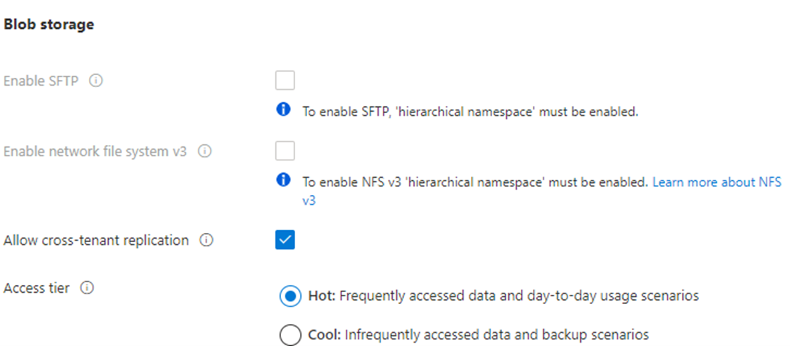

When using a VM, you may have to consider licensing for the OS, the processor and number of cores, the attached storage, and the network interface. Changing any of these parameters (including the region) may also impact the price.

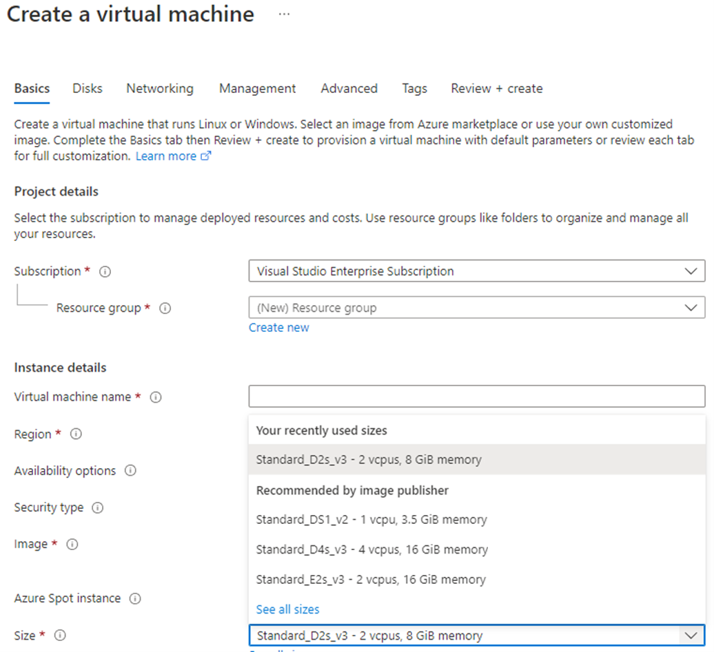

#### Consumption

Pay-as-you-go is the cloud payment model where you pay for the resource that you use during a billing cycle.

However, Azure also offers the ability to commit to using a set amount of cloud resources in advance and receiving discounts on those "reserved" resources. Many services include this option and you can get a discount up to 72%.

In that case, you reserve capacity, and commit to use and pay for a certain amount of Azure resources during a given period (typically one or three years). This doesn't prevent you from also using pay-as-you-go for surges in the demand.

#### Maintenance

The flexibility of the cloud makes it possible to rapidly adjust resources based on demand. Using resource groups can help keep all of your resources organized. Especially because some resources may not be deprovisioned when you deprovision the resource that created them.

For example, when you create a VM you will also create storage and network resources. When you decide to deprovision the VM, those additional storage and network may not be removed at the same time, and therefore, may cause additional spend because of resource no longer needed.

#### Geography

When you provision resources in Azure, you define a region where the resource deploys.

Azure infrastructure is distributed globally, which enables you to deploy your services centrally or closest to your customers, or something in between.

With this global deployment comes global pricing differences.

Network traffic is also impacted based on geography, as it's less expensive to move information within Europe than to move information from Europe to Asia or South America.

#### Network traffic

Bandwidth refers to data moving in and out of Azure datacenters. Some inbound data transfers (data going into Azure datacenters) are free. For outbound data transfers, the pricing is based on zones.

A zone is a geographical grouping of Azure regions for billing purposes.

#### Subscription type

Azure features different types of subscriptions. For example, an Azure free trial subscription provides access to a number of Azure products that are free for 12 months. It also includes credit to spend within your first 30 days of sign-up. You'll get access to more than 25 products that are always free.

#### Azure Marketplace

Azure Marketplace lets you purchase Azure-based solutions and services from 3rd-party vendors. This could be a server with software preinstalled and configured, managed network firewall appliances, or connectors to third-party backup services.

When you purchase products through Azure Marketplace, the billing structure is set by the vendor, and it may include more things than just the resources you're using.

All solutions available in Azure Marketplace are certified and compliant with Azure policies and standards.

### The pricing calculator

The Pricing Calculator is a calculator that helps you understand potential Azure expenses. It is accessible from the internet and allows you to build out a configuration.

When using the Pricing Calculator nothing is provisioned. It is used to get an estimate of a solution.

### Exercise: Estimate workload costs using the Pricing Calculator

In this exercise, you use the Pricing Calculator to estimate the cost of running a basic web application on Azure.

Let's assume that you will use the following configuration: An ASP.NET web application running on Windows. The web application provides information about product inventory and pricing. There are two VMs connected through a central LB. The web app connects to a SQL Server db that holds both the inventory and pricing information.

In terms of Azure resources, you will need the following:

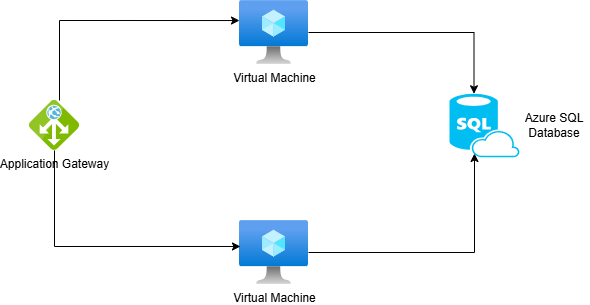

Therefore:

+ You will use Azure Virtual Machines instances.
+ Azure Application Gateway for the load balancing.
+ Azure SQL Database

In practice, you will define the requirements in greater detail:

+ The application is used internally, and it's not made accessible to customer.
+ The application doesn't require a massive amount of computing power.
+ The VMs and the db must run 24x7 (730 hours per month).
+ The network processes about 1 TB of data per month.
+ The db doesn't need to be configured for high-performance workloads and requires no more than 32 GB of storage.

1. Visit the [Pricing Calculator](https://azure.microsoft.com/pricing/calculator/)

    You will find different tabs showing:

      + Products: where you can choose Azure services you want to include in your estimate.

      + Example scenarios: where you can find reference architectures you can use as starting points.

      + Saved estimates: previously saved estimates

      + FAQs: answers to frequently asked questions.

2. On the Products tab, select the services you will use.

3. Configure the services to match your requirements.

4. Review, share, and save your estimate.

### Cost Management Tool

Cost management provides the ability to quickly check Azure resource costs, create alerts based on resource spend, and create budgets that can be used to automate the management of resources.


#### Cost analysis

Cost analysis is a subset of Cost Management that provides a quick visual for the Azure costs. You can see costs by billing cycle, region, resource, ...


You can use cost analysis to explore and analyze organizational costs, view aggregated costs, identify spending trends, etc.

#### Cost alerts

Cost alerts provide a single location to check on all of the different alert types that may show up in the Cost Management service:

+ Budget alerts
+ Credit alerts
+ Department spending quota alerts


##### Budget alerts

Alerts notify when spending, based on usage or cost, reaches or exceeds the amount defined in the alert condition of the budget.

These budgets can be created using Azure Portal (in this case, budgets are defined by cost) or the Azure Consumption API (in this case, budgets can be defined by cost or by consumption usage).

Budget alerts are generated automatically whenever the budget alert conditions are met. You can view all cost alerts in the Azure portal, and an alert email is also sent to the people in the alert recipient list of the budget.

##### Credit alerts

Credit alerts notify you when your Azure credits are consumed. These are awarded to organizations with Enterprise Agreements (EAs).

When generated, alerts will be reflected in cost alerts, and in the email sent to account owners.

##### Department spending quota alerts

These alerts are trigered when department spending reaches a fixed threshold of the quota. These are configured in the EA portal.

When a threshold is met, an email will be sent to department owners, and it will show up in cost alerts.

#### Budgets

A budget is where you set a spending limit for Azure. You can set budgets based on a subscription, resource group, service type, or other criteria.

When you set a budget, you also set a budget alert. When the budget hits the budget alert level, it will trigger a budget alert that shows up in the cost alerts area. If configured, this will also send an email notification.

A more advance use of budgets enables budget conditions to trigger automation to suspend or otherwise modify resources once the trigger condition has occurred.

### The purpose of tags

A good organization strategy helps you understand your cloud usage and can help you manage costs.

One way to organize related resources is to place them in their own subscriptions. Resource groups can also be used to manage related resources. Resource tags are yet another way to organize resources.

Tags provide extra information, or metadata, about your resources that will let you do:

+ Resource management by creating tags to locate and act on resources that are associated with specific workloads, environments, business units, and owners.

+ Cost management and optimization by creating tags that group resources so that you can report on costs, allocate internal cost centers, track budgets, and forecast estimated cost.

+ Operations management by creating tags to group resources according to how critical their availability is to your business. This grouping will let you formulate SLAs.

+ Security by creating tags that classify data by its security level, such as public or confidential.

+ Governance and regulatory compliance by creating tags to identify governance or regulatory compliance requirements such as ISO 27001. Tags can also be part of your standards enforcement efforts (e.g., all resources must be tagged with an owner, project, and department name).

+ Workload optimization and automation by creating tags to visualize all of the resources that participate in complex deployments.

#### How do I manage resource tags?

Tags can be maintained through PowerShell, Azure CLI, Azure Resource Manager templates (ARM templates), REST API, or the Azure portal.

Azure Policy service can be used to enforce tagging rules and conventions (requiring certain tags to be added to new resources as they're provisioned, reapplying tags that might have been removed, etc.).

Resources don't inherit tags from subscriptions and resource groups, meaning that you can apply tags at one level and those will not automatically show up at a different level.

#### An example tagging structure

A resource tag consists of a name and a value. You can assign one or more tags to each Azure resource.


| Tag Name | Tag Value Description |
| :------- | :-------------------- |
| AppName | The name of the application this resource is part of. |
| CostCenter | The internal cost center code. |
| Owner | The name of the business owner who's responsible for the resource. |
| Environment | Environment name, such as Prod, Dev, Test. |
| Impact | Importance classification, such as "Mission-critical", "High-impact", "Low-impact". |


### You know you've mastered this chapter when ...

+ You understand that when using Azure instead of a traditional on-prem datacenter, you shift your costs from CapEx (building and maintaining infrastructure and facilities) to OpEx (renting infra as you need it).

+ You understand that OpEx in Azure can be impacted by man factors: resource type used, consumption, maintenance (some resources such as VM disks or network cards might not be deprovisioned when you deprovision your VM), geography, subscription type, whether it's an Azure Marketplace resource or not...

+ You understand that there are several tool to help you understand and plan your costs in Azure: Pricing Calculator and Azure Advisor. There used to be another tool called TCO calculator to plan and forecast your migration costs to Azure but it's been retired.

+ You're aware that the Pricing Calculator is a calculator that helps you understand potential Azure expenses.

+ **Cost Management Tool**
  + You understand that the Cost Management Tool is an Azure service that provides the ability to quickly check Azure resource costs, create alerts based on resource spend, and create budgets that can be used to automate the management of resources.

  + You're are aware of the different Cost Management sections:
    + Cost Analysis: quick visual for Azure costs (by billing cycle, region, resource...)
    + Cost Alerts: single location to check on all of the different alert types that may show up in the Cost Management service (budget alert, credit alerts, department spending quota alerts).
    + Budgets: where you set a speding limit for Azure. You can set budgets based on a subscription, resource group, service type, etc.

+ You understand the purpose of tags to establish a good organizational strategy to track and manage your cloud costs.

+ You're aware that you can maintain tags through PowerShell, Azure CLI, Azure Resource Manager templates (ARM templates), REST API, or the Azure portal.

+ You're aware that you can rely on Azure Policy service to enforce tagging rules and conventions.

+ You know that resources don't inherit tags from subscriptions and resource groups: if you apply a tag to a resource group, it won't show up in your resource.

+ You understand the different types of metadata you can keep in tags: workloads, environments, business units, cost centers, SLA groups, security, regulatory, etc.

## 3B: Features and tools in Azure for governance and compliance
> https://learn.microsoft.com/en-us/training/modules/describe-features-tools-azure-for-governance-compliance/

### Key points
+ Describe the purpose of Microsoft Purview
+ Describe the purpose of Azure Policy
+ Describe the purpose of resource locks
+ Describe the purpose of the Service Trust portal

### The purpose of Microsoft Purview

Microsoft Purview is a family of data governance, risk, and compliance solutions that helps you get a single, unified view into your data. Microsoft Purview brings insights about your on-prem, multicloud, and SaaS data together.

With Microsoft Purview, you can stay up-to-date on your data landscape thanks to:
+ Automated data discovery
+ Sensitive data classification
+ End-to-end data lineage

Two main solution areas comprise Microsoft Purview:
1. Risk and compliance.
2. Unified data governance

#### Microsoft Purview risk and compliance solutions

Microsoft 365 is a core component of the Microsoft Purview risk and compliance solutions.

Microsoft Teams, OneDrive, and Exchange are some of the Microsoft 365 services that Microsoft Purview uses to help manage and monitor your data.

Microsoft Purview, by managing and monitoring your data, can help your organization to:
+ Protect sensitive data across clouds, apps, and devices.
+ Identify data risks and manage regulatory compliance requirements.
+ Get started with regulatory compliance.

#### Unified data governance

Microsoft Purview has robust, unified data governance solutions that help manage your on-prem, multicloud, and SaaS data. Microsoft Purview's robust data governance capabilities enable you to manage your data stored in Azure, SQL and Hive databases, locally, and even in other cloud services such as Amazon S3.

Microsoft Purview's unified data governance helps your organization to:
+ Create an up-to-date map of your entire data estate that includes data classification and end-to-end lineage.
+ Identify where sensitive data is stored in your estate.
+ Create a secure environment for data consumers to find valuable data.
+ Generate insights about how your data is stored and used.
+ Manage access to the data in your estate securely and at scale.


### Azure Policy

Azure Policy is a service in Azure that enables you to create, assign, and manage policies that control or audit your resources. These policies enforce different rules across your resource configurations so that those configurations stay compliant with corporate standards.

#### How does Azure Policy define policies?

Azure Policy enables you to define both individual policies and groups of related policies, known as initiatives. Azure Policy evaluates your resources and highlights resources that aren't compliant with the policies you've created. Azure Policy can also prevent noncompliant resources from being created.

Azure Policies can be set at each level, enabling you to set policies on a specific resource, resource group, subscription, and so on. Additionally, Azure Policies are inherited, so if you set a policy at a high level, it will automatically be applied to all of the groupings that fall within that parent. For example, if you set a policy on a resource group, all resources created within that resource group will automatically receive the same policy.

Azure Policy comes with built-in policy and initiative definitions for Storage, Networking, Computing, Security Center, and Monitoring. For example, if you define a policy that allows only a certain size for the VMs to be used in your environment, that policy is invoked when you create a new VM and whenever you resize existing VMs. Azure Policy also evaluates and monitors all current VMs in your environment, including VMs that were created before the policy was created.

In some cases, Azure Policy can automatically remediate noncompliant resources and configurations to ensure the integrity of the state of the resources. For example, if all resources in a certain resource group should be tagged with AppName tag and a value of "SpecialOrders", Azure Policy will automatically apply that tag if it is missing. However, you still retain full control of your environment. If you have a specific resource that you don't want Azure Policy to automatically fix, you can flag that resource as an exception and the policy won't automatically fix that resource.

Azure Policy also integrates with Azure DevOps by applying any CI/CD pipeline policies that pertain to the pre-deployment and post-deployment phases of your apps.

#### What are Azure Policy initiatives?

An Azure Policy initiative is a way of grouping related policies together. The initiative definitions contain all of the policy definitions to help track your compliance state for a larger goal.

For example, Azure Policy includes an initiative named Enable Monitoring in Azure Security Center. Its goal is to monitor all available security recommendations for all Azure resource types in Azure Security Center.

Under this initiative, the following policy definitions are included:
+ Monitor unencrypted SQL Database in Security Center: This policy monitors for unencrypted SQL dbs and servers.
+ Monitor OS vulnerabilities in Security Center: This policy monitors servers that don't satisfy the configured OS vulnerability baseline.
+ Monitor missing Endpoint Protection in Security Center: This policy monitors for servers that don't have an installed endpoint protection agent.

### Resource locks

A resource lock prevents resources from being accidentally deleted or changed.

Even with Azure RBAC policies in place, there's still a risk that people with the right level of access could delete critical cloud resources. Resource locks prevents resources from being deleted or updated, depending on the type of lock. Resource locks can be applied to individual resources, resource groups, or even an entire subscription. Resource locks are inherited, meaning that if you place a resource lock on a resource group, all of the resources within the resource group will also have the resource lock applied.

#### Types of Resource Locks

There are two types of resource locks, one that prevents users from deleting and one that prevents user from changing or deleting a resource.

+ Delete means authorized users can still read and modify a resource, but they can't delete the resource.
+ ReadOnly means authorized users can read a resource, but they can't delete or update the resource. Applying this lock is similar to restricting all authorized users to the permissions granted by the Reader role.

#### How do I manage resource locks?

Resource locks can be managed from the Azure portal, PowerShell, the Azure CLI, or from an Azure Resource Manager (ARM) template.

To view, add, or delete locks in the Azure portal, go to the Locks section of any resource's Settings pane in the Azure portal.


#### How do I delete or change a locked resource?

Although locking helps prevent accidental changes, you can still make changes by following a two-step process.

To modify a locked resource, you must first remove the lock. After you remove the lock, you can apply any action you have permissions to perform. Resource locks apply regardless of RBAC permissions. Even if you're an owner of the resource, you must still remove the lock before you can perform the blocked activity.

### Exercise: Configure a resource lock

In this exercise you configure a resource lock in an Storage account and validate its impact.

#### Task 1: Create a resource

Create a new storage account defined in a new resource group from the portal.

#### Task 2: Apply a read-only resource lock

Navigate to the recently created storage account. Find Locks under settings and configure a Read-only lock.

#### Task 3: Add a container to the storage account

Create a container within your storage account. The container is where you will store your blobs.

In the blade, select Data Storage >> Containers and create a container.

When trying to create hte container you will see an error message telling you that the container could not be created because there is a lock.

#### Task 4: Modify the resource lock and create a storage container

Navigate to Settings >> Locks and change the type of the resource lock to Delete. Then Navigate to Data Storage >> Containers and create a container. The operation must succeed.

#### Task 5: Delete the storage account

Navigate to Overview and select Delete to delete the storage account. You should get a notification letting you know that the storage account couldn't be deleted because it has a delete lock.

#### Task 6: Remove the delete lock and delete the storage account

Navigate to Settings >> Locks and remove the lock. Then delete the storage account by selecting the Overview page and then clicking on the Delete button.

#### Task 7: Delete the resource group

Search for the Resource Groups services and locate your recently created resource group. Click on it and verify it has no resources. Then delete it.

### Service Trust Portal

The Microsoft Service Trust Portal is a portal that provides access to various content, tools, and other resources about Microsoft security, privacy, and compliance practices.

The Service Trust Portal contains details about Microsoft's implementation of controls and processes that protect our cloud services and the customer data therein. To access some of the resources on the Service Trust Portal, you must sign in as an authenticated user with your Microsoft cloud services account (Microsoft Entra organization account). You'll need to review and accept the Microsoft non-disclosure agreement (NDA) for compliance materials.

#### Accessing the Service Trust Portal

The Service Trust Portal is available at: https://servicetrust.microsoft.com/

The Service Trust Portal features and content are accessible from the main menu and includes the following categories:
+ Service Trust Portal: provides a quick access hyperlink to return to the Service Trust Portal home page.
+ My Library: lets you save (or pin) documents to quickly access them on your My Library page. You can also set up to receive notifications when documents in your My Library are updated.
+ All Documents: a single landing place for documents on the Service Trust Portal. From All Documents, you can pin documents to have them show up in your My Library.

### You know you've mastered this chapter when ...

+ **Microsoft Purview**
  + You're aware that Microsoft Purview is a family of data governance, risk, and compliance solutions that helps you get a single, unified view into your data.
  + You understand that Purview covers on-prem, multi-cloud, and SaaS data together.
  + You're aware that Purview provides: automated data discovery, sensitive data classification, end-to-end data lineage.
  + You're aware it covers two main areas:
    + Unified data governance
    + Risk and compliance

+ **Azure Policy**
  + You know that Azure Policy is a service that lets you define individual policies and groups of related policies (initiatives).
  + You're aware that Azure Policy evaluates your resources and highlights the ones that are not compliant with the policies, even preventing them from being created.
  + You understand that Azure Policies can be set at any level: resource, resource group, subscription, management group, ... and that the policies are inherited, so that if you apply a policy at a high level, it will automatically be applied to all of the groupings that fall within that parent.
  + You're aware that Azure Policy comes with built-in policy and initiative definitions for Storage, Networking, Computing, Security Center, and Monitoring.
  + You know that in some cases, Azure Policy can automatically remediate noncompliant resources.
  + You're aware that Azure Policy can integrate with Azure DevOps by applying CI/CD pipeline policies that pertain to the pre-deployment and post-deployment phases of your apps.

+ **Resource locks**
  + You know about resource locks: a functionality that prevents resources from being accidentally deleted or changed, and understand that this is orthogonal to Azure RBAC.

  + You understand that there are two types of resource locks: Delete (allows the resource to be updated, but not deleted) and ReadOnly (does not allow updates or deletes).

+ **Service Trust Portal**
  + You know about the Service Trust Portal, which provides access to various content, tools, and other resources about Microsoft security, privacy, and compliance practices.
  + You're aware that the Service Trust Portal contains details about Microsoft's implementation of controls and processes that protect our cloud services and the customer data therein.
  + You understand that you need to sign-in and accept an NDA for certain content.
  + You know that the Service Trust Portal is available at https://servicetrust.microsoft.com/ and includes the following categories:
    + Service Trust Portal
    + My Library: where you can pin documents and subscribe to receive notifications.
    + All Documents: the single landing page for documents on the Service Trust Portal.


## 3C: Features and tool for managing and deploying Azure resources
> https://learn.microsoft.com/en-us/training/modules/describe-features-tools-manage-deploy-azure-resources/


### Tools for interacting with Azure

Azure provides multiple tools for managing your environment, including:

+ Azure Portal
+ Azure PowerShell
+ Azure Command Line Interface

#### Azure Portal

Azure Portal is a web-based, unified console that lets you manage your Azure subscription by using a GUI.

You can:

+ Build, manage, and monitor everything from simple web apps to complex cloud deployments.
+ Create custom dashboards for an organized view of resources.
+ Configure accessibility options for an optimal experience
+ Customize your UX through custom dashboards that you create, to see the data that is most important to you.

The Azure Portal is designed for resiliency and continuous availability. It maintains a presence in every Azure datacenter. This configuration makes the Azure Portal resilient to individual datacenter failures and avoids network slowdowns by being close to users. The Azure Portal updates continuously and requires no downtime for maintenance activities.

#### Azure Cloud Shell

Azure Cloud Shell is a browser-based shell tool that allows you to create, configure, and manage Azure resources using a shell.

Azure Cloud Shell supports both Azure PowerShell and Azure CLI (bash).

Azure Cloud Shell can be accessed from Azure portal by selecting the Cloud Shell icon.

The benefits of using Azure Cloud Shell are:
+ It's a browser-based experience, requiring no local installation or configuration needed.
+ It is authenticated to your Azure credentials, so when you log in, it inherently knows who you are and what permissions you have.
+ You can choose the shell you're most familiar with.

#### Azure PowerShell

Azure PowerShell is a shell with which developers, DevOps, and IT professionals can run commands called cmdlets. These commands call the Azure REST API to perform management tasks in Azure.

Cmdlets can be run independently to handle one-off changes, or they may be combined to help orchestrate complex actions such as:

+ The routine setup, teardown, and maintenance of a single resource or multiple connected resources.
+ The deployment of an entire infrastructure, which might contain dozens or hundreds of resources, from imperative code.

Capturing the commands in a script makes the process repeatable and automatable.

In addition to be available via Azure Cloud Shell, you can install and configure Azure PowerShell on Win, Linux, and Mac.

#### Azure CLI

The Azure CLI is functionally equivalent to Azure PowerShell, but using Azure CLI bash commands.

Azure CLI provides the same benefits of handling discreet tasks or orchestrating complex operations through code. It's also installable on Win, Linux, and Mac.


### Azure Arc

Managing hybrid and multi-cloud environments can rapidly get complicated. Azure provides a host of tools to provision, configure, and monitor Azure resources.

In utilizing Azure Resource Manager (ARM), Arc lets you extend your Azure compliance and monitoring to your hybrid and multi-cloud configurations. Azure Arc simplifies governance and management by delivering a consistent multi-cloud and on-prem management platform.

Azure Arc provides a centralized, unified way to:
+ Manage your entire environment together by projecting your existing non-Azure resources into ARM.
+ Manage multi-cloud and hybrid VMs, Kubernetes clusters, and dbs as if they are running in Azure.
+ Use familiar Azure services and management capabilities, regardless of where they live.
+ Continue using traditional ITOps while introducing DevOps practices to support new cloud and native patterns in your environment.
+ Configure custom locations as an abstraction layer on top of Azure Arc-enabled Kubernetes clusters and cluster extensions.

#### What can Azure Arc do outside of Azure?

Currently, Azure Arc allows you to manage the following resource types hosted outside of Azure:
+ Servers
+ Kubernetes clusters
+ Azure data services
+ SQL Server
+ VMs (preview)

### Azure Resource Manager (ARM) and Azure ARM templates

Azure Resource Manager (ARM) is the deployment and management service for Azure. It provides a management layer that enables you to create, update, and delete resources in your Azure account. Anytime you do anything with your Azure resources, ARM is involved.

When a user sends a request from any of the Azure tools, APIs, or SDKs, ARM receives the request. ARM authenticates and authorizes the request. Then, ARM forwards the request to the Azure service, which takes the requested action to create, delete, or manage the actual resource. You see consistent results and capabilities in all the different tools because all requests are handled through the same API.


Azure Resource Manager is at the center of managing resources in Azure. It provides a management layer that enables you to create, update, and delete resources in your Azure account.

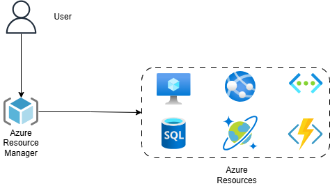

Azure Resource Manager is the management layer providing a unified API when you interact with any sort of Azure Resource using any of the available ways you have at your disposal.

Azure Resource Manager provides the Resource Group concept that lets you organize related resources together. By using Resource Groups you can do such things as:
+ Move all the resources in a Resource Group to a new subscription.
+ Delete all the resources in a Resource Group with one action.

Azure Resource Manager leverages existing Azure RBAC for subscriptions, resource groups, and resources. Access rules are used regardless of the client you're using.

#### Azure Resource Manager benefits

With ARM you can:

+ Manage your infra through declarative templates rather than scripts. An ARM template is a JSON file that defines what you want to deploy to Azure.
+ Deploy, manage, and monitor all the resources for your solution as a group, rather than handling these resources individually.
+ Re-deploy your solution throughout the development life-cycle and have confidence your resources are deployed in a consistent state.
+ Define the dependencies between resources, so they're deployed in the correct order.
+ Apply access control to all services, because RBAC is natively integrated into the management platform.
+ Apply tags to resources to logically organize all the resources in your subscription.
+ Clarify your organization's billing by viewing costs for a group of resources that share the same tag.

#### Infrastructure-as-Code (IaC)

Infrastructure-as-Code (IaC) is a concept where you manage your infrastructure as lines of code. At an introductory level, it's things like using Azure Cloud Shell, Azure PowerShell, or the Azure CLI to manage and configure your resources. As you get more comfortable in the cloud, you can use the IaC concept to manage entire deployments using repeatable templates and configurations. ARM templates and Bicep are two examples of using IaC with the Azure Resource Manager to maintain your environment.

#### ARM templates

By using ARM templates, you can describe the resources you want to use in a declarative JSON format. With an ARM template, the deployment code is verified before any code is run. This ensures that the resources will be created and connected correctly. The template then orchestrates the creation of those resources in parallel. That is, if you need 50 instances of the same resource, all 50 instances are created at the same time.

Ultimately, the developer, DevOps professional, or IT professional needs only to define the desired state and configuration of each resource in the ARM template, and the template does the rest. Templates can even execute PowerShell and Bash scripts before or after the resource has been setup.

##### Benefits or using ARM templates

ARM templates are a great way of deploying your Azure resources:

+ Declarative syntax: ARM templates allow you to create and deploy an entire Azure infrastructure declaratively. Declarative means you define what you want to deploy but not how. That is, you don't need to write the actual programming commands and sequence.

+ Repeatable results: Repeatedly deploy your infrastructure throughout the development lifecycle and have confidence your resources are deployed in a consistent manner. You can use the same ARM template to deploy multiple dev/test environments, knowing that all the environments are the same.

+ Orchestration: You don't have to worry about the complexities of ordering operations. Azure Resource Manager orchestrates the deployment of interdependent resources, so they're created in the correct order. When possible, Azure Resource Manager deploys resources in parallel, so your deployments finish faster than serial deployments. You deploy the template through one command, rather than through multiple imperative commands.

+ Modular files: You can break your templates into smaller, reusable components, and link them together at deployment time. You can also nest one template inside another template. For example, you could create a template for a VM stack, and then nest than template inside of templates that deploy entire environments, and that VM stack will consistently be deployed in each of the environment templates.

+ Extensibility: With deployment scripts, you can add PowerShell or Bash scripts to your templates. The deployment scripts extend your ability to set up resources during deployment. A script can be included in the template or stored in an external source and referenced in the template. Deployment scripts give you the ability to complete your end-to-end environment setup in a single ARM template.

#### Bicep

Bicep is a language that uses declarative syntax to deploy Azure resources. A Bicep file defines the infrastructure and configuration. Then, ARM deploys that environment based on your Bicep file. While similar to an ARM template, which is written in JSON, Bicep files tend to use a simpler, more concise style.

Some benefits of Bicep are:
+ Support for all resource types and API versions: Bicep immediately supports all preview and GA versions for Azure services. As soon as a resource provider introduces new resource types and API versions, you can use them in your Bicep file. You don't have to wait for tools to be updated before using the new services.

+ Simple syntax: When compared to the equivalent JSON template, Bicep files are more concise and easier to read. Bicep requires no previous knowledge of programming languages. Bicep language is declarative and specifies which resources and resource properties you want to deploy.

+ Repeatable results: Bicep files are idempotent, which means you can deploy the same file many times and get the same resource types in the same state. You can develop one file that represents the desired state, rather than developing lots of separate files to represent updates.

+ Orchestration: You don't have to worry about the complexities of ordering operations. Resource Manager orchestrates the deployment of interdependent resources so they're created in the correct order. When possible, Resource Manager deploys resources in parallel so your deployments finish faster than serial deployments. You deploy the file through one command, rather than through multiple imperative commands.

+ Modularity: You can break your Bicep code into manageable parts by using modules. The module deploys a set of related resources. Modules enable you to reuse code and simplify development. Add the module to a Bicep file anytime you need to deploy those resources.

### You know you've mastered this chapter when ...

+ You're aware of the differen tools for managing your environment in Azure: Azure Portal, Azure PowerShell, and Azure CLI.

+ You're aware that the Azure Portal is built for resiliency and continuous availability, which makes it resilient and quick. Azure Portal updates continuously and requires no downtime for maintenance activities.

+ You know about the Azure Cloud Shell and its benefits:
  + it's browser-based
  + it's automatically authenticated based on your Azure Portal context
  + it lets you choose the shell you're most familiar with

+ You know about Azure PowerShell, and the cmdlets.
+ You know about Azure CLI.

+ You understand that management using PowerShell/Azure CLI is imperative.

+ **Azure Arc**
  + You're aware that Azure Arc lets you extend your Azure compliance and monitoring to your hybrid and multicloud configurations with a consistent platform.
  + You know that Arc enables projecting non-Azure resources into ARM, effectively letting you manage multicloud, hybrid VMs, Kubernetes clusters, and dbs, as if they were running in Azure.
  + You understand that Azure Arc allows you to manage servers, Kubernetes clusters, Azure data services, SQL servers, and VMs.

+ **Azure Resource Manager (ARM)**
  + You can define ARM as the deployment and management service for Azure. It provides a management layer that enables you to create, update, and delete resources in your Azure account.
  + You understand the interaction flow: when a user sends a request from any of the Azure tools, APIs, or SDKs, ARM receives the request, authenticates, and authorizes the request. Then ARM forwards the request to the corresponding Azure service, which takes the request action to create, delete, or manage the actual resource.
  + You understand that the Resource Group is a concept defined by ARM that lets you organize related resources together, so that they can be moved together to a new subscription, or deleted together (for example).
  + You understand that ARM leverages Azure RBAC, independently of the type of tool or client that you're using.
  + You know about ARM templates: a JSON file that defines what you want to deploy to Azure.

+ You can define IaC as a concept that lets you manage your infrastructure as lines of code: ARM templates, Bicep are examples of IaC technologies that are accepted by ARM.

+ You know about ARM templates, and understand that when using them you interact with ARM in a declarative way, so that the resources might be created in parallel and using a different sequence from which they are defined in the template.

+ You know that ARM templates are modular, and you can break them into smaller, reusable components, and link them together at deployment time, and even nest a template within another template.

+ You're aware that ARM templates are extensible, allowing you to add PowerShell or Bash scripts to the templates.

+ You're aware of Bicep, another language that uses declarative syntax to deploy Azure resources.
+ You understand that Bicep files tend to be simpler and more concise.
+ You're aware that Bicep support all resource types and API versions.

## 3D: Monitoring tools in Azure
> https://learn.microsoft.com/en-us/training/modules/describe-monitoring-tools-azure/


### Key Topics

+ Describe the purpose of Azure Advisor.
+ Describe Azure Service Health.
+ Describe Azure Monitor, including Azure Log Analytics, Azure Monitor Alerts, and Application Insights.


### Azure Advisor

Azure Advisor evaluates your Azure resources and make recommendations to help improve reliability, security, and performance, achieve operational excellence, and reduce costs.

Azure Advisor is designed to help you save time on cloud optimization. The recommendation service includes suggested actions you can take right away, postpone, or dismiss.

The recommendations are available via the Azure portal and the API, and you can set up notifications to alert you of new recommendations.

When you're in the Azure portal, the Advisor dashboard displays personalized recommendations for all your subscriptions. You can use filters to select recommendations for specific subscriptions, resource groups, or services.

The recommendations are divided into five categories:

+ Reliability: used to ensure and improve the business continuity of your business critical apps.
+ Security: used to detect threats and vulnerabilities that might lead to security breaches.
+ Performance: used to improve the speed of your apps.
+ Operational Excellence: used to help you achieve process and workflow efficiency, resource manageability, and deployment best practices.
+ Cost: used to optimize and reduce your overall Azure spending.

You can access Azure Advisor by using the Search resources search bar and typing advisor.

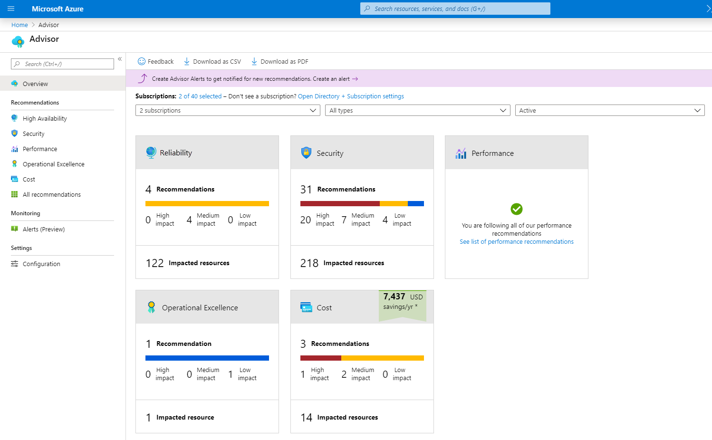


### Azure Service Health

Azure Service Health helps you keep track of Azure resources, both your specifically deployed resources and the overall status of Azure.

Azure Service Health does this by combining three different Azure services:

+ Azure Status: a broad picture of the status of Azure globally. Azure status informs you of service outages in Azure on the Azure Status page. The page is a global view of the health of all Azure services across all Azure regions. It's a good reference for incidents with widespread impact.

+ Service Health: provides a narrower view of Azure services and regions. It focuses on the Azure services and regions you're using. This is the best place to look for service impacting comms about outages, planned maintenance activities, and other health advisories because the authenticated Service Health experience knows which services and resources you currently use. You can even set up Service Health alerts to notify you when service issues, planned maintenance, or other changes may affect the Azure services and regions you use.

+ Resource Health: tailored view of your actual Azure resources. It provides information about the health of your individual cloud resources, such as specific VM instances. Using Azure Monitor, you can also configure alerts to notify you of availability changes to your cloud resources.

By using Azure status, Service Health, and Resource Health, Azure Service Health gives you a complete view of your Azure environment all the the way from the global status of Azure services and regions down to specific resources. Additionally, historical alerts are stored and accessible for later review. Something you initially thought was a simple anomaly that turned into a trend, can readily be reviewed and investigated thanks to the historical alerts.

Finally, in the event that a workload you're running is impacted by an event, Azure Service Health provides links to support.

### Azure Monitor

Azure Monitor is a platform for collecting data on your resources, analyzing that data, visualizing the information, and even acting on the results.

Azure Monitor can monitor Azure resources, your on-prem resources, and even multi-cloud resources like VMs hosted with a different cloud provider.

The following diagram illustrates Azure Monitor's functional architecture:


+ On the left you find the list of sources of logging and metric data that can be collected at every layer in your app architecture, from app to OS and network.

+ In the center, the logging and metric data are stored in central repositories.

+ On the right, the data is used in several ways. You can view real-time and historical performance across each layer of your arch or aggregated. The data is displayed at different levels for different audiences. You can view high-level reports on the Azure Monitor Dashboard or create custom views by using Power BI and Kusto queries.

Additionally, you can use the data to help you react to critical events in real time, through alerts delivered to teams via SMS, email, and so on. Or you can use thresholds to trigger autoscaling functionality to scale to meet the demand.

#### Azure Log Analytics

Azure Log Analytics is the tool in the Azure Portal where you'll write and run log queries on the data gathered by Azure Monitor.

Log Analytics is a robust tool that supports both simple, complex queries, and data analysis.

You can write a simple query that returns a set of records and then use features of Log Analytics to sort, filter, and analyze the records. You can write an advanced query to perform statistical analysis and visualize the results in a chart to identify a particular trend.

Whether you work with the results of your queries interactively or use them with other Azure Monitor features such as log query alerts or workbooks, Log Analytics is a tool that you're going to use write and test those queries.


#### Azure Monitor Alerts

Azure Monitor Alerts are an automated way to stay informed when Azure Monitor detects a threshold being crossed. You set the alert conditions, the notification actions, and then Azure Monitor Alerts notifies you when an alert is triggered.

Depending on your configuration, Azure Monitor Alerts also attempt corrective action.

Alerts can be set up to monitor the logs and trigger on certain log events, or they can be set to monitor metrics and trigger when certain metrics are crossed. For example, you could set a metric-based alert up to notify you when the CPU usage on a VM exceeded 80%. Alert rules based on metrics provide near real-time alerts based on numeric values. Rules based on logs allow for complex logic across data from multiple sources.

Azure Monitor Alerts use action groups to configure who to notify and what action to take. An action group is simply a collection of notification and action preferences that you associate with one or multiple alerts. Azure Monitor, Service Health, and Azure Advisor all use action groups to notify you when an alert has been triggered.

The following picture illustrate what the Azure Monitor Alerts look like:


#### Application Insights

Application Insights, an Azure Monitor feature, monitors your web apps. Application Insights is capable of monitoring applications that are running in Azure, on-prem, or in a different cloud environment.

There are two ways to configure Application Insights to help monitor your application. You can either install an SDK in your app, or you can use the Application Insights agent. The Application Insights agent is supported in C#, .NET, VB.NET, Java, JavaScript, Node.js, and Python.

Once Application Insights is up and running, you can use it to monitor a broad array of information, such as:

+ Request rates, response times, and failure rates.
+ Dependency rates, response times, and failure rates, to show whether external services are slowing down performance.
+ Page views and load performance reported by users' browsers.
+ AJAX calls from web pages, including rates, response times, and failure rates.
+ Performance counters from Windows or Linux servers, such as CPU, memory, and network usage.

Not only does Application Insights help you monitor the performance of your application, but you can also configure it to periodically send synthetic requests to your application, allowing you to check the status and monitor your application even during periods of low activity.

### You know you've mastered this chapter when ...

+ **Azure Advisor**
  + You're aware that Azure Advisor evaluates your Azure resources and make recommendations to help improve reliability, security, and performance, achieve operational excellence, and reduce costs.
  + You understand that Azure Advisor recommendations can be taken right away, postponed, or dismissed.
  + You're aware that the recommendations are available in the Azure Portal and via the API, and that you can configure notifications to get alerts about the new recommendations.
  + You know that the recommendations are classified in five categories: reliability, security, performance, operational excellence (to help you achieve process and workflow efficiency, resource manageability, and deployment best practices), and cost.

+ **Azure Service Health**
  + You understand that Azure Service Health is a dashboard that helps you keep track of Azure resources (yours, and the overall status of Azure).
  + You're aware that it comprises:
    + Azure Status: broad picture of the status of Azure globally.
    + Service Health: narrower view of Azure services and regions (service health, planned maintenance, other health advisories on the regions you're using).
    + Resource Health: tailored view of your actual Azure resources.
  + You're aware that you can configure Azure Monitor alerts to get norified of availability changes to your cloud resources.

+ **Azure Monitor**
  + You know that Azure Monitor is a platform for collecting data on your resources, analyzing that data, visualizing the information, and even acting on the results.
  + You're aware that Azure Monitor supports your on-prem resources, and even multi-cloud resources like VMs hosted on different public cloud providers.
  + You're familiar of the different tools and subservices within Azure Monitor:
    + **Azure Log Analytics**
      + You know that Azure Log Analytics is the tool in Azure Portal where you write and run log queries on the data gathered by Azure Monitor.
      + You understand that you can write simple and complex queries, and then use different features to visualize the results on tables and charts.
      + You're aware that you can work with the query results interactively, or use them with other features such as Log Query Alerts or Workbooks.

    + **Azure Monitor Alerts**
      + You know that Azure Monitor Alerts are an automated way to stay informed when Azure Monitor detects a threshold being crossed.
      + You understand that you work with Azure Monitor Alerts by setting the alert conditions, the notification actions, and the Azure Monitor Alerts notifies you when an alert is triggered.
      + You understand that alerts can be set up to monitor logs and trigger on certain log events, or they can be set to monitor metrics and trigger when certain metrics (such as CPU usage) are crossed.
      + You're aware that rules based on logs allow for complex logic across data from multiple sources, while alerts based on metrics provide near real-time alerts based on numeric values.
      + You understand that Azure Monitor Alerts use action groups to configure who to notify and what action to take.
      + You're aware that an action group is simply a collection of notification and action preferences that you associate with one or multiple alerts.

    + **Application Insights**
      + You know that Application Insights is another Azure Monitor feature that monitors your web apps on Azure, on-prem, or in a different could environment.
      + You're aware that it can be configured by using an SDK in your app, or by deploying an Application Insights agent (supported in C#, .NET, VB.NET, Java, JavaScript, Node.js, and Python).
      + You understand that Application Insights comes preconfigured with a vast array of web-related information such as: request rates, response times, failure rates, dependency rates, page views, ajax calls, and other performance counters from Windows or Linux such as CPU, memory, and network usage.
      + You're aware that you can configure it to periodically send sythetic requests to your application.


## 4A: Exam AZ-900 study guide
> https://aka.ms/AZ900-StudyGuide

### How to earn the certification

#### Overview

As a candidate for this certification, you are a tech professional who wants to demonstrate foundational knowledge of cloud concepts in general and Microsoft Azure in particular. This certification is a common starting point in a journey towards a career in Azure.

You can describe Azure architectural components and Azure services such as:
+ Compute
+ Networking
+ Storage

You can also describe features and tools to secure, govern, and administer Azure.

You should have skills and experience working with an area of IT, such as:
+ Infrastructure management
+ Database management
+ Software development


#### Take the exam

The exam will be 45 mins long.

The exam will be proctored.

You will have to:
+ Describe cloud concepts
+ Describe Azure architecture and services
+ Describe Azure management and governance

If the exam is not available in your native language, you can submit a form to request additional time: https://www.pearsonvue.com/content/dam/VUE/vue/en/documents/publications/999930.pdf

### Exam scoring and score reports

All technical exam scores are reported on a scale of 1 to 1,000. A passing score is 700 or greater.

The exam uses a scaled score, so it might not mean 70% of the points. A passing score is based on the knowledge and skills needed to demonstrate competence as well as the difficulty of the questions.

When answering most multi-part questions, you'll receive one point for each correctly answered component. You can earn all, some, or none of the points possible for that question.

There's no penalty for guessing. If you choose an incorrect answer, you simply won't earn the point for that question or part. No points are deducted for incorrect answers.

For most exams, you'll have your results within minutes of finish the exam.

Score reports are available for online exams taken with Pearson VUE and Certiport.

You just need to sign in to https://learn.microsoft.com/en-us/users/me/credentials?tab=credentials-tab and click on credentials.

If you fail an exam, you can retake it in 24 hours after the first attempt.

To prepare for a retake, review the strengths or weaknesses on your score report. Practice the skills where your exam performance was weak as well as the skills in the content areas with the highest percentage of questions.

### Exam Sandbox and Free Practice Assessment

You can explore the exam environment by visiting the exam sandbox here: https://aka.ms/examdemo

You can also test your skills with practice question to help you prepare for the exam.

### Skills measured as of Oct 30, 2025

As a candidate for this certification, you are a tech professional who wants to demonstrate foundational knowledge of cloud concepts in general and Microsoft Azure in particular. This certification is a common starting point in a journey towards a career in Azure.

You can describe Azure architectural components and Azure services such as:
+ Compute
+ Networking
+ Storage

You can also describe features and tools to secure, govern, and administer Azure.

You should have skills and experience working with an area of IT, such as:
+ Infrastructure management
+ Database management
+ Software development

#### Skills at a glance

+ Describe cloud concepts: 25%-30%
  + Describe cloud computing
    + Describe the shared responsibility model
    + Define cloud models, including public, private, and hybrid
    + Identify appropriate use cases for each cloud model
    + Describe the consumption-based model
    + Compare cloud pricing models
    + Describe serverless
  + Describe the benefits of using cloud services
    + Describe the benefits of high availability and scalability in the cloud
    + Describe the benefits of reliability and predictability in the cloud
    + Describe the benefits of security and governance in the cloud
    + Describe the benefits of manageability in the cloud
  + Describe cloud service types
    + Describe IaaS
    + Describe PaaS
    + Describe SaaS
    + Identity appropriate use case for each cloud service type

+ Describe Azure architecture and services: 35%-40%
  + Describe core architectural components of Azure
    + Describe Azure regions, region pairs, and sovereign regions
    + Describe availability zones
    + Describe Azure datacenters
    + Describe Azure resources and resource groups
    + Describe subscriptions
    + Describe management groups
    + Describe the hierarchy of resource groups, subscriptions, and management groups
  + Describe Azure compute and networking services
    + Compare compute types, including containers, VMs, and functions
    + Describe VM options, including Azure VMs, Azure VM Scale Sets, and availability sets, and Azure Virtual Desktop.
    + Describe the resources required for VMs
    + Describe app hosting options, including web apps, containers, and VMs
    + Describe virtual networking, including the purpose of Azure virtual networks, Azure virtual subnets, peering, Azure DNS; Azure VPN Gateway, and ExpressRoute
    + Define public and private endpoints
  + Describe Azure Storage services
    + Compare Azure Storage services
    + Describe storage tiers
    + Describe redundancy options
    + Describe storage account options and storage types
    + Identify options for moving files, including AzCopy, Azure Storage Explorer, and Azure File Sync.
    + Describe migration options, including Azure Migrate and Azure Data Box
  + Describe Azure identity, access, and security
    + Describe directory services in Azure, including Microsoft Entra ID and Microsoft Entra Domain Services
    + Describe authentication methods in Azure, including SSO, MFA, and passwordless
    + Describe external identities in Azure, including B2B and B2C.
    + Describe Microsoft Entra Conditional Access
    + Describe Azure RBAC
    + Describe the concept of Zero Trust
    + Describe the purpose of the defense-in-depth model
    + Describe the purpose of Microsoft Defender for Cloud

+ Describe Azure management and governance: 30%-35%
  + Describe cost management in Azure
    + Describe factors that can affect costs in Azure
    + Explore the pricing calculator
    + Describe cost management capabilities in Azure
    + Describe the purpose of tags
  + Describe features and tools in Azure for governance and compliance
    + Describe the purpose of Microsoft Purview in Azure
    + Describe the purpose of Azure Policy
    + Describe the purpose of resource locks
  + Describe features and tools for managing and deploying Azure resources
    + Describe the Azure Portal
    + Describe Azure Cloud Shell, including Azure CLI and Azure PowerShell
    + Describe the purpose of Azure Arc
    + Describe IaC
    + Describe Azure Resource Manager (ARM) and ARM templates
  + Describe monitoring tools in Azure
    + Describe the purpose of Azure Advisor
    + Describe Azure Service Health
    + Describe Azure Monitor, including Log Analytics, Azure Monitor alerts, and Application Insights


## 4A: Practice Assessment
> https://learn.microsoft.com/en-us/credentials/certifications/azure-fundamentals/practice/assessment?assessment-type=practice&assessmentId=23&practice-assessment-type=certification
