# Microsoft Azure
> notes on Microsoft Azure

## [01: Azure Fundamentals](01_azure_fundamentals/README.md)

Notes about Azure fundamentals. The contents are required knowledge to get the AZ-900 certification.

### [Azure: Distilled skills: Azure Fundamentals](#azure-fundamentals)

Distilled notes about Azure Fundamentals.

## [02: Azure Administration](02_azure_admin/README.md)

Notes about Azure Administration. The contents are required knowledge to get the AZ-104 certification.

## Azure: Distilled Skills

### Azure Fundamentals

This section focuses on presenting a distilled version of the skills requires to pass the AZ-900 exam.

+ Describe cloud concepts: 25%-30%
  + Describe cloud computing
    + Describe the shared responsibility model
    + Define cloud models, including public, private, and hybrid
    + Identify appropriate use cases for each cloud model
    + Describe the consumption-based model
    + Compare cloud pricing models
    + Describe serverless
  + Describe the benefits of using cloud services
    + Describe the benefits of high availability and scalability in the cloud
    + Describe the benefits of reliability and predictability in the cloud
    + Describe the benefits of security and governance in the cloud
    + Describe the benefits of manageability in the cloud
  + Describe cloud service types
    + Describe IaaS
    + Describe PaaS
    + Describe SaaS
    + Identify appropriate use case for each cloud service type

+ Describe Azure architecture and services: 35%-40%
  + Describe core architectural components of Azure
    + Describe Azure regions, region pairs, and sovereign regions
    + Describe availability zones
    + Describe Azure datacenters
    + Describe Azure resources and resource groups
    + Describe subscriptions
    + Describe management groups
    + Describe the hierarchy of resource groups, subscriptions, and management groups
  + Describe Azure compute and networking services
    + Compare compute types, including containers, VMs, and functions
    + Describe VM options, including Azure VMs, Azure VM Scale Sets, and availability sets, and Azure Virtual Desktop.
    + Describe the resources required for VMs
    + Describe app hosting options, including web apps, containers, and VMs
    + Describe virtual networking, including the purpose of Azure virtual networks, Azure virtual subnets, peering, Azure DNS; Azure VPN Gateway, and ExpressRoute
    + Define public and private endpoints
  + Describe Azure Storage services
    + Compare Azure Storage services
    + Describe storage tiers
    + Describe redundancy options
    + Describe storage account options and storage types
    + Identify options for moving files, including AzCopy, Azure Storage Explorer, and Azure File Sync.
    + Describe migration options, including Azure Migrate and Azure Data Box
  + Describe Azure identity, access, and security
    + Describe directory services in Azure, including Microsoft Entra ID and Microsoft Entra Domain Services
    + Describe authentication methods in Azure, including SSO, MFA, and passwordless
    + Describe external identities in Azure, including B2B and B2C.
    + Describe Microsoft Entra Conditional Access
    + Describe Azure RBAC
    + Describe the concept of Zero Trust
    + Describe the purpose of the defense-in-depth model
    + Describe the purpose of Microsoft Defender for Cloud

+ Describe Azure management and governance: 30%-35%
  + Describe cost management in Azure
    + Describe factors that can affect costs in Azure
    + Explore the pricing calculator
    + Describe cost management capabilities in Azure
    + Describe the purpose of tags
  + Describe features and tools in Azure for governance and compliance
    + Describe the purpose of Microsoft Purview in Azure
    + Describe the purpose of Azure Policy
    + Describe the purpose of resource locks
  + Describe features and tools for managing and deploying Azure resources
    + Describe the Azure Portal
    + Describe Azure Cloud Shell, including Azure CLI and Azure PowerShell
    + Describe the purpose of Azure Arc
    + Describe IaC
    + Describe Azure Resource Manager (ARM) and ARM templates
  + Describe monitoring tools in Azure
    + Describe the purpose of Azure Advisor
    + Describe Azure Service Health
    + Describe Azure Monitor, including Log Analytics, Azure Monitor alerts, and Application Insights

### Describe cloud concepts

#### Describe cloud computing

+ **Cloud computing**: the delivery of computing services (VMs, storage, databases, networking, ML IoT, AI) over the internet by using a pay-as-you-go pricing model.

+ **Shared responsibility model**: the cloud security model, where responsibilities are shared between the cloud provider (Azure) and the consumer (you).
    + Physical security, power, cooling, and network connectivity are the responsibility of the cloud provider.
    + The consumer is responsible for the data and the information stored in the cloud. The consumer is also responsible for access security (giving access to those who need it).

    There are areas that will always fall into the cloud provider's responsibility, others that will always fall under your responsibility, and others that might fall with the cloud provider or you depending on the service and model:

    + Cloud provider always: physical datacenter,physical network, physical hosts.
    + Consumer always: information and data stored in the cloud, devices that are allowed to connect to the cloud, accounts and identities of the people, services, and devices within your org.
    + Depends: OS, network controls, apps, identity and infrastructure.

    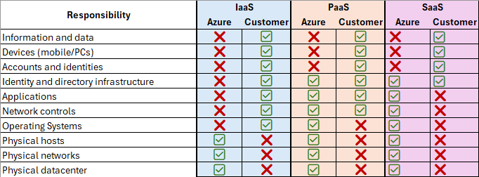

#### Define cloud models, including public, private, and hybrid

+ **Cloud models**: private, public, and hybrid.

+ **Private cloud**: a cloud that is used by a single entity. It's the natural evolution from a corporate datacenter. It may be hosted in your on prem datacenter, in a dedicated datacenter offsite, or even by a 3rd party that has a dedicated datacenter for you.

+ **Public cloud**: a cloud that is built, controlled, and maintained by a 3rd party cloud provider.

+ **Hybrid cloud**: computing environment that uses both public and private clouds in an inter-connected environment. Typically, a hybrid cloud allows a private cloud environment to handle increased demand by deploying public cloud resources.

+ **Other models**:
    + **Multi-cloud**: scenario in which you use multiple public cloud providers.
    + **Azure Arc**: a set of technologies that helps manage Azure, hybrid, multi-cloud environments from Azure.
    + **Azure VMware**: a service that lets you run VMware workloads in Azure.

#### Identify appropriate use cases for each cloud model

+ **Private**: when compliance requirements might prevent you from using public cloud. This will give you much greater control, with a greater cost and fewer of the benefits of a public cloud.
+ **Public**: controlled by a 3rd party public provider.
+ **Hybrid**: when you have a established private cloud but would like to complement it with public for increases in demand or additional features.

#### Describe the consumption-based model

Public cloud is a consumption-based, pay-as-you-go model (OpEx):
+ No upfront costs
+ No need to purchase or manage infrastructure
+ You can pay for more resources if and when they are needed
+ You can stop paying for resources that are no longer needed

#### Compare cloud pricing models

+ When comparing IT infra models, there are two types of expenses:
    + **Capital Expenditure** (CapEx): one-time, upfront expenditure to purchase or secure tangible resources (e.g., building a datacenter, buying a server).
    + **Operational Expenditure** (OpEx): spending money on services or products over time (e.g., renting a convention center, signing-up for cloud services).

+ Public cloud is OpEx, because it operates on a consumption-based model.

+ With the pay-as-you-go model you will be able to:
  + Plan and manage your operating costs.
  + Run your infra more efficiently.
  + Scale as your business needs change.

#### Describe serverless

+ The goal of serverless computing is to help forget the maintenance tasks (OS upgrades, patches in packages, etc.) by taking care of those server management tasks automatically by the platform, so that you can focus your effort on getting your app ready for your end users.
+ There are servers is serverless computing, but responsibility of managing the server is handled for you.
+ Benefits:
  + No infra management: deploy your code and run it with HA
  + Scalability: you can scale from nothing to 10,000s of request with no configuration
  + Pay for what you use: you're charged only for the time it takes to run your code in response to an event.

### Describe the benefits of using cloud services

+ High Availability (HA)
+ Scalability
+ Reliability
+ Predictability
+ Security
+ Governance
+ Manageability

#### Describe the benefits of high availability and scalability in the cloud

+ HA
  + HA focuses on ensuring maximum availability, regardless of disruptions or events that may occur.
  + SLAs formalize uptime guarantees, with a percentage of uptime.
  + Resiliency is the ability of a system to recover quickly. Resiliency supports availability.
  + In the cloud, it's easy to implement HA as many services provide HA out of the box (no downtime).

+ Scalability
  + Scalability is the ability to adjust resources to meet demand.
  + In the cloud, you can have both vertical (capabilities of a resource) and horizontal scaling (number of resources) with no upfront commitments.

#### Describe the benefits of reliability and predictability in the cloud

+ Reliability
  + Reliability is the ability of a system to recover from failures and continue to function.
  + In the cloud, thanks to its decentralized design, it supports a reliable (system can recover from failures) and resilient (system recover quickly after a failure) infrastructure.
  + Some services also shift to different regions automatically.

+ Predictability
  + Cloud gives you performance predictability and cost predictability.
  + Performance predictability is about predicting the resources you need to deliver a positive UX.
  + Cost predictability focuses on forecasting your cloud spend.

  | NOTE (Reliability vs. Resiliency): |
  | :---- |
  | To distinguish reliability (ability of a system to recover from failures) from resiliency (ability to recover quickly after a failure), you can think about the city's power grid: it is very reliable (it fails very rarely), but it's not very resilient (everytime it fails, it takes a long time to reestablish). |

#### Describe the benefits of security and governance in the cloud

+ Security and governance are supported by the cloud in different ways:
  + You can use templates to ensure your resources meet corporate standards and regulatory requirements.
  + Cloud-based auditing can help flag resources that are out of compliance and even provide mitigation strategies.
  + Cloud providers are well suited to handle DDoS attacks.

#### Describe the benefits of manageability in the cloud

+ Management in the cloud is about how you interact with the cloud and your resources:
  + through a web portal
  + command line interfaces (PowerShell, Bash)
  + using APIs and SDKs

+ Management of the cloud is about the features at hand to manage your resources:
  + automatically scaling resources based on needs
  + deploy resources based on preconfigured templates, without requiring manual configuration.
  + monitor the health of resources and replacing the ones that fail.
  + receive alerts based on configured metrics.

### Describe cloud service types

+ IaaS
+ PaaS
+ SaaS

#### Describe IaaS

+ The cloud provider is responsible for maintaining the hardware, the network (connectivity), and physical security. You're responsible for everything else: OS installation and configuration, maintain network configuration, database and storage configuration...

+ IaaS shared responsibility model:

    | Responsibility               | Azure | Customer |
    | :--------------------------- | :---- | :------- |
    | Physical datacenter          | ✅   | ❌       |
    | Physical network             | ✅   | ❌       |
    | Physical hosts               | ✅   | ❌       |
    | Operating system             | ❌   | ✅       |
    | Network controls             | ❌   | ✅       |
    | Applications                 | ❌   | ✅       |
    | Identity and directory infra | ❌   | ✅       |
    | Accounts and identities      | ❌   | ✅       |
    | Devices (mobile/PCs)         | ❌   | ✅       |
    | Information and data         | ❌   | ✅       |

#### Describe PaaS

+ The cloud provider maintains the physical infrastructure, physical security, and connection to the internet. They maintain as well th OS, middleware, dev tools, and business intelligence.

+ PaaS shared responsibility model:

    | Responsibility               | Azure | Customer |
    | :--------------------------- | :---- | :------- |
    | Physical datacenter          | ✅   | ❌       |
    | Physical network             | ✅   | ❌       |
    | Physical hosts               | ✅   | ❌       |
    | Operating system             | ✅   | ❌       |
    | Network controls             | ✅   | ✅       |
    | Applications                 | ✅   | ✅       |
    | Identity and directory infra | ✅   | ✅       |
    | Accounts and identities      | ❌   | ✅       |
    | Devices (mobile/PCs)         | ❌   | ✅       |
    | Information and data         | ❌   | ✅       |

#### Describe SaaS

+ Renting or using a fully developed application.

+ SaaS shared responsibility model:

| Responsibility               | Azure | Customer |
| :--------------------------- | :---- | :------- |
| Physical datacenter          | ✅   | ❌       |
| Physical network             | ✅   | ❌       |
| Physical hosts               | ✅   | ❌       |
| Operating system             | ✅   | ❌       |
| Network controls             | ✅   | ❌       |
| Applications                 | ✅   | ❌       |
| Identity and directory infra | ✅   | ✅       |
| Accounts and identities      | ❌   | ✅       |
| Devices (mobile/PCs)         | ❌   | ✅       |
| Information and data         | ❌   | ✅       |

#### Identify appropriate use case for each cloud service type

+ IaaS:
  + lift-and-shift migrations.
  + testing and development.

+ PaaS:
  + frameworks that developers can build upon to develop or customize cloud-based apps.
  + analytics or business intelligence tools provided as a service to analyze or mine their data, finding insights and patterns, predicting outcomes to improve forecasting, etc.

+ SaaS:
  + Email and messaging.
  + Financial software.
  + Business productivity apps.

### Describe Azure architecture and services

+ Azure is Microsoft's cloud computing platform. It supports IaaS, PaaS, and SaaS models. Most of Azure services are pay-as-you-go.

+ Azure is powered by an ever increasing number of regional datacenters that allow you to distribute your apps globally so that data and apps are located where they're needed most.

+ Azure Portal lets you create, configure, and control all youre services and resources from a single, easy to use web-based interface.

+ Azure provides more than 100 services that enable many types of approaches: from running legacy apps on VMs to exploring new software paradigms.

+ The most popular services are:
  + VMs
  + Cloud based storage
  + Azure's App Service
  + Azure Functions
  + Azure Container Instances and Azure Kubernetes Service
  + Fully managed relational and in-memory dbs (supporting many commercial OSS engines)
  + Azure Cosmos DB for NoSQL scenarios
  + Azure AI and ML services

#### Describe core architectural components of Azure

+ When working with Azure, you need to create an Azure Account: an identity in Microsoft Entra ID or in an directory that Microsoft Entra ID trusts.
+ To create Azure services you need an Azure subscription. Once you've created an Azure account you can create additional subscriptions (for organizational/billing purposes).
+ You can create Azure resources on each subscription.

  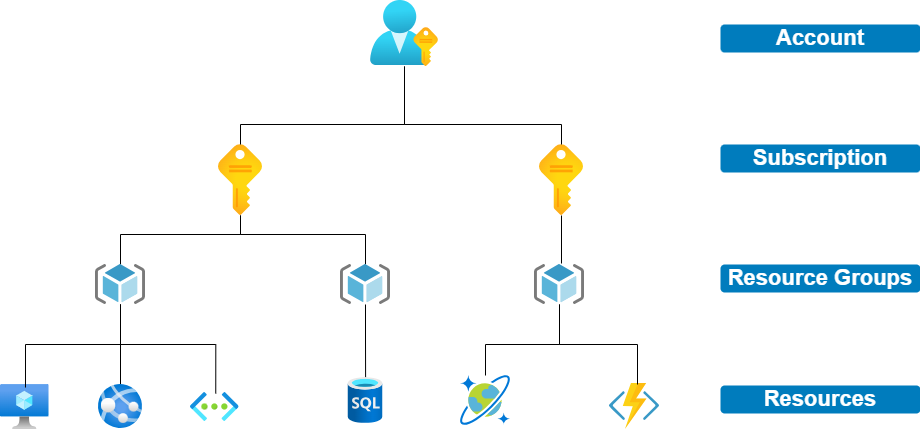

+ The free account you get when you first create an Azure account includes:
  + Free access to popular Azure products for 12 months.
  + $200 credit to use for the first 30 days.
  + Access to more than 25 products that are always free.

+ There's also a free account for students.

+ Azure architecture is typically broken down into two main categories:
  + Physical infrastructure
  + Management infrastructure

##### Describe Azure regions, region pairs, and sovereign regions

+ **Azure Region**: a geographical area on the planet that contains at least one, but potentially multiple, datacenters that are nearby and networked together with a low-latency network.

  + Some services are only available in certain regions, while some other services are global and don't require you to select any particular region when deployed (e.g., Entra ID, Azure DNS, Azure Traffic Manager, ...)

+ **Region pairs:** most Azure regions are paired with another region within the same geography (but at least 300 miles away). The makes your app resilient to outages impacting multiple availability zones: if a region (and therefore the corresponding availability zones) is affected by an outage, services would automatically fail over to the other region in its region pair.

  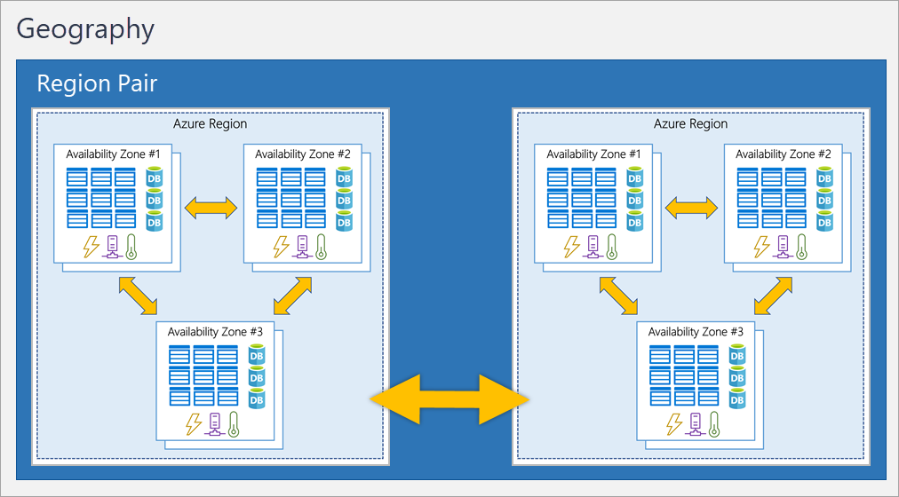

+ **Sovereign regions**: instances of Azure that are isolated from the main instance of Azure for compliance/legal purposes (e.g., US DoD, US Gov Virginia, China East, etc.)

##### Describe availability zones

+ Physically separated datacenters within an Azure region.
+ Each availability zone is made up of one or more datacenters equipped with independent power, cooling, and networking.
+ An availability zone is set up to be an isolation boundary, so that if one availability zone goes down, the other continues working.

+ To ensure resiliency, a minimum of three separate availability zones are present in all availability zone-enabled regions.

    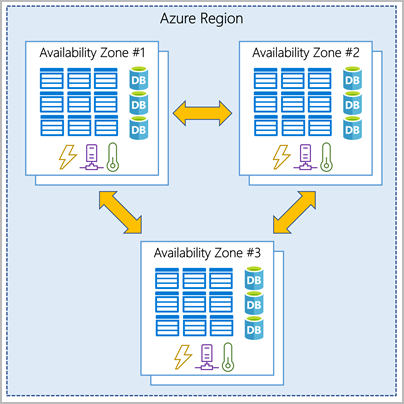

+ You use availability zones to make your services and data redundant, thus providing HA to your apps and data: to co-locate your compute, storage, networking, and data resources within an availability zone and replicate it in other availability zone within the selected region.

+ Azure services that support availability zones fall into three categories:
    + Zonal services: you pin the resource to a specific availability zone (e.g., VMs, managed disk, etc.).
    + Zone-redundant services: Azure replicates automatically across zones (e.g., SQL database, zone-redundant storage, ...).
    + Non-regional services: services that are always available and resilient to zone-wide and region-wide outages.

##### Describe Azure datacenters

+ The physical infrastructure starts with datacenters: facilities located all over the globe with resources arranged in racks, with dedicated power, cooling, and networking infrastructure. Datacenters aren't directly accesible. Datacenters are grouped into Regions and Availability Zones.

##### Describe Azure resources and resource groups

+ Azure management infrastructure includes accounts, subscriptions, resource groups, and resources.

  

##### Describe subscriptions

+ Subscriptions are a unit of management, billing, and scale.

+ Subscriptions lets you organize your resource groups and facilitate billing.

+ A subscription provides you with authenticated and authorized access to Azure products and services. It also allows you to provision resources.

+ An Azure subscription links to an Azure account.

+ Subscriptions are typically used to configure different billing models and/or apply different access-management policies:
    + Billing boundary: this type of subscription type determines how an Azure account is billed for using Azure.
    + Access control boundary: Azure applies access-management policies at the subscription level, and you can create separate subscriptions to reflect different organizational structures (e.g., departments with distinct Azure subscription policies).

##### Describe management groups

+ Management groups are groupings of subscriptions and other management groups.
+ You can organize your resources into a hierarchy for unified policy and access management using management groups.

  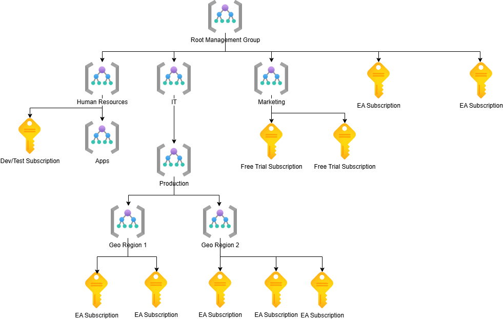

+ Policies applied to a management group will be inherited by all the subscriptions that are descendants of that management group and will end up being applied to the resources deployed on those subscriptions.
+ Azure RBAC assignments applied at the management group level will make all the sub-management groups, subscriptions, resource groups, and resources underneath inherit those permissions.

+ Limits:
  + 10,000 management groups supported in a single directory.
  + A management group tree support up to six levels or depth (not counting the root or subscription level).
  + Each management group and subscription support a single parent (no graphs!)

##### Describe the hierarchy of resource groups, subscriptions, and management groups

+ **Resource**: the basic building block of Azure. Anything you create, provision, deploy, configure, etc. is a resource (e.g., VMs, virtual networks, cognitive services).

+ **Resource Group**: a grouping of resources. When you create a resource you're required to place it into a resource group.

#### Describe Azure compute and networking services

+ Azure compute
  + VMs:
    + Azure VMs
    + Azure VM Scale Sets
    + Availability Sets
  + Containers:
    + Azure Container Instances
    + Azure Container Apps
    + Azure Kubernetes Service (AKS)
  + Functions-as-a-Service
    + Azure Function Apps
  + Desktop and app virtualization services
    + Azure Virtual Desktop
  + Other compute services
    + Azure App Service

+ Azure networking services
  + Azure Virtual Networks and Virtual Subnets
  + Azure DNS
  + Azure VPN and Azure VPN Gateway
  + ExpressRoute

##### Compare compute types, including containers, VMs, and functions

+ **Azure VMs**
  + Provide IaaS in the form of virtualized servers in Azure.
  + Gives you total control over the OS, the software you run, and the custom hosting configurations.
  + You are responsible for the configuration, update, and software maintenance on the VM.
  + You can create our use an image to speed up the VM provisioning.
  + VMs create an abstraction layer over CPU, memory, and storage: they emulate a full computer.
  + Scenarios:
    + testing and development
    + running apps in the cloud
    + extending an on-prem datacenter to the cloud
    + during disaster recovery
    + lift-and-shift on-prem workloads to the cloud

+ **Azure Containers**
  + Virtualization environment that lets you run multiple apps on a single physical or virtual host.
  + Unlike VMs, you don't manage the OS for a containers.
  + Containers are much lightweight than VMs: they're designed to be created, scaled out, and stopped dynamically.
  + A container bundles a single app and its dependencies, which can then be deployed as a unit to a container host. Multiple containers can run side-by-side with other containerized apps.
  + Scenarios:
    + microservices (when you break solutions into smaller, independent pieces that can be maintained, scaled, or updated independently).
    + three-tier apps: containers for your front-end, backend and storage/persistence layer.

+ **Azure Functions**
  + Event-driven, serverless compute option that doesn't require maintaining VMs or containers.
  + An event wakes up the function. No need to have something running when the app is idle.
  + Azure functions can be stateless (the default) or stateful (context is passed through the function to keep track of prior activity).
  + Scenarios:
    + When focus is on running a service and not about the underlying platform or infra.
    + Event-driven workloads (REST requests, timers, messages).
    + When demand is variable, and you want to pay for only what you use.

##### Describe VM options, including Azure VMs, Azure VM Scale Sets, and availability sets, and Azure Virtual Desktop.

+ You can run single VMs for testing, development, or other minor tasks.
+ Advanced scenarios require grouping VMs together to provide HA, scalability, and redundancy.
  + **Azure VM Scale Sets**:
    + Allow you to centrally manage, configure, and update a large number of identical, load-balanced VMs.
    + The number of instances can be configured to change in response to demand, or defined by schedule.
    + Automatically deploy a load balancer to ensure resources are being used efficiently.
    + Scenarios: large scale compute, big data, container workloads.

  + **Availability Sets**
    + Designed to ensure that VMs stagger updates and have varied power and network connectivity, preventing you from losing all your VMs with a single network or power failure.
    + You can group your VMs in two ways:
      + Update domain: grouping by VMs that can be rebooted at the same time.
      + Fault domain: grouping by common power source and network switch.
    + There's no cost for configuring an availability set.

  + **Azure Virtual Desktop**
    + Desktop and application virtualization service that runs on the cloud. It enables you to use a cloud hosted version of Windows from any location and across devices.
    + It simplifies security management by using a centralized approach.
    + It separates OS data and apps from local hardware, thus providing increased security.
    + All remote desktop infrastructure is fully managed: gateway, broker, diagnostics, load balancing...
    + All communication is over secure connection.
    + You can enable MFA and use RBAC.
    + It lets you run Windows 10 or Windows 11 Enterprise multi-session (multiple concurrent users on a single VM).

##### Describe the resources required for VMs
  + Size: purpose, number of processor cores, amount of RAM
  + Storage disks: HDD, SDD, etc.
  + Networking: virtual network, public IP address, port configuration

##### Describe app hosting options, including web apps, containers, and VMs

+ **Containers**
  + **Azure Container Instances**
    + PaaS that allows you to upload containers and the service runs them for you.
    + Fastest and simplest way to run a container in Azure without having to manage any VM or adopt additional services.
  + **Azure Container Apps**
    + PaaS that removes the container management piece.
    + It enables you to incorporate load balancing and scaling.
  + **Azure Kubernetes Service (AKS)**
    + AKS is a container orchestration service that manages the lifecycle of containers.

+ **VMs**
  + **Azure VMs**
    + Single VMs for testing, development, or other minor tasks
  + **Azure VM Scale Sets**
    + Groups of identical VMs with load-balancing built-in.
  + **Availability Sets**
    + Groups of VMs with varied power and connectivity sources to enable HA.

+ **Functions**
  + **Azure Functions**
    + Event-driven serverless solution.

+ **Other PaaS services for hosting apps**
  + **Azure App Service**
    + Enables you to build and host web apps, background jobs, mobile backends, and RESTful APIs.
    + Supports multiple programming languages: Java, PHP, Python, Node.js, .NET, .NET Core.
    + No infrastructure management: deployment and management is integrated, endpoints can be secured, sites can be scaled, built-in load balancing and HA with traffic manager.
    + Offers automatic scaling and HA.

##### Describe virtual networking, including the purpose of Azure virtual networks, Azure virtual subnets, peering, Azure DNS; Azure VPN Gateway, and ExpressRoute

+ Azure virtual networks and virtual subnets enable Azure resources to communicate:
  + with each other
  + with users on the internet
  + with on-prem client computers

+ Azure virtual networks provide the following key capabilities:
  + isolation and segmentation: you can create multiple isolated virtual networks and divide the IP address space into subnets.
  + internet communications: you can enable incoming connections from the internet by assigning a public IP address to a resource or by putting a resource behind a public load balancer.
  + communication between Azure resources: virtual networks can connect many types of resources (VMs, AKS, VM scale sets), and you can also use service endpoint to connect other resource types as well (e.g., Storage accounts, Azure SQL)
  + communication with on-prem resources: you can create networks that spans both your local and cloud environment using point-to-site, site-to-site, or Azure ExpressRoute.
  + route network traffic: Azure routes traffic between subnets on any connected virtual networks, on-prem networks and the internet, but you can configure those settings with route tables and Border Gateway Protocol (BGP) with Azure VPN.
  + filter network traffic: filter traffic between subnets using Network Security Groups or Network Virtual appliances.
  + connect virtual networks: you can link virtual network together using peering (which lets you connect two virtual networks to each other).

+ Communication with on-prem resources: Azure virtual networks enable you to link resources together in your on-prem environment and within your Azure subscription using either:
  + Point-to-site VPN: from a computer outside your org back into your corporate network. An encrypted VPN connection is used by the client computer to connect to your Azure virtual network.
  + Site-to-site private network: links your on-prem VPN device or gateway to the Azure VPN gateway in a virtual network. The connections works over the internet and traffic is encrypted.
  + Azure ExpressRoute: dedicated private connectivity to Azure that doesn't travel over the internet. Providers greater bandwidth and higher level of security.

+ **Azure DNS**:
  + Hosting service for DNS domains that provides name resolution by using Azure infrastructure: using the same credentials, APIs, tools, and billing you're familiar with.
  + Provides resiliency and HA.
  + Integrated with Azure Resource Manager: works with Azure RBAC, activity logs, and support resource locking.
  + Can manage DNS records for your Azure services and also for external resources.
  + Supports alias record sets: you can use an alias record to refer to an Azure resource, and if the IP address of the underlying resource changes, the alias record set seamlessly updates itself during DNS resolution.
  + You can't use Azure DNS to buy a domain name, but you can use App Service domains or a 3rd party domain name registrar.
  + For name resolution you can use Azure DNS or you can configure the virtual network to use either an itnernal or external DNS server.

+ **Azure VPN**
  + A VPN uses an encrypted tunnel to connect two or more trusted networks to one another over an untrusted network (typically the public internet).

+ **Azure VPN Gateway**
  + a type of virtual network gateway that is deployed in a dedicated subnet of the virtual network to enable:
    + connectivity from on-prem datacenters to virtual networks through a site-to-site connection.
    + connectivity for individual devices to virtual networks through a point-to-site connection.
    + connectivity for virtual networks to other virtual networks though a network-to-network connection.
  + Only one VPN gateway can be deploy in each virtual network, but one gateway can service multiple locations (other virtual networks or on-prem datacenters).
  + There are two typs of VPN Gateways:
    + Policy-based VPN gateways: specify statically the IP addresses of packets that should be encrypted through each tunnel.
    + Route-based VPN gateways: More resilient to topology changes and preferred connection method for on-prem devices.
      + Connections between virtual networks
      + Point-to-site connections
      + Multisite connections
      + Coexistence with Azure ExpressRoute gateways
  + Support active/standby (default) and active/active for HA.
  + Can be configured as a secure failover for ExpressRoute connections.

+ **ExpressRoute**
  + Lets you extend your on-prem networks into the Microsoft cloud over a private connection with the help of a connectivity provider.
  + Connection is called an ExpressRoute circuit. It can establish connections to Microsoft cloud services (Azure, Microsoft 365) from your offices and datacenters.
  + Connections don't go over the public internet.

##### Define public and private endpoints

+ Azure virtual networking supports public and private endpoints to enable communication between external or internal resources:
  + Public endpoints: feature a public IP address and can be accessed from anywhere in the world.
  + Private endpoints: exist within a virtual network and have a private IP address within the address space of the virtual network in which they are defined.

#### Describe Azure Storage services

+ Azure Storage is Azure's cloud storage solution for modern data storage scenarios.
+ Core Azure Storage services offer:
  + **Azure Blob Storage**: object storage solution to store massive amounts of unstructured data (text, binary).
  + **Azure Disk Storage**: disks for Azure VMs and apps to access and use as they need. It offers both HDDs and SDDs.
  + **Azure File**: fully managed file shares in the cloud accesible via industry standard network protocols.
  + **Azure Table Storage**: NoSQL data store for key-value pairs backed by large scale datasets.
  + **Azure Queue Storage**: async message queueing for communication between app components.

+ A storage account provides a unique namespace for your Azure Storage data, accessible from anywhere in the world over HTTP.
  + Every storage account in Azure must have a unique-in-Azure account name. The combination of the account name and the Azure Storage Service endpoint forms the endpoints for your storage account. The storage account name must be between 3 and 24 chars long. Only letters and numbers are allowed.

    | Storage service | Endpoint |
    | :-------------- | :------- |
    | Blob Storage | https://{storage-account-name}.blob.core.windows.net |
    | Data Lake Storage Gen2 | https://{storage-account-name}.dfs.core.windows.net |
    | Azure Files | https://{storage-account-name}.file.core.windows.net |
    | Queue Storage | https://{storage-account-name}.queue.core.windows.net |
    | Table Storage | https://{storage-account-name}.table.core.windows.net |

+ Data in an Azure Storage Account is HA, durable, and massively scalable.

##### Compare Azure Storage services

+ **Azure Blobs**
  + massively scalable object store for text and raw binary data.
  + Scenarios: big data analytics, serve images for the browser, storing data for archives, video/audio streaming, DR.

+ **Azure Disks**
  + block-level storage volumes for Azure VMs.
  + Scenarios: VMs that require persistent HDDs or SDDs.

+ **Azure Tables**
  + NoSQL tables for structured, non-relational data.
  + Scenarios: apps requiring a database for semi-structured data.

+ **Azure Files**
  + managed file shares for cloud or on-prem deployments.
  + Scenarios: file shares for on-prem, file shares for cloud apps.

+ **Azure Queues**
  + messaging store for reliable messaging between app components.
  + Scenarios: synchronization between distributed app components.

##### Describe storage tiers

+ With respect to cost, there are three storage tiers:
  + hot: data accessed frequently
  + cool: data accessed infrequently for at least 30 days
  + cold: data accessed infrequently for at least 90 days
  + archive: data rarely accessed for at least 180 days

+ Hot, cool, and cold are set at the account level.
+ All tiers can be set at the blob level, during or after the upload.

##### Describe redundancy options

+ Azure Storage always store multiple copies of your data so that it's protected from planned and unplanned outages. This impacts the durability and availability of your data.

+ When deciding the redundancy option, consider the tradeoff between cost and availability.

+ The factors to consider in the redundancy options are:
  + How is your data replicated in the primary region, where you define your storage account.
  + Whether the data is replicated to a second region, separated from the primary region.
  + Whether your app requires read access to the replicated data in the secondary region, even if the primary region is running optimally.

The list of redundancy options are:
+ Replication only in the primary region:
  + Locally redundant storage (LRS)
  + Zone-redundant storage (ZRS)
+ Replication in the primary region and in a secondary region (paired region):
  + Geo-redundant storage (GRS)
  + Geo-zone-redundant storage (GZRS)
+ Replication in the primary region and in a secondary region with read access to the secondary region:
  + Read-access geo-redundant storage (RA-GRS)
  + Read-access geo-zone-redundant storage (RA-GZRS)

+ Data in an Azure Storage Account is always replicated in the primary region, with two available strategies:
  + **Locally Redundant Storage (LRS)**
    + Data is replicated three times within a single datacenter in the primary region
    + Provides 11 nines of durability over a year
    + Lowest cost
    + Only protects against rack and drive failures

      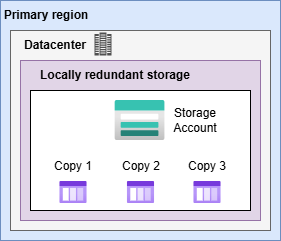

  + **Zone Redundant Storage (ZRS)**
    + Data is replicated synchronously across three Azure availability zones in the primary region
    + Provides 12 nines of durability over a year
    + Good balance between cost and availability
    + Protects against datacenter failures

      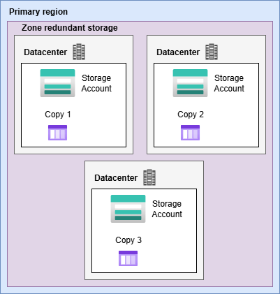

  + **Geo-Redundant Storage (GRS)**
    + Data is replicated in the primary region using LRS
    + Data is replicated in the secondary region using LRS, asynchronously
    + Data in the secondary region is not available, unless there's a failover
    + Provides 16 nines of durability over a year
    + Protects against region outages
    + Because data is replicated asynchronously, a failure in the primary region may result in data loss (RPO is 15 mins)

      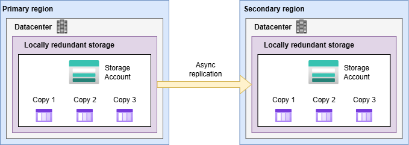

  + **Geo-Zone-Redundant Storage (GZRS)**
    + Data is replicated in the primary region using ZRS
    + Data is replicated in the secondary region using LRS, asynchronously
    + Data in the secondary region is not available, unless there's a failover
    + Provides 16 nines of durability over a year
    + Protects against region outages, with better availability in the primary region
    + Because data is replicated asynchronously, a failure in the primary region may result in data loss (RPO is 15 mins)

      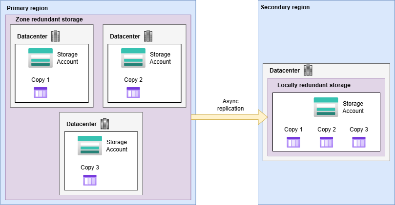

  + **Read Access Geo-Redundant Storage (RA-GRS)**
    + Uses GRS for data replication in the primary and secondary region.
    + Data is available for read access in the secondary region, even if the primary region is running optimally.

  + **Read Access Geon-Zone-Redundant Storage (RA-GZRS)**
    + Uses GZRS for data replication in the primary and secondary region.
    + Data is available for read access in the secondary region, even if the primary region is running optimally.

##### Describe storage account options and storage types

+ The list of storage account types are:
  + Standard general-purpose v2
  + Premium block blobs
  + Premium file shares
  + Premium page blobs

    | Type | Supported services | Redundancy Options | Usage |
    | :--- | :----------------- | :----------------- | :---- |
    | Standard general-purpose v2 | Blob Storage (including Data Lake Storage), Queue Storage, Table Storage, and Azure Files | LRS, GRS, RA-GRS, ZRS, GZRS, RA-GZRS | Standard storage account type for blobs, file shares, queues, and tables. Rcommended for most scenarios using Azure Storage. If you want support for network file system (NFS) in Azure files, use the premium file shares account type instead. |
    | Premium block blobs | Blob Storage (including Data Lake Storage) | LRS, ZRS | Premium storage account type for block blobs and append blobs. Recommended for scenarios with high transaction rates or that use smaller objects or require consistently low storage latency. |
    | Premium file shares | Azure files | LRS, ZRS | Premium storage account type for file shares only. Recommended for enterprise or high-performance scale applications. Use this account type if you want a storage account that supports both Server Message Block (SMB) and NFS file shares. |
    | Premium page blobs | Page blobs only | LRS | Premium storage account type for page blobs only |

##### Identify options for moving files, including AzCopy, Azure Storage Explorer, and Azure File Sync

+ These options are for moving individual files or small file groups.

+ **AzCopy**
  + Command-line utility to copy blobs or files to/from your storage account.
  + Supports upload, download, copy, and synchronization.
  + Supports different public clouds.

+ **Azure Storage Explorer**
  + Standalone app that provides a GUI to manage files and blobs in your storage account.
  + Uses AzCopy on the backend.
  + Supports upload to Azure, download from Azure, move between storage accounts.

+ **Azure File Sync**
  + Tool to centralize your file shares in Azure Files.
  + Lets you establish a bi-directional synchronization between a local Windows server and Azure Files.
  + Lets you configure cloud tiering so that most frequently accessed files are replicated locally, while infrequently accessed files are kept in the cloud until requested.

##### Describe migration options, including Azure Migrate and Azure Data Box

+ These options are for large scale migrations.

+ **Azure Migrate**
  + Service that helps migrate from an on-prem environment to the cloud.
  + Hub to manage both the assessment and migration of on-prem datacenters to Azure
  + Tools:
    + Azure Migrate: Discovery and Assessment
    + Azure Migrate: Server Migration
    + Data Migration Assistant (SQL Server data)
    + Azure Database Migration Service (on-prem dbs to Azure VMs)
    + Azure App Servive Migration Assistant
    + Other tools supported by ISVs

+ **Azure Data Box**
  + Physical migration service to transfer large amounts of data in a quick, inexpensive, and reliable way (uses a Data Box storage device).
  + Supports both import and export of data from Azure.
  + Scenarios:
    + one-time migration
    + media library migration
    + migrating VM farms, SQL servers, etc.
    + periodic uploads
    + moving historical data
    + DR

#### Describe Azure identity, access, and security

+ Azure identity: Microsoft Entra ID and its features.
+ Access: Azure RBAC
+ Security: Zero Trust Model, Defense in depths, Microsoft Defender for the cloud for Security Posture Management.

##### Describe directory services in Azure, including Microsoft Entra ID and Microsoft Entra Domain Services

+ **Microsoft Entra ID**
  + A directory service that enables you to sign in and access both Microsoft cloud apps and the cloud apps you develop.
  + It can also help you maintain your on-prem Active Directory (AD) deployment, and enables AD with additional security features such as sign-in attempt monitoring.
  + It's your responsibility to control the identity accounts, and Microsoft ensures that the service is globally available.
  + User personas:
    + IT admins: control access to apps and resources.
    + App devs: provide standards-based approach for authx.
    + Users: manage their own identities, self-service password reset.
    + Online service subscribers: authenticate to their Microsoft 365, Microsoft Office 365, and Microsoft Dynamics CRM Online services.
  + Features:
    + Authentication: identity verification, self-service password reset, MFA, password policy configuration, smart lockout services.
    + SSO
    + App management: manage your cloud and on-prem apps through Entra ID with features such as Application Proxy, SaaS apps, My Apps portal, SSO configuration...
    + Device management
    + Connect AD with Entra ID with Microsoft Entra Connect, which syncs user identities between on-prem AD and Entra ID.

+ **Microsoft Entra Domain Services**
  + Provides managed domain services such as domain join, group policy, LDAP, and Kerberos/NTLM auth.
  + You can legacy apps in the cloud that can't use modern authentication methods, or where you don't want directory lookups to always go back to an on-prem AD DS environment.
  + Integrates with your existing Microsoft Entra tenant, so that users can sign in into legacy apps using their existing Entra credentials.
  + Deployment:
    + when you create a Microsoft Entra Domain Services managed domain you define a unique namespace: a domain name.
    + Two Windows Server domain controllers are then deployed into your selected Azure region (a replica set).
    + These servers are fully managed: no need to configure or update these DCs (including backups and encryption at rest).
  + Synchronization:

    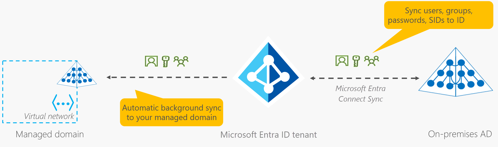

##### Describe authentication methods in Azure, including SSO, MFA, and passwordless

+ **SSO**
  + Enables a user to sign in one time and use that credential to access multiple resources and apps from different providers.
  + A single identity is tied to a user, which simplifies the security model.

+ **MFA**
  + Process of prompting a user for an extra form (or factor) of identification during the sign-in process.
  + Protects against a password compromise in the scenario where the second factor isn't.
  + Typically consists of entering a code sent to your phone after having introduced your username and pass.
  + The elements the second factor can rely on are:
    + Something the user knows: a challenge question.
    + Something the user has: a phone featuring a time-based code.
    + Something the user is: biometric data.

+ **Passwordless**
  + Authentication where the password is removed and replaced by:
    1. something you have
    2. plus something you are, or something you know.
  + It requires a setup before it can work: for example, in a computer **you have**, you need to enroll first, then you'll be asked to provide something **you know** (a PIN) or **you are** (a fingerprint).
  + Passwordless authentication options supported by Azure:
    + Windows Hello for Business: convenient method to access corporate resourse from Windows PCs.
    + Microsoft Authenticator app: turns the phone into a strong passwordless credential.
    + FIDO2 security keys: USB, bluetooth, or NFC devices using FIDO, an open standard for passwordless authentication.

##### Describe external identities in Azure, including B2B and B2C.

+ **Azure Extenal Identities** and **Microsoft Entra External ID**
  + person, device, service, etc. that is outside your organization.
  + Microsoft Entra External ID dictates all the ways you can securely interact with external identities.
  + Similar to SSO: with External ID users can bring their own identity to sign-in whether those users have corporate, government-issued digital identity, or unmanaged social identity like Google or Facebook.
  + Manage to your apps is done with Microsoft Entra ID or Azure AD B2C.

    + **B2B collaboration**
      + collaborate with external users by letting them use their preferred identity to sign-n to your Microsoft apps or other enterprise apps (SaaS apps, custom developed apps).
      + B2B collaboration users are represented in your directory as guest users.

    + **B2B Direct Connect**
      + Establish a mutual, two-way trust with another Microsoft Entra organization for seamless collaboration.
      + Currently supports Teams shared channels, to share resources from within their home instances of Teams.
      + Users not visible in your directory; only from within the Teams shared channel, where they can be monitored.

    + **AD B2C**
      + lets you publish modern SaaS apps or custom developed apps to consumers and customers, using Azure AD B2C for identity and access management.

    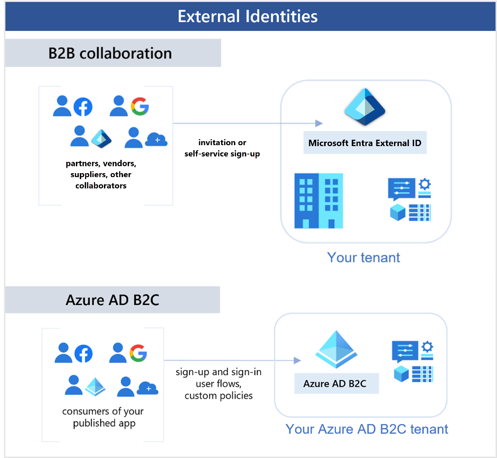

+ With Entra ID, you can enable collaboration across organizational boundaries using Microsoft Entra B2B feature. Guest users from other tenants can be invited by admins or by other users, even if they use social identities.

+ Guest users can be configured with the appropriate access either by asking the guest users themselves or by enabling decision makers in access reviews.

##### Describe Microsoft Entra Conditional Access

+ Tool that Entra ID uses to allow or deny access to resources based on identity signals.
+ Signals can be:
  + who the user is
  + where the user is
  + what device the user is requesting access from
+ Supports a more granular MFA experience (requiring MFA only on certain scenarios).
+ Supports limiting or blocking the user based on signals (e.g., unusual location).
+ useful when:
  + require MFA to access an app based on the requester's role, location, or network.
  + require access only through approved client apps (e.g., approved email apps).
  + require access only through managed devices.
  + block access from untrusted sources, such as unexpected locations.

##### Describe Azure RBAC

+ Principle of least privilege: you should only grant access up to the level needed to complete a task.
+ Instead of configuring permissions individually for each user, you define roles.
  + Each role has an associated set of access permissions.
  + You can assign individuals or groups of users to one or more rules.
  + They will receive all the associated access permissions.
+ Azure provides built-in roles describing common access rules for cloud resources.
+ You can also define your own roles.
+ Azure RBAC is applied to a scope, which is a resource or set of resources that the access applies to:
  + Scopes: management group, subscription, resource group, resource...
  + Roles: Reader, Resource-specific, Custom, Contributor, Owner...
  + Groups/Categories of users or processes: observers, users managing resources, admins, automated processes

    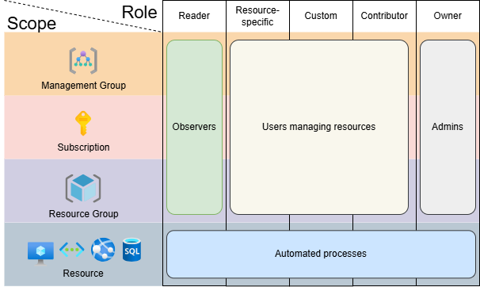

+ Azure RBAC is hierarchical: when you grant access at a parent scope, those permissions are inherited by all child scopes. For example, when you assign the Owner role to a user at the magement group scope, the user can manage everything in all the subscriptions within the management group.

+ Azure RBAC is enforced through Azure Resource Manager (ARM).
+ Azure RBAC doesn't enforce access permissions at the application or data level. That is an application responsibility.
+ Azure RBAC uses an allow model (additive):
  + When you're assigned a role, Azure RBAC allows you to perform actions within the scope of that role.
  + It's additive: if you're granted read permissions to a resource group, and a different role gives you write access, you will have both read and write access to the resource group.

##### Describe the concept of Zero Trust
+ Security model that assumes the worst case scenario and protects resources with that expectations.
+ Assumes each request comes from an uncontrolled network.
+ It doesn't assume a device is safe because it's within the corporate network. Instead, flips the scenario and requires to authenticate in all circumstances.
+ Zero Trust security model guiding principles:
  + Verify explicitly: always authenticate and authorize based on all available data points.
  + Use least privilege access: limit user access with Just-In-Time/Just-Enough-Access risk-based adaptive policies and data protection.
  + Assume breach: minimize blast radius and segment access. Use end-to-end encryption. Use analytics to drive threat detection. Improve defenses.

##### Describe the purpose of the defense-in-depth model

+ Security strategy that uses a series of mechanisms to slow the advance of an attack that aims at acquiring unauthorized access to data.
+ It can be visualized as a set of layers, with the data to be secured at the center and all the other layers functioning to protect that central data layer.

    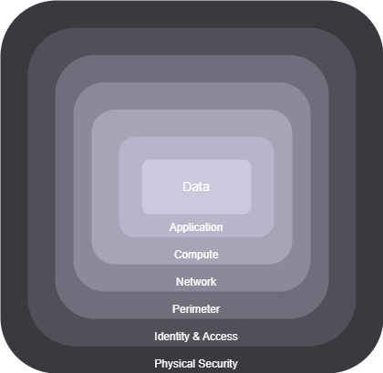

+ Each layer provides protection so that if one layer is breached, a subsequent layer is already in place to prevent further exposure:
  1. Physical Security: secure access to buildings and computing hardware within the datacenter.
  1. Identity and Access: Identities are secure, access is granted only to what's needed and sign-in events and changes are logged.
  1. (Network) Perimeter: Protect from network-based attacks against your resources by identifying, eliminating their impact, and alerting you when they happen. Requires DDoS protection to filter large scale attacks and perimeter firewalls to identify and alert malicious attacks.
  1. Network: limiting network connectivity across all your resources to allow only what's required.
      + Limit communication between resources
      + Deny by default
      + Restrict inbound internet access and limit outbound access where appropriate.
      + Implement secure connectivity to on-prem networks.
  1. Compute: ensure compute resources are secured and that proper controls are in place to minimize security issues.
      + Secure access to VMs, containers, functions...
      + Implement endpoint protection on devices and keep systems patched and current
  1. Application: integrate security into the application development lifecycle to reduce the number of vulnerabilities introduced in the code.
      + Ensure apps are secure and free of vulnerabilities
      + Store sensitive app secrets in a secure storage medium
      + Make security a design requirement for all app development
  1. Data: Implement controls and processes to ensure confidentiality, integrity, and availability of the data.

##### Describe the purpose of Microsoft Defender for Cloud

+ Monitoring tool for security posture management and threat protection.
+ Provides the tools needed to:
  + harden your resources
  + track your security posture
  + protect against cyber attacks
  + streamline security management
+ Can span your cloud, on-prem, hybrid, and multi-cloud environments.
+ Provide guidance and notifications aimed at strengthening your security posture.
+ Many Azure services are monitored and protected automatically.
+ Defender for the cloud can automatically deploy a Log Analytics agent to gather security related data. This is automatic in Azure, and may require Azure Arc for non-Azure machines.
+ Cloud Security Posture Management (CSPM) works without the need for any agents.
+ In Azure, it helps you detect threats across:
  + Azure PaaS services: Azure App Service, Azure SQL, Azure Storage saccount. It can perform anomaly detection on Azure activity logs using Microsoft Defender for Cloud Apps.
  + Azure Data services: helps you classify your data in Azure SQL and get assessments for potential vulnerabilities across Azure SQL and Storage services, recommendations about how to mitigate them.
  + Networks: Defender for Cloud helps you limit exposure to brute force attacks by reducing access to VM ports, just-in-time VM access, preventing unnecessary access to networks, establish allowed source IP address ranges or IP addresses.
+ It can be configured to protect your non-Azure servers with the help of Azure Arc.
+ In other clouds, Defender for Cloud's CSPM features extends to AWS resources with recommendations, container threat detection on EKS, Linux EC2 instances.
+ It fills three vital needs:
  + Continuosly assess: vulnerability assessment solutions for your VMs, container registries, and SQL servers.
  + Secure: harden your resources with policies built on top of Azure Policy Controls.
  + Defend: provide security alerts and advanced threat protection features.
+ It provides advanced threat protection features for your deployed resources such as VMs, SQL databases, containers, web apps, and your network.

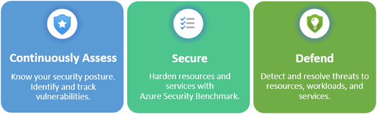

### Describe Azure management and governance

+ Azure Management:
  + Cost Management in Azure: Pricing Calculator, Cost Services, Budgets
  + Using Tags to add metadata to your resources

+ Azure Governance (and compliance):
  + Microsoft Purview: solution for risk and compliance, unified data governance.
  + Azure Policy: manage policies to control/audit your resources.
  + Resource Locks: delete/read-only locks for your resources, orthogonal to Azure RBAC.
  + Service Trust Portal: security, privacy, and compliance portal.

#### Describe cost management in Azure

+ Azure shifts development costs from CapEx (building and maintaining infrastructure and facilities) to OpEx (renting infra as you need it).

+ Tools available to understand the costs of operating your solution in Azure:
  + **Pricing calculator**: select the services, dev/prod, region, support, billing options...
  + **Azure Advisor**: lets you monitor your actual costs and get recommendations about unused resources and ways to optimize your resources. It also lets you set spending limits to prevent cost overruns.

    | NOTE: |
    | :---- |
    | There used to be another tool (TCO Calculator) that allowed you to specify your on-prem datacenter details and you'd get the cost savings when implementing a similar solution in Azure. It has been retired. |

##### Describe factors that can affect costs in Azure

+ OpEx can be impacted by many factors:
  + Resource type used.
  + Consumption.
  + Maintenance: refers to standalone resources that are not deleted when the resource they were attached to has been deprovisioned (e.g., network interfaces, disks, etc.).
  + Geography: price of the services and cost of network traffic depends on the regions.
  + Network traffic: generally, inbound data transfers are free. Outbound data transfers cost is based on zones (geographical grouping of Azure regions, for billing purposes).
  + Subscription type.
  + Azure Marketplace: when you purchase products from Azure Marketplace, the billing structure is set by the vendor, and may include additional costs on top of the resources you're using.

##### Explore the pricing calculator

+ A tool available in the internet that allows you to build out a configuration and generates the potential Azure expenses.

##### Describe cost management capabilities in Azure

+ **Cost Management Tool**
  + provides the ability to quickly check Azure resource costs, create alerts based on resource spend, and create budgets that can be used to automate the management of resources.

    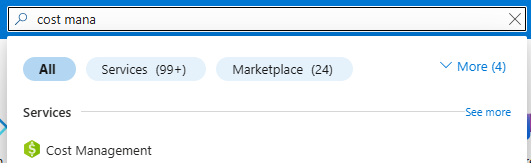

+ **Cost Analysis**
  + subcomponent of Cost Management that provides a quick visual for Azure costs.
  + You can see costs by billing cycle, region, resource, ...

    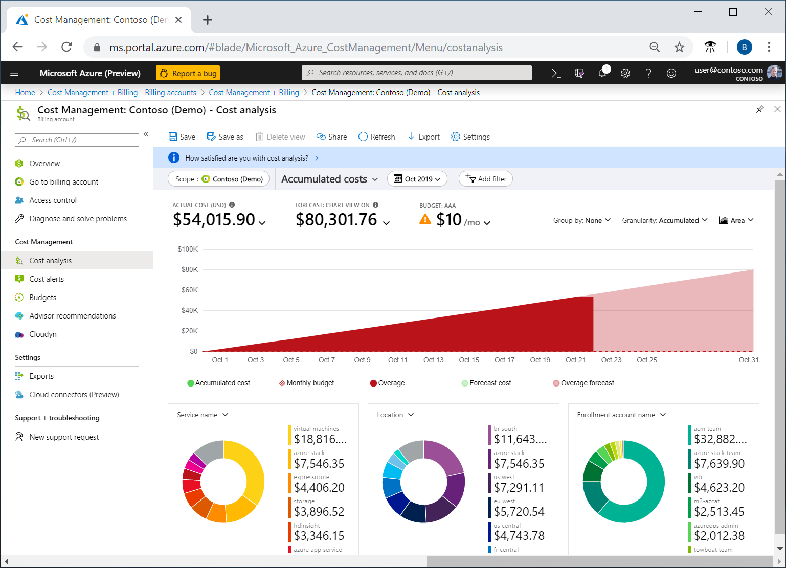

+ **Cost Alerts**
  + single location to check on all of the different alert types that may show up in the Cost Management service
  + **Budget alerts**
    + Triggered when spending, based on usage or cost, reaches the amount defined in the alert condition of the budget.
    + Budgets are create using Azure Portal (by cost) or the Azure Consumption API (by cost or by usage).
    + When triggered, alert will be available in the Azure portal, and an email is sent to the people in the alert recipient list.
  + **Credit alerts**
    + Triggered when your Azure credits are consumed.
    + Credits are awarded to organizations with Enterprise Agreements (EAs).
  + **Department Spending Quota alerts**
    + Triggered when department spending reaches a fixed threshold of the quota.
    + Configured in the EA portal.
    + When triggered, an email will be sent to the department owners, and show up in cost alerts.

+ **Budgets**
  + The construct in which you set a spending limit for Azure.
  + Can be based on a subscription, resource group, service types, etc.
  + A budget is linked to a budget alert that will be triggered when the amount is reached.
  + Notification will be visible im Cost Alerts. If configured, an email will be sent.
  + Automation can be configured to trigger automation to suspend or modify resources.

##### Describe the purpose of tags

+ Tags provide metadata about your resources to organize related resources beyond subscription placement or resource group organization, so that you can do:
  + Resource management: by creating tags to locate and act on resources associated with specific workloads, environments, business units, owners...
  + Cost management and optimization: by creating tags that group resources so that you can report on costs, allocate internal cost centers, track budgets, forecast estimated cost...
  + Operations management: by creating tags that classify data by its security level, such as public, confidential, ...
  + Governance and regulatory compliance: by creating tags to identify which resources comply with certain things such as ISO 27001. Tags can be part of the standards enforcement efforts (e.g., all resources must be tagged with owner, project, and department name).
  + Workload optimization and automation: creating tags that visualize all the resources that participate in complex deployments.

+ Tags can be maintained through:
  + PowerShell
  + Azure CLI
  + Azure Resource Manager templates
  + REST API
  + Azure Portal

#### Describe features and tools in Azure for governance and compliance

+ Microsoft Purview: solution for risk and compliance, unified data governance.
+ Azure Policy: manage policies to control/audit your resources.
+ Resource Locks: delete/read-only locks for your resources, orthogonal to Azure RBAC.
+ Service Trust Portal: security, privacy, and compliance portal.

##### Describe the purpose of Microsoft Purview in Azure

+ Microsoft Purview is a family of data governance, risk, and compliance solutions that helps you get a single, unified view into your data.
+ Microsoft Purview brings insight about your on-prem, multicloud, and SaaS data together.
+ It provides:
  + Automated data discovery
  + Sensitive data classification
  + End-to-end data lineage
+ Microsoft Purview covers two main solution areas:
  1. Risk and compliance
      + manages and monitors your data to:
        + Protect sensitive data across clouds, apps, and devices
        + Identify data risks and manage regulatory compliance requirements
        + Get started with regulatory compliance
      + Microsoft 365 is a core component, as it manages and monitors data on Teams, OneDrive, Exchange, ...
  1. Unified data governance
      + unified data governance solutions that help manage on-prem, multicloud, and SaaS data.
      + robust data governance capabilities enable you to manage your data in Azure, SQL and Hive dbs, locally, and even in other cloud services as S3.
      + helps organizations to:
        + create and up-to-date map of your entire data estate, including data classification and end-to-end lineage.
        + identify where sensitive data is stored in your estate.
        + create a secure environment for data consumers to find valuable data.
        + generate insights about how your data is stored and used.

##### Describe the purpose of Azure Policy
+ Service in Azure that enables you to create, assign, and manage policies that control or audit your resources.
+ Policies enforce different rules across your resources configurations so that those resources stay compliant with corporate standards.

+ Azure Policy enables you to define both individual policies and groups of related policies, known as initiatives.
+ Azure Policy evaluates your resources and highlights those that aren't compliant.
+ It can prevent noncompliant resources from being created.

+ Policies can be set at each level: specific resource, resource group, subscription, management group...
+ Policies are inherited, if applied at a high-level, it will automatically be applied to all of the groupings that fall within that parent.

+ Azure Policy comes with built-in policy and initiative definitions for Storage, Networking, Computing, Security Center, and Monitoring.
+ When you define a policy, it will be applied to future resources, but also current resources created before the policy was defined will be evaluated.
+ It supports remediation of non-compliant resources in some cases.
+ It can be integrated with Azure DevOps by applying CI/CD pipeline policies that pertain to the pre-deployment and post-deployment phases of your apps.

+ **Azure Policy initiatives**
  + A way of grouping related policies together.
  + For example, Azure Policy contains an initiative 'Enable Monitoring' in Azure Security Center whose goal is to monitor all available security recommendations for all Azure resource types in Azure Security Center.
    + Monitor unencrypted SQL Databases in Security Center.
    + Monitor OS vulnerabilities in Security Center.
    + Monitor missing Endpoint Protection in Security Center (flags servers that don't have endpoint protection agent)

##### Describe the purpose of resource locks
+ Azure Locks prevent users from deleting or changing/deleting a resource:
  + Delete: authorized users can read and modify a resource, but they can't delete the resource.
  + ReadOnly: authorized users can read a resource, but they can't delete or update the resource (similar to applying the Reader role to the resource).

+ Can be managed from Azure Portal, PowerShell, Azure CLI, or from an ARM template.

+ Resource locks apply regardles of RBAC permissions: even if you're the owner of the resource, you must still remove the lock before you can perform an action on the locked resource.

##### Describe the Service Trust Portal
+ Microsoft Service Trust Portal is a portal that provides access to various content, tools, and other resources about Microsoft security, privacy, and compliance practices.

+ To access some of the resources, you must sign in as an authenticated user with your Microsoft Entra organization account and accept the NDA.

+ It contains details about Microsoft's implementation of controls and processes.

+ Sections of the Service Trust Portal:
  + Service Trust Portal home page
  + My Library: to pin documents
  + All Documents: landing plae for all documents on the Service Trust Portal

#### Describe features and tools for managing and deploying Azure resources
+ Azure provides multiple tools for managing your environment including:
  + Azure Portal
  + Azure PowerShell
  + Azure Command Line Interface

##### Describe the Azure Portal
+ A web-based unified console that lets you manage your Azure subscription by using a GUI.
+ Capabilities:
  + Build, manage, and monitor everything from simple web apps to complex cloud deployments.
  + Create custom dashboards for an organized view of resources.
  + Configure accessibility options for an optimal experience.
  + Customize your UX through custom dashboards that you create, to see the data that is most important to you.

+ Build for resiliency and continuous availability.
  + It maintains a presence in every Azure datacenter.
  + Updates continuously, and requires no downtime for maintenance activity.

##### Describe Azure Cloud Shell, including Azure CLI and Azure PowerShell
+ Browser-based shell tool that allows you to create, configure, and manage Azure resources using a shell.
+ Supports both Azure PowerShell and Azure CLI (bash).
+ Accesible from Azure Portal.
+ Benefits:
  + requires no local installation or configuration, only a browser.
  + authenticates with your Azure credentials, so when you log in, it inherently knows who you are and what permissions you have.
  + you can choose the shell you're most familiar with.

+ **Azure PowerShell**
  + Shell that DevOps, devs, and IT professionals can use to run commands called cmdlets that call the Azure REST API to perform management tasks.
  + Cmdlets can be run independently to handle small one-off changes, or combined and orchestrated to achieve complex Azure tasks.
  + Uses an imperative approach.

+ **Azure CLI**
  + Functionally equivalent to Azure PowerShell but using Azure CLI bash commands.
  + Same benefits as Azure PowerShell.

##### Describe the purpose of Azure Arc
+ Azure Arc provides a centralized, unified way to:
  + Manage your entire environment together by projecting your existing non-Azure resources into Azure Resource Manager (ARM).
  + Manage multi-cloud and hybrid VMs, Kubernetes clusters, and dbs as if they are running in Azure.
  + Use familiar Azure services and management capabilities, regardless of where they live.
  + Continue using traditional ITOps while introducing DevOps practices to support new cloud and native patterns in your environment.
  + Configure custom locations as an abstraction layer on top of Azure-Arc enabled Kubernetes clusters and cluster extensions.
  + Supports the following resource types hosted outside of Azure:
    + Servers
    + Kubernetes clusters
    + Azure data services
    + SQL Server
    + VMs (preview)

##### Describe IaC
+ IaC is a concept where you manage your infrastructure as lines of code.
+ Cmdlets and bash scripts is considered a primitive way of dealing with the management of your resources. Not considered IaC.
+ ARM templates and Bicep are two technologies supported by ARM.

##### Describe Azure Resource Manager (ARM) and ARM templates
+ Azure Resource Manager (ARM) is the deployment and management service for Azure.
+ Provides a unified, centralized, management layer that enables you to create, update, and delete resources in your Azure account.
+ Anytime you do anything with your Azure resources, ARM is involved.
+ Lifecycle of a user-initiated management request in Azure:
  + No matter where the request is originated (Azure tools, APIs, SDKs, ...) ARM receives the request.
  + ARM authenticates and authorizes the request.
  + ARM forwards the request to the Azure service, which takes the requested action to create, delete, or manage the actual resources.
  + ARM replies with the results to the user. That's why you see consistent results and capabilities, as everything is handled through the same API.

  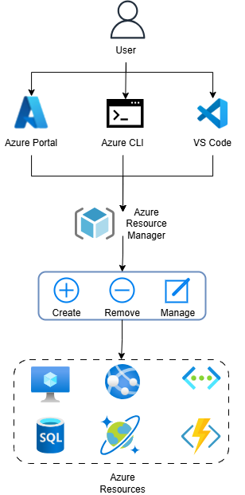

+ ARM provides the Resource Group concept to organize related resources together.
+ By using Resource Groups you can:
  + Move all the resources in a Resource Group to a new subscription.
  + Delete all the resources in a Resource Group with a single action.

+ ARM leverages existing Azure RBAC for subscriptions, resource groups, and resources. Access rules are enforced no matter the type of client you're using because it's performed by ARM.

+ Benefits:
  + Manage your infra through declarative templates (JSON files that define what you want to deploy to Azure) rather than scripts.
  + Deploy, manage, and monitor all the resources for your solution as a group, rather than handling resources individually.
  + Re-deploy your solution throughout the development lifecycle and have confidence your resources are deployed in a consistent state.
  + Define the dependencies between resources, so they're deployed in the correct order.
  + Apply access control to all services, because RBAC is natively integrated into the management platform.
  + Apply tags to resources to logically organize all the resources in your subscription.
  + Clarify your organization's billing by viewing costs for a group of resources that share the same tag.

+ **ARM templates**
  + Lets you describe the resources you want to deploy/manage using a declarative JSON format.
    + Declarative means: you define the desired state and configuration of each resources instead of how it needs to be created.
  + In the first step, the ARM template is examined to confirm it can be deployed. This ensures that resources will be created and connected correctly.
  + ARM will handle the creation of those resources in parallel.
  + Benefits:
    + Declarative syntax
    + Repeateable results
    + Orchestration
    + Modularity
    + Extensibility

+ **Bicep**
  + Language that uses a declarative syntax to deploy Azure resources.
  + A Bicep file defines the infrastructure and configuration.
  + While similar to an ARM template, Bicep files tend to use simpler, more concise style.
  + Benefits:
    + Support for all resource types and API version.
    + Simple syntax
    + Repeatable results
    + Orchestration
    + Modularity

#### Describe monitoring tools in Azure

+ Azure Advisor
+ Azure Service Health
  + Azure Status
  + Service Health
  + Resource Health
+ Azure Monitor
  + Azure Insights
+ Azure Log Analytics
+ Azure Monitor Alerts

##### Describe the purpose of Azure Advisor
+ A service that evaluates your Azure resources and make recommendations to:
  + help improve reliability: ensure and improve business continuity of your critical apps.
  + security: detect threats and vulnerabilities that might lead to security breaches.
  + performance: improve the speed of your apps.
  + achieve operational excellence: achieve process and workflow efficiency, resource manageability, and deployment best practices.
  + reduce costs: optimize and reduce the cost of your overall Azure spending.

+ Recommendations are available in the Azure Portal, and the API.
+ You can set up notifications to alert you of new recommendations.
+ Recommendations are aligned to the aread identified above.

##### Describe Azure Service Health
+ Azure Service Health helps you keep track of Azure resources (yours and the overall Azure status).
+ It's composed of three services:
  1. **Azure Status**: broad picture of the status of Azure globally. Good place to check for incidents with widespread impact.
  1. **Service Health**: more detailed view of Azure services and regions. It focuses on the Azure services and regions you're using. Good place to look for communications that might affect you like planned maintenance, outages, etc.
  1. **Resource Health**: tailored view of your actual Azure resources.

##### Describe Azure Monitor, including Log Analytics, Azure Monitor alerts, and Application Insights
+ **Azure Monitor**
  + Platform for collecting data on your resources, analyzing that data, visualizing the information, and acting on the results.
  + Supports your Azure resources, your on-prem resources, and even multi-cloud resources such as VMs hosted with a different cloud provider.
  + You can use the data to help you react to critical events in real time, through alerts delivered to teams via SMS, email, ...
  + You can also use thresholds to trigger autoscaling functionality to scale to meet demand.

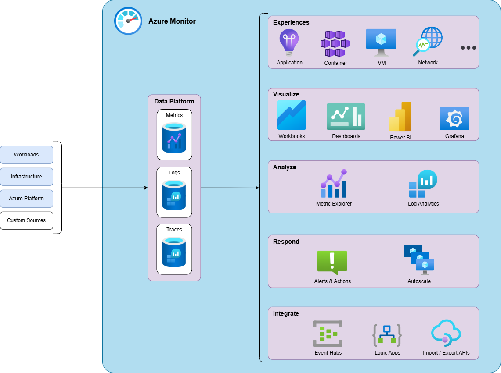

+ **Azure Log Analytics**
  + The tool you use in Azure Portal to write and run log queries on data gathered by Azure Monitor.
  + Support basic queries, complex queries, and data analysys.

+ **Azure Monitor Alerts**
  + An automated way to stay informed when Azure Monitor detects a threshold being crossed.
  + You set the alert conditions, the notification actions, and then Azure Monitor Alerts notifies you when an alert is triggered.
  + Depending on the configuration, corrective actions can also be attempted.
  + Alerts can be set up to:
    + monitor the logs and trigger on certain log events: allow for complex logic across data from multiple sources.
    + monitor metrics and trigger when certain metrics are crossed: provide near real-time alerts based on numeric values.
  + Action groups are used to configure who to notify and what action to take. Action groups is a collection of notification and action preferences that you associate with one or multiple alerts.
  + Azure Monitor, Service Health, and Azure Advisor all use action groups to notify you when an alert has been triggered.

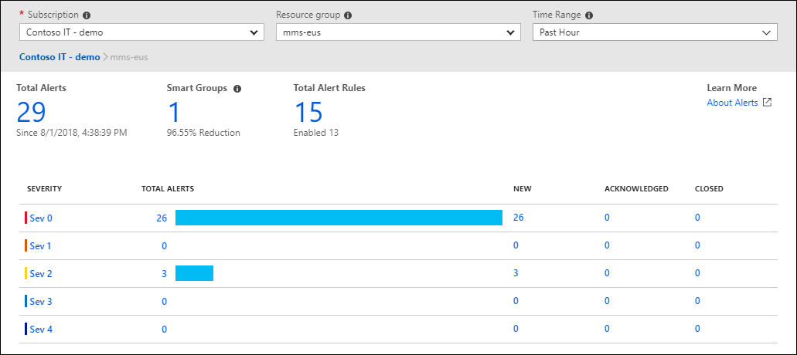

+ **Application Insights**
  + An Azure Monitor feature, to monitor web apps.
  + Supports web apps in Azure or in a different cloud environment.
  + You can install an SDK in your app, or use the Application Insights agent, which supports C#, .NET, VB.NET, Java, JavaScript, Node.js, and Python.
  + Once installed, it provides the following information:
    + Request rates, response times, failure rates.
    + Dependency rates, response times, failure rates associated with external services that might be slowing down the performance.
    + Page views, load performance reported by users' browsers.
    + AJAX calls from web pages, including rates, response times, failure rates.
  + Supports configuring synthetic resquests to your application to check the status.

## Azure cheat sheet and reference notes

### Azure services

| Service | Icon | Description |
| :------ | :--- | :---------- |
| Azure Advisor |  | Service that evaluates your Azure resources and make recommendations to help improve reliability, security, performance, achieve operational excellence, and reduce cost. |
| Azure Application Insights |  | An Azure Monitor feature that monitors your web apps. It supports Azure, on-prem, or other public cloud environments. |
| Azure Arc |  | Set of technologies that helps manage your cloud environment, whether it's a public cloud solely on Azure, a private cloud in your datacenter, a hybrid configuration, or even a multi-cloud environment running on multiple cloud providers at once. |
| Azure App Services |  | Scalable hosting platform to create web based apps (web apps, background jobs, RESTful APIs and mobile backends) with fully managed services. |
| Azure Container Apps | 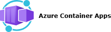 | A PaaS service for running containers providing load balancing and scaling. |
| Azure Blob Storage |  | Part of Storage Account. An object storage solution to store massive amounts of unstructured data. |
| Azure Container Instances | 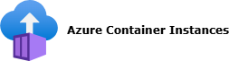 | Allows you to deploy containerized apps with fully managed services. |
| Azure Cosmos DB |  | Support for NoSQL databases. |
| Azure Disk Storage |  | Part of Storage Account. Service that provides disks for Azure VMs and apps. |
| Azure DNS |  | A hosting service for domains that provides name resolution in Azure. |
| Azure ExpressRoute |  | Service that lets you extend your on-prem networks into Microsoft Cloud (Azure compute services, Azure cloud services, Microsoft Office 365, Microsoft Dynamics 365). |
| Azure File |  | Part of Storage Account. Service that offers managed file shares in the cloud using industry standard protocols. |
| Azure Function Apps |  | an event-driven, serverless compute option that doesn't require maintaining VMs or containers. |
| Azure Kubernetes Services |  | Allows you to deploy containerized apps onto a fully managed Kubernetes. |
| Azure Log Analytics |  | A tool within Azure Monitor accessible in Azure Portal where you write and run log queries on the data gathered by Azure Monitor. |
| Azure Migrate |  | Service that helps you migrate from an on-prem environment to the cloud, acting as a hub that helps you manage the assessment and migrations of your on-prem datacenter to Azure. |
| Azure Monitor |  | A platform for collecting data on your resources, analyzing that data, visualizing the information, and acting on the results. It supports on-prem and resources on other cloud providers. |
| Azure Monitor Alerts |  | A tool within Azure Monitor that lets you set an automated way to stay informed when Azure Monitor detects a threshold being crossed. |
| Azure Policy |  | Service in Azure that enables you to create, assign, and manage policies that control or audit your resources. These policies enforce different rules across your resource configurations so that the resources stay compliant with corporate standards. |
| Azure Queue Storage |  | Part of Storage Account. Service providing async messaging queueing for communication between app components. |
| Azure Resource Manager (ARM) |  | The deployment and management service for Azure. It provides a management layer that enables you to create, update, and delete resources in your Azure account. Anytime you do anything with your Azure resources, ARM is involved. |
| Azure Storage Account |  | Cloud storage solution available in Azure for modern data storage scenario. The service offers: a massively scalable object store, disk storage for VMs, a file system service for the cloud, a messaging system, and a NoSQL store. |
| Azure Table Storage |  | Part of Storage Account. Service the provides a NoSQL data store for key-value pairs backed by large scale datasets. |
| Azure Virtual Machines |  | IaaS in the form of virtualized servers. |
| Azure Virtual Networks |  | Allows you to define virtual neworks and virtual subnets to enable Azure resources to communicate between them, with users on the internet, and with on-prem client computers. |
| Azure Virtual Desktop |  | A desktop and application virtualization service that runs in the cloud a version of Windows 11. |
| Azure VPN Gateway |  | A service deployed in a dedicated subnet of the virtual network to enable site-site between on-prem and virtual networks, point-to-site to connect devices and virtual networks, and connect virtual networks together. |
| Cost Management |  | Azure service that provides the ability to quickly check Azure resource costs, create alerts based on resource spend, and create budgets that can be used to automate the management of resources. |
| External Identities |  | The service that enables you to securely interact with users outside your organization. |
| Microsoft Defender for Cloud |  | Microsoft Defender for Cloud is a monitoring tool for security posture management and threat protection. It monitors your cloud, on-prem, hybrid, and multicloud environments to provide guidance and notifications aimed at strengthening your security posture. |
| Microsoft Entra Connect |  | A service that connects Microsoft Entra ID with your on-prem AD to sync changes between both systems and enable extra functionality such as MFA and SSO on your on-prem AD. |
| Microsoft Entra ID |  | Microsoft Entra ID is Microsoft's cloud-based identity and access management service. It is a directory service that enables you to sign-in and access both Microsoft cloud apps and the cloud apps you develop. It can also help maintain your on-prem Active Directory (AD) deployments. |
| Microsoft Purview |  | A family of data governance, risk, and compliance solutions that helps you get a single, unified view into your data. Microsoft Purview beings insights about your on-prem, multicloud, and SaaS data together. |

### Definitions

#### A

##### ARM template
A JSON file that defines what you want to deploy to Azure.

##### Availability
Uptime. See [HA](#high-availability-ha).

##### Availability Zone
A physically separate datacenter within an Azure Region, with each datacenter equipped with independent cooling, and networking.

##### Availability-Zone enabled Regions
Azure Regions with a minimum of three Availability Zones to ensure resiliency.

##### Authentication
The process of establishing the identity of a person, service, or device.

##### Azure
Azure is Microsoft's cloud computing platform. It supports IaaS, PaaS, and SaaS computing. Most of Azure's services are pay-as-you-go.

##### Azure Account
An identity in Microsoft Entra ID or an identity in a directory Microsoft Entra ID trusts. When you sign up to Azure, you first create an Azure Account.

##### Azure Management Groups
A construct that lets you organize subscriptions. It lets you create a hierarchy of other Management Groups and Azure Subscriptions to simplify applying policies or control access to multiple subscriptions.

##### Azure Portal
A single, web-based management interface that lets you create, configure, and control all your services and resources.

##### Azure Region
A geographical area on the planet that contains at least one, but potentially multiple datacenters that are nearby and networked together with low-latency network.

##### Azure Policy Initiative
An Azure Policy initiative is a grouping of related individual Azure policies.

##### Azure Resource
The basic building block of Azure. Anything you create, provision, configure, or deploy is a resource.

##### Azure Resource Group
A concept defined by Azure Resource Manager (ARM) that lets you organize related resources together so that they can be dealt with together.

##### Azure Subscription
A unit of management, billing, and scale that lets you logically organize your Resource Groups and facilitate billing. An Azure Subscription provides you with authenticated and authorized access to Azure products and services. Resources are provisioned into subscriptions. An Azure subscription liks to an Azure account.

#### C

##### CapEx
See [Capital expenditure](#capital-expenditure-capex).

##### Capital expenditure (CapEx)
A (typically) one-time, up-front expenditure to purchase or secure tangible resources. Examples: A new building, repaving a parking lot, building a datacenter, or buying a company vehicle.

##### Cloud computing
The delivery of computing services over the internet, typically using a pay-as-you-go model.

##### Container
A lightweight virtualization technology that allows to run multiple containers side-by-side on a single host.

##### CSPM
CSPM stands for Cloud Security Posture Management. It refers to a set of tools and practices designed to continuously monitor, assess, and improve the security posture of cloud environments.

CSPM solutions help organizations identify and remediate misconfigurations, compliance violations, and vulnerabilities across public, private, and hybrid cloud infrastructures.

#### D

##### Defense-in-depth
A security strategy that employs a series of mechanisms to slow the advance of an attack that aims at acquiring unauthorized access to data. It can be visualized as a set of layers, with the data to be secured at the center, and all the other layers functioning to protect that central layer. Each layer should provide protection so that if one layer is breached, a subsequent layer is already in place to prevent further exposure.

1. Physical Security Layer: Security in the datacenter.
2. Identity and Access Layer: Access control to infrastructure.
3. Perimeter Layer: DDoS protection to filter large-scale attacks.
4. Network Layer: Employs segmentation and limits communication control between resources.
5. Compute Layer: Secures access to VMs, containers, or functions.
6. Application Layer: Ensure applications are secure and free of any security vulnerability.
7. Data Layer: Controls access to business and customer data.

#### E

##### Endpoint Protection

In the compute layer of a defense-in-depth strate, endpoint protection refers to security measure applied directly to end-user devices and servers (laptops, desktops, mobile devices, VMs, ...) to prevent, detect, and respond to threats that target these systems.

Keys aspects include anti-virus and anti-malware software, firewalls, configuration hardening, patch and vulnerability management, tamper protection and integration with a SIEM.

#### F

##### FIDO2
The Fast Identity Online (FIDO) is an alliance that helps to promote open authentication standards and reduce the use of passwords as a form of authentication. FIDO2 is the latest standards that incorporates the web authentication (WebAUthn) standard.

FIDO is an open standard for passwordless authentication. FIDO allows users and organizations to leverage the standard to sign-in to their resources without a username or password by using an external security key or a platform key built into a device.

#### H

##### HA
See [High Availability](#high-availability-ha).

##### High Availability (HA)
The capability to ensure maximum uptime/availability, regardless of disruptions or events that may occur.

#### I

##### IaaS
See [Infrastructure-as-a-Service](#infrastructure-as-a-service)

##### Image
A template used to create a VM that may already include an OS and other software.

##### Infrastructure-as-a-Service
The model in which the cloud provider is responsible for maintaining the hardware, network (connectivity), and physical security, while the customer is responsible for everything else: OS installation, configuration, and maintenance; network configuration; storage and database configuration, ...

#### M

##### Management Groups
See [Azure Management Groups](#azure-management-groups).

#### O

#### Opex
#See [Operational expenditure](#operational-expenditure-opex).

##### Operational expenditure (OpEx)
Spending money on services or products over time. Examples: Renting a convention center, leasing a company vehicle, signing-up for cloud services.

#### N

##### Network File System (NFS)
A file sharing protocol.

##### NFS
See [Network File System](#network-file-system-nfs)

#### P

##### PaaS
See [Platform-as-a-Service](#platform-as-a-service)

##### Platform-as-a-Service
The model in which the cloud provider maintains the physical infrastructure, physical security, and connection to the internet, the operating systems, middleware, development tools, and business intelligence services that make up a cloud solution, and the customer doesn't need to worry about licensing or patching OS and DBs.

##### Principle of least privilege
The principle of least privilege says you should only grant access ip to the level needed to complete a task.

#### R

##### Region
See [Azure Region](#azure-region).

##### Region Pairs
Azure Regions that are paired with other Azure Regions to enable resiliency when an incident impacts multiple Availability Zones in a single Azure Region.

##### Reliability
The ability of a system to recover from failures and continue to function.

##### Resiliency
Ability of a system to recover quickly and continue operating after a failure, disruption, or unexpected event.

##### Resource
See [Azure Resource](#azure-resource)

##### Resource Group
A grouping of resources. A Resource Group can contain many resources, but a Resource needs to be placed into a single Resource Group.

#### S

##### SaaS
See [Software-as-a-Service](#software-as-a-service)

##### Scalability
Ability to handle demand. Ability to adjust resources to meet demand.

##### Scope (RBAC)
In Azure RBAC, scope is a construct that identifies a resource or a set of resources that this access applies to.

##### Server Message Block (SMB)
A file sharing standard.

##### Service-Level Agreement (SLA)
An industry term that serves as a formal agreement between the service provider and the customer that guarantees the customer a stated level of service. It is a service availability guarantee.

##### SIEM
SIEM stands for Security Information and Event Management. It is a security solution that aggregates, correlates, and analyzes log and event data from across an organization's IT infrastructure.

##### Single Sign-On (SSO)
SSO enables a user to sign in one time and use that credential to access multiple resources and apps from different providers. In essence, a single identity is tied to a user, so when a user change roles or leave an organization, access modifications are tied to that identity which greatly simplifies the security model.

##### Shared Responsibility Model
A security framework where the cloud provider is responsible for securing the underlying infrastructure and services, while the customer is responsible for securing their data, apps, and configurations within that infrastructure.

The details on such responsibilities heavily rely on the corresponding model used: IaaS, PaaS, and SaaS.

##### SMB
See [Server Message Block](#server-message-block-smb)

##### Software-as-a-Service
The model in which the customer essentially rents or uses a fully developed app.

##### SSO
See [Single Sign-On](#single-sign-on-sso)

#### Z

##### Zero Trust Model
Zero Trust is a security model that assumes the worst case scenario and protects resources with that expectations. Zero Trust assumes breach at tht outset, and the verifies each request as though it originated from an uncontrolled network.

Zero Trust is based on these guiding principles:
+ Verify explicitly: always authenticate and authorize based on all available data points.
+ Use least privilege access: limit user access with *Just-In-Time*/*Just-Enough-Access* (JIT/JEA), risk-based adaptive policies, and data protection.
+ Assume breach: minimize blast radius and segment access. Verify end-to-end encryption. Use analytics to get visibility, drive threat detection, and improve defenses.

##### Zone
For billing purposes, a zone is grouping of Azure geographical regions.

## FAQs / ToDos

- [ ] Azure Tenant Definition
- [ ] Review authentication methods
- [ ] [Azure Well Architected Framework](https://learn.microsoft.com/en-us/learn/paths/azure-well-architected-framework/)
- [ ] [Understand Microsoft Entra ID](https://learn.microsoft.com/en-us/training/modules/understand-azure-active-directory/)